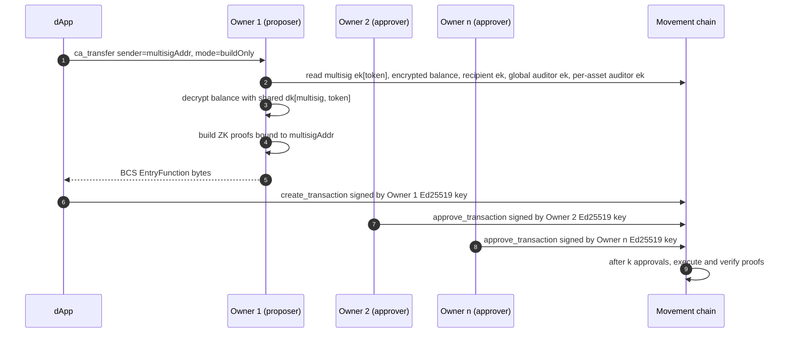

# Confidential Assets — Wallet Integration Design

> **Status:** Draft proposal, pending alignment before implementation.
>
> This document specifies the integration design for confidential assets in the wallet: the responsibilities of the wallet, the dApp–wallet protocol, and the design decisions that govern both.

---

## Table of contents

1. [Guiding principles](#guiding-principles)
2. [Trust boundary](#trust-boundary)
3. [Decryption key lifecycle](#decryption-key-lifecycle)
4. [Operation-by-operation design](#operation-by-operation-design)
   - [Register](#register)
   - [Deposit](#deposit)
   - [Withdraw](#withdraw)
   - [Confidential transfer](#confidential-transfer)
   - [Rollover and normalization](#rollover-and-normalization)
   - [Key rotation (not wallet-supported)](#key-rotation-not-wallet-supported)
5. [Wallet UX decisions](#wallet-ux-decisions)
6. [Hardware wallets](#hardware-wallets)
7. [Keyless accounts](#keyless-accounts)
8. [Multisig accounts](#multisig-accounts)
9. [Auditor support](#auditor-support)
10. [Safety and loss-of-funds analysis](#safety-and-loss-of-funds-analysis)
11. [Wallet ↔ application interface](#wallet--application-interface)
12. [Application conformance rules](#application-conformance-rules)
13. [Branch integration plan (Motion Wallet)](#branch-integration-plan-motion-wallet)
14. [Open questions](#open-questions)

---

## Guiding principles

1. **Decryption keys are wallet-custodied.** Each decryption key (`dk`) is stored in the wallet's encrypted keystore, used in-process for proof construction, and disclosed outside the wallet only through an explicit, user-initiated export flow. dApps, web origins, and the wallet adapter do not receive `dk` bytes under any code path.
2. **Per-asset `dk` isolation.** The wallet derives, stores, and uses a distinct `dk` for every `(account, token)` pair. There is no per-account `dk`.
3. **Proof generation occurs inside the wallet.** Every ZK proof for registration, transfer, withdraw, and normalize is constructed in the wallet using the `dk` for the asset being acted on. Key rotation is not a wallet-supported operation (see [Key rotation](#key-rotation-not-wallet-supported)).
4. **Rollover and normalization require explicit user authorization.** Rollover and normalization are on-chain transactions that incur gas and alter account state. The wallet surfaces the pending balance, presents an explicit action ("Accept incoming funds" or equivalent), and submits the rollover transaction (chaining normalization where required) only after the user authorizes it. The wallet does not initiate rollover or normalization without that authorization.
5. **The application expresses intents; the user authorizes every transaction.** The dApp specifies an action (for example, "transfer N tokens to address `R`"); the wallet selects the appropriate per-asset `dk`, fetches the necessary on-chain state, constructs the proofs, and prepares each required transaction. Every on-chain transaction is submitted only after the user reviews and confirms it through the wallet UI.

---

## Trust boundary

```
┌────────────────────────────────────────────────────────────┐
│  Wallet (privileged process; e.g. browser-extension        │
│  background context)                                       │
│                                                            │
│  - Ed25519 signing key                                     │
│  - Per-asset TwistedEd25519PrivateKey (dk[token]) -        │
│    one per (account, token); derived on demand, or held    │
│    in encrypted keystore (imported, multisig). Each        │
│    entry is encrypted and exportable on the same footing   │
│    as an Ed25519 signing key.                              │
│  - ZK proof construction (registration, sigma, range) —    │
│    each proof loads only the dk for the asset being acted  │
│    on; other dks stay sealed.                              │
│  - Balance decryption                                      │
│  - Transaction building and signing; submission only       │
│    after explicit user confirmation in the wallet UI       │
│  - Rollover / normalize orchestration (requires explicit   │
│    user authorization per submission; not auto-initiated)  │
│  - Auditor key lookup (chain-level global, per-asset,      │
│    and per-transfer voluntary)                             │
│                                                            │
│  Exposes: ca_* dApp -> wallet API (tables below)           │
└──────────────────────────┬─────────────────────────────────┘
                           │ ca_register, ca_transfer, ...
                           │ (intents in, tx hashes out)
┌──────────────────────────▼─────────────────────────────────┐
│  Application (browser dApp)                                │
│                                                            │
│  - Token selection UI                                      │
│  - Recipient / amount input                                │
│  - Balance display (from wallet-decrypted values)          │
│  - Auditor address input (optional)                        │
│  - Transaction status / history                            │
│                                                            │
│  MUST NOT: hold dk, build proofs, call SDK directly        │
└────────────────────────────────────────────────────────────┘
```

The normative definition of the `ca_*` method set is in [Method namespace](#method-namespace) under [Wallet ↔ application interface](#wallet--application-interface). No separate published document defines these methods.

---

## Decryption key lifecycle

### Scope: one `dk` per `(account, token)`

The wallet maintains a separate `dk` for every `(account, token)` pair the account has registered.

- An account registered for `n` tokens holds `n` distinct `dk` values, `dk[token₁], …, dk[tokenₙ]`. Each is a 32-byte Ristretto scalar.
- The on-chain `ek` slot for each `(account, token)` registration is `dk[token].publicKey()`. Encryption keys are not reused across tokens.
- Operations on asset `X` load `dk[X]` into the wallet process's memory. `dk[Y]` for `Y ≠ X` remains sealed in the encrypted keystore for the duration of the operation.

### Derivation

Three backings are supported, one per account type:

- **Software backings** derive `dk[token]` via `TwistedEd25519PrivateKey.fromDerivationPath` (`confidential-assets/src/crypto/twistedEd25519.ts:163`).
- **Hardware backings** derive `dk[token]` via `TwistedEd25519PrivateKey.fromSignature` (`twistedEd25519.ts:172`).
- **Keyless backings** derive `dk[token]` via `TwistedEd25519PrivateKey.fromUniformBytes` over `HKDF-SHA512` of the keyless pepper (see [HKDF layout for keyless backings](#hkdf-layout-for-keyless-backings) and [Keyless accounts](#keyless-accounts)). The pepper is the long-lived per-identity secret the keyless wallet already holds for address derivation; ephemeral signing keys play no role in `dk` derivation.

#### Path layout for software backings

The Ed25519 signing key for an account is derived at the BIP-32 path:

```
m/44'/637'/{accountIndex}'/0'/0'
```

The per-asset decryption key for the same account, for a given token, is derived at the BIP-32 path:

```
m/44'/637'/{accountIndex}'/1'/{tokenIndex}'
```

Where:

- `{accountIndex}` is the BIP-44 account index.
- The fourth level distinguishes branches: `0'` is reserved for the Ed25519 signing key; `1'` is reserved for confidential-asset decryption keys.
- `{tokenIndex}` is a 31-bit value derived deterministically from the token's fungible-asset metadata address (see [Token addressing](#token-addressing)):

  ```
  tokenIndex = u32_le(SHA-256(tokenMetadataAddress)[0..4]) & 0x7FFFFFFF
  ```

  That is: SHA-256 of the 32-byte metadata address, take the first 4 output bytes as a little-endian unsigned 32-bit integer, and clear the top bit to fit a hardened BIP-32 index.

##### Software-backing derivation call

```
dk[token] = TwistedEd25519PrivateKey.fromDerivationPath(
  "m/44'/637'/{accountIndex}'/1'/{tokenIndex}'",
  mnemonic,
)
```

#### Signed-message layout for hardware backings

```
message[token] = decryptionKeyDerivationMessage ‖ ":" ‖ tokenMetadataAddressHex
dk[token]      = TwistedEd25519PrivateKey.fromSignature(device.sign(message[token]))
```

Where:

- `decryptionKeyDerivationMessage` is the SDK constant defined at `twistedEd25519.ts:170`: `"Sign this message to derive decryption key from your private key"`.
- `tokenMetadataAddressHex` is the 32-byte token metadata address rendered as a 64-character lowercase hex string with no `0x` prefix.
- `":"` is a single ASCII colon byte (`0x3a`).

#### HKDF layout for keyless backings

Keyless accounts have no mnemonic and no device that can sign a wallet-fixed message with a stable key (the keyless ephemeral keypair rotates). The wallet's stable per-identity secret is the **keyless pepper** it already holds for address derivation. `dk[account, token]` is derived from the pepper via HKDF, with the **account address** and the token metadata address both bound into the `info` field:

```
ikm  = pepper                                                          // 31 bytes (hex-decoded
                                                                       //   from `MovementKeyless.completeLoginWithJwt(...).pepper`)
salt = utf8("movement-ca/v1")                                          // 14 bytes
info = utf8("dk:") || accountAddress || tokenMetadataAddress           // 3 + 32 + 32 = 67 bytes
                                                                       //   raw 32-byte addresses, not hex
okm  = HKDF-SHA512(ikm, salt, info, L = 64)                            // 64 bytes
dk[account, token] = TwistedEd25519PrivateKey.fromUniformBytes(okm)
```

Where:

- `pepper` is the per-identity secret the keyless wallet maintains; it survives ephemeral-key rotation and is recovered through the same path that recovers address derivation. In Motion Wallet via `@eigerco/movement-keyless` it is 31 raw bytes (the hex string returned by the prover, hex-decoded). HKDF accepts any input length, so the policy here is robust to a future change in pepper-service byte width.
- `salt` is the fixed ASCII string `movement-ca/v1`. The `v1` suffix reserves room to introduce a `v2` layout in a future release without orphaning existing registrations under `v1`.
- `info` is the 3-byte ASCII prefix `dk:` followed by the raw 32-byte account address and then the raw 32-byte token metadata address (neither rendered as hex).
- `accountAddress` is the address whose on-chain `ek` slot this `dk` is being derived for: the keyless wallet's own account address when deriving an owner-account `dk[token]`, or the multisig account's address when the keyless owner is acting as designated proposer for `dk[multisig, token]` (see [Multisig accounts](#multisig-accounts)). Binding `accountAddress` into `info` is what lets a single keyless identity (one pepper) safely back multiple distinct CA accounts — the keyless owner's own account plus any number of multisigs the owner is a designated proposer for — without `dk` collisions across them. It mirrors how software backings use `accountIndex` to distinguish multiple accounts under a single mnemonic.
- `L = 64` provides ≥ 512 bits of entropy for uniform reduction modulo the Ed25519 group order ℓ. `fromUniformBytes` performs the reduction and returns a 32-byte scalar in canonical little-endian form.

The pepper is held in the same trust class as the mnemonic for software backings: in the wallet process only, never returned to any web origin, never logged, and never supplied by a dApp.

#### dApp-supplied parameters

A dApp may supply the 32-byte token metadata address through `ca_register`, `ca_transfer`, and similar methods. It supplies no other derivation parameter. The wallet does not accept path prefixes, hardened-index counts, signed-message prefixes, or any other derivation input from a dApp.

### Examples

These examples are non-normative.

#### Example 1 — software wallet, single account, three registered tokens

`accountIndex = 0`, registered for MOVE, USDC, and WETH:

```
Ed25519 signing key:
  m/44'/637'/0'/0'/0'   (signing key for accountIndex = 0)

Per-asset decryption keys:
  dk[MOVE] = fromDerivationPath("m/44'/637'/0'/1'/{tokenIndex(MOVE)}'", mnemonic)
  dk[USDC] = fromDerivationPath("m/44'/637'/0'/1'/{tokenIndex(USDC)}'", mnemonic)
  dk[WETH] = fromDerivationPath("m/44'/637'/0'/1'/{tokenIndex(WETH)}'", mnemonic)

  tokenIndex(X) = u32_le(SHA-256(X_meta_addr)[0..4]) & 0x7FFFFFFF

On-chain ek registrations:
  (account, MOVE) → ek[MOVE] = dk[MOVE].publicKey()
  (account, USDC) → ek[USDC] = dk[USDC].publicKey()
  (account, WETH) → ek[WETH] = dk[WETH].publicKey()
```

#### Example 2 — software wallet, two accounts, same token

`accountIndex = 0` and `accountIndex = 1`, both registered for MOVE:

```
dk[acct₀, MOVE] = fromDerivationPath("m/44'/637'/0'/1'/{tokenIndex(MOVE)}'", mnemonic)
dk[acct₁, MOVE] = fromDerivationPath("m/44'/637'/1'/1'/{tokenIndex(MOVE)}'", mnemonic)
```

#### Example 3 — hardware wallet, two registered tokens

```
msg[MOVE] = decryptionKeyDerivationMessage + ":" + hex(MOVE_meta_addr)
msg[USDC] = decryptionKeyDerivationMessage + ":" + hex(USDC_meta_addr)

dk[MOVE] = TwistedEd25519PrivateKey.fromSignature(device.sign(msg[MOVE]))
dk[USDC] = TwistedEd25519PrivateKey.fromSignature(device.sign(msg[USDC]))
```

The wallet does not persist natively derived `dk[token]` for a hardware-backed account across lock events; each `dk[token]` is recomputed from a fresh device signature on unlock. Imported `dk` entries (for multi-owner custody) are persisted in the encrypted keystore.

#### Example 4 — keyless wallet, two registered tokens

For the keyless owner's own account (address `acct`) registered for MOVE and USDC:

```
info[MOVE] = utf8("dk:") || acct || MOVE_meta_addr
info[USDC] = utf8("dk:") || acct || USDC_meta_addr

okm[MOVE]  = HKDF-SHA512(pepper, utf8("movement-ca/v1"), info[MOVE], 64)
okm[USDC]  = HKDF-SHA512(pepper, utf8("movement-ca/v1"), info[USDC], 64)

dk[acct, MOVE] = TwistedEd25519PrivateKey.fromUniformBytes(okm[MOVE])
dk[acct, USDC] = TwistedEd25519PrivateKey.fromUniformBytes(okm[USDC])
```

If the same keyless owner is the designated proposer for two multisigs `M1` and `M2`, both registered for MOVE, the same pepper produces three distinct `dk` values for token MOVE — one per `(account, token)` pair — because the account address is bound into `info`:

```
dk[acct, MOVE] = fromUniformBytes(HKDF-SHA512(pepper, salt, "dk:" || acct || MOVE_meta_addr, 64))
dk[M1,   MOVE] = fromUniformBytes(HKDF-SHA512(pepper, salt, "dk:" || M1   || MOVE_meta_addr, 64))
dk[M2,   MOVE] = fromUniformBytes(HKDF-SHA512(pepper, salt, "dk:" || M2   || MOVE_meta_addr, 64))
```

As with software and hardware backings, natively derived `dk[account, token]` for a keyless account is recomputed on demand from the pepper and is not persisted at rest.

### Storage and export

Each per-asset `dk` (natively derived or imported) is stored, exported, and imported on the same footing as an Ed25519 signing key.

| Operation | Behavior |
|---|---|
| At rest | One keystore entry per `(account, token)`, sealed under the wallet's key-encryption key. |
| In memory | Loaded only while an operation against the corresponding token is running; zeroed on wallet lock and on idle timeout. Loading `dk[X]` does not decrypt `dk[Y]`. |
| Export | User-initiated UI action, scoped to one `(account, token)`. Gated by master-password re-prompt and typed confirmation of the asset name. Returns a single 32-byte hex string. No bulk export. No dApp-callable export. |
| Import | User-initiated UI action, scoped to one `(account, token)`. Imported entries are labeled `imported` in the UI. |
| Backup | For software backings, mnemonic recovery reproduces every natively derived `dk[token]`. For hardware backings, re-pairing the same device reproduces them. For keyless backings, pepper recovery (the same path that recovers the keyless account's address) reproduces them. Imported `dk` entries are not reproduced by any of these paths and must be retained out of band. |
| Display | The wallet UI may display `ek[token]`. `dk[token]` bytes are displayed only inside the export confirmation flow. |

### Security invariants

- A given `dk[token]` is held in the wallet process's memory only while an operation against that token is running. On wallet lock, all cached per-asset `dk` values are zeroed along with the rest of the unlocked key material. For software-backed accounts the mnemonic and any cached BIP-32 intermediate state are also zeroed; for hardware-backed accounts the mnemonic is never present in wallet memory; for keyless-backed accounts the pepper and any cached HKDF intermediate state are also zeroed.
- `dk[token]` bytes are never returned to any web origin and are never logged.
- `dk[token]` is stored at rest only in one of two forms: (a) derivable on demand from root key material the wallet already holds (the mnemonic for software-backed accounts, device re-signing for hardware-backed accounts, or the pepper for keyless-backed accounts); or (b) a user-imported standalone blob in the encrypted keystore, with the same protections as imported Ed25519 signing keys, gated behind an explicit user import action. Form (b) is never written by a dApp-callable code path.
- Per-asset isolation is enforced in code, not by convention. The function that loads a `dk` takes `(accountAddress, tokenMetadataAddress)` and returns exactly one `dk`. No API returns "the account's `dk`" or "all `dk` values." Proof-construction routines accept a single `dk` and a single token address; a mismatch is rejected before any cryptographic work begins.
- The derivation policy is stable across releases. For software-backed accounts this includes the BIP-32 path layout `m/44'/637'/{accountIndex}'/1'/{tokenIndex}'` and the `tokenIndex` derivation `u32_le(SHA-256(tokenMetadataAddress)[0..4]) & 0x7FFFFFFF`. For hardware-backed accounts it includes the SDK's fixed `decryptionKeyDerivationMessage` prefix and the convention that the 32-byte token metadata address is appended as its lowercase hex representation, separated by a single ASCII colon. For keyless-backed accounts it includes the fixed HKDF parameters specified in [HKDF layout for keyless backings](#hkdf-layout-for-keyless-backings) — `salt = utf8("movement-ca/v1")`, `info = utf8("dk:") || accountAddress || tokenMetadataAddress` (each 32 raw bytes), `hash = SHA-512`, `L = 64`, scalar reduced via `fromUniformBytes`. Any change to any of these yields a different `dk[token]` / `ek[token]` and breaks existing registrations; release notes must call out such changes.
- The derivation message used with `fromSignature`, and the HKDF salt and info layout used with the keyless pepper, are hard-coded in the wallet and are never supplied by a dApp. The dApp's only influence on derivation is the 32-byte FA metadata address it passes through `ca_*` methods; the wallet always inserts that address into the same fixed path layout (software backing), appends it to the same fixed prefix message (hardware backing), or splices it into the same fixed HKDF `info` field (keyless backing). See [Wallet adapter integration](#wallet-adapter-integration).

### Motion Wallet keystore schema

This section specifies how Motion Wallet implements the storage requirements above. The invariants in [Storage and export](#storage-and-export) and [Security invariants](#security-invariants) are normative for any wallet; the concrete schema below is normative for Motion Wallet specifically. Other implementations may choose a different schema as long as they preserve the invariants.

#### Wallet entries

Motion Wallet represents a multisig account as a first-class wallet entry alongside Ed25519-backed entries:

```ts
type WalletEntry =
  | { kind: 'mnemonic';    id: string; /* … existing fields … */ }
  | { kind: 'private-key'; id: string; /* … existing fields … */ }
  | { kind: 'keyless';     id: string; /* … existing fields, including the encrypted pepper … */ }
  | {
      kind: 'multisig';
      id: string;                  // local entry id; unrelated to on-chain address
      address: string;             // multisig account address (32 bytes, 0x-prefixed lowercase)
      threshold: number;           // k in k-of-n
      owners: string[];            // all on-chain owner addresses
      ownedByWalletIds: string[];  // ids of local Ed25519 wallets that are also on-chain owners;
                                   // can be empty (view-only) or contain multiple ids
                                   // (e.g. two device-local wallets that are both owners)
    };
```

`ownedByWalletIds` is an array, not a single id, so a user with two device-local Ed25519 wallets that are both on-chain owners of the same multisig has one multisig entry, not two — and the imported `dk` set is not duplicated across owner blobs. When a multisig proposal needs an owner signature for approval, the popup picks among the listed local wallets; if `ownedByWalletIds` is empty, the entry is a read-only view (balances visible if `dk` entries are present, but no approvals possible from this device).

Removing the last local Ed25519 wallet referenced by `ownedByWalletIds` does not delete the multisig entry — its imported `dk`s remain available for balance decryption — but the entry is marked view-only in the UI.

#### Storage location

There is one `dk` store per wallet entry, keyed by entry id:

```
mv_dk_store:${walletEntryId}
```

For mnemonic and private-key entries this stores any imported `dk`s for that account (rare but supported — e.g. a cross-device shared `dk` for a single-owner account). For multisig entries it stores the imported `dk[multisig, token]` set that gives the local user the ability to decrypt balances and propose transfers for that multisig.

This per-entry keying contains corruption blast radius, lets a wallet-delete remove one storage key, and — critically for the multisig case — keeps each `dk` material in a single canonical location regardless of how many device-local Ed25519 wallets co-own the multisig.

#### Persisted shape

```ts
type DkStoreV1 = {
  version: 1;
  walletEntryId: string;
  entries: Record<DkEntryKey, EncryptedDkEntry>;
};

// The lookup key inside a store is just the token's metadata address; the
// account address is implicit in the parent store (it's the wallet entry's address).
// 0x-prefixed, lowercase, 32-byte hex.
type DkEntryKey = string;

type EncryptedDkEntry = {
  source: 'imported';     // see "What is persisted" below
  tokenMetaAddr: string;
  ciphertext: string;     // base64 AES-GCM ciphertext + tag
  iv: string;             // base64, 12 bytes, fresh per entry
  label?: string;         // token symbol/name at import; UI only
  importedAt: number;     // unix ms
};
```

The outer `DkStoreV1` envelope is a plain JSON blob in `chrome.storage.local`. Per-entry AES-GCM provides the per-entry isolation; the envelope is not double-encrypted. The account address is not stored on individual entries because it is implied by the parent store's `walletEntryId` — see the AAD binding below for how this is enforced cryptographically.

#### What is persisted

Only **imported** entries are persisted at rest. Natively derived `dk[token]` values are recomputed on demand from root key material the wallet already holds (mnemonic for software, fresh device signature for hardware, pepper for keyless) and live only in an in-memory cache for the unlocked session.

The cache shares its lifecycle with the Ed25519 signing-key cache: a derived `dk[token]` is computed lazily on first use during an unlocked session, retained for the remainder of that session, and zeroed on the same events that zero `cachedSigners` — wallet lock, idle auto-lock, and any future invalidation event that already clears the signing-key cache. Concretely the cache is a `Map<DkEntryKey, Uint8Array>` alongside `cachedSigners` in `services/wallet/account.ts`, governed by the existing `walletMutex`, and tied to the same lock/idle hooks rather than carrying its own eviction policy.

Tying `dk` lifetime to the signing-key lifetime keeps the privacy blast radius equal to the fund-movement blast radius: any window in which an attacker with wallet-process access could read `dk[token]` is the same window in which they could already produce signatures with the Ed25519 key, so a stricter `dk`-only eviction policy would close no real gap and would make hardware-wallet UX unusable (a fresh device signature per CA operation).

This split enforces the doc's two-form storage rule structurally: there is no on-disk state to enumerate for natively derived keys.

#### Encryption key

Each entry's `ciphertext` is sealed under Motion Wallet's existing runtime second-layer key from `core/storage/encrypted-storage.ts` — the PBKDF2-from-password key parameterised by `mv_storage_salt`. Reasons:

- It is already lifecycle-bound to the unlocked session and zeroed on lock — the same lifecycle a `dk` ciphertext key requires.
- It avoids a third PBKDF2 run on unlock (already 600k iterations for the mnemonic vault).
- The "tentative read before key init" timing issue for `mv_active_wallet` (see project notes) does not apply to `dk` operations, which only run after unlock has fully completed.

The mnemonic-vault key is *not* reused: that key conceptually unlocks the seed, and binding `dk` storage to it would propagate seed-vault format changes into `dk` storage.

#### AAD binding

Per-entry isolation is enforced cryptographically through AES-GCM additional authenticated data. The AAD is reconstructed at decrypt time from the loader's arguments, never read back from storage:

```
AAD = utf8("mv-dk-v1") || 0x00 || accountAddress || tokenMetaAddr
```

Where `accountAddress` is the parent wallet entry's address (the multisig address, or the Ed25519 account address) and `tokenMetaAddr` is the FA metadata address — each the raw 32 bytes (not hex). Binding the address into the AAD makes a ciphertext physically unmovable between stores: even though the entry doesn't carry the address as a plaintext field, AES-GCM tag verification fails on any cross-store substitution. The version tag in AAD also makes future schema changes (e.g. `mv-dk-v2`) unforgeable from v1 ciphertexts.

#### Loader contract

A single function in the wallet implements the doc's loader signature:

```ts
loadDk(accountAddress: AccountAddress, tokenMetaAddr: AccountAddress): Promise<TwistedEd25519PrivateKey>
```

The wallet first resolves `accountAddress` to a `WalletEntry` (Ed25519 or multisig). Resolution order within that entry:

1. In-memory cache for natively derived entries (mnemonic-, device-, or keyless-backed entries), keyed by `${accountAddress}:${tokenMetaAddr}`.
2. For mnemonic-backed entries whose `accountAddress` matches a known mnemonic-derived account: derive via `fromDerivationPath("m/44'/637'/{accountIndex}'/1'/{tokenIndex}'", mnemonic)`, populate cache, return.
3. For hardware-backed entries whose `accountAddress` matches a known device account: derive via `fromSignature(device.sign(decryptionKeyDerivationMessage ‖ ":" ‖ hex(tokenMetaAddr)))`, populate cache, return.
4. For keyless-backed entries whose `accountAddress` matches a known keyless account: derive via `fromUniformBytes(HKDF-SHA512(pepper, salt = utf8("movement-ca/v1"), info = utf8("dk:") || accountAddress || tokenMetaAddr, L = 64))`, populate cache, return.
5. Imported entry in `mv_dk_store:${walletEntry.id}.entries[tokenMetaAddr]`: AES-GCM-decrypt with AAD as defined above (using the parent entry's `accountAddress`); return.
6. Otherwise, throw — the loader does not fall back to "any `dk` for this account."

Multisig entries skip steps 2, 3, and 4: there is no mnemonic, device, or pepper that can derive a multisig's `dk` (a multisig has no private key), so step 5 is the only path that can succeed for them. If no imported entry exists for `(multisigAddress, tokenMetaAddr)`, the loader throws — the user has not yet imported the shared `dk` for that asset, and the UI should prompt for import or surface the asset as view-only-without-key.

Proof-construction routines accept exactly one `dk` and one `tokenMetaAddr` and reject mismatches before any cryptographic work begins, as required by [Security invariants](#security-invariants).

#### Migration

Schema v1 is additive: on unlock, if `mv_dk_store:${walletEntryId}` is absent, the wallet treats it as `{ version: 1, walletEntryId, entries: {} }` and lazy-creates on first import. There is no v0 to migrate. A `dkSchemaVersion` field will be introduced only when a v2 forces it.

When a multisig wallet entry is created (whether by importing an existing on-chain multisig or by completing a creation flow), the wallet creates an empty `mv_dk_store:${entryId}` and prompts the user to import each registered token's `dk` separately, per [DK sharing among co-owners](#dk-sharing-among-co-owners).

#### Whole-wallet export

When the wallet exposes a "back up wallet" flow that already includes the encrypted mnemonic vault, it includes every `mv_dk_store:${walletEntryId}` blob alongside it — both for Ed25519 entries and for multisig entries. The blobs are already sealed under the runtime second-layer key and are useless without the password; excluding them would silently lose imported multisig material that mnemonic recovery cannot reproduce. The export-flow copy must state that the backup includes imported decryption keys.

---

## Operation-by-operation design

The tables in this section describe the default `mode: "submit"` flow, in which the wallet signs and submits a transaction for its own account. For multisig confidential-asset operations the dApp passes `sender = <multisig account address>` and `mode: "buildOnly"`; the wallet stops at proof construction and returns BCS-encoded `EntryFunction` bytes instead of submitting (see [Multisig accounts](#multisig-accounts) and [Wallet ↔ application interface](#wallet--application-interface)).

### Register

The wallet registers an encryption key `ek[token]` for a given `(account, token)` pair on chain, accompanied by a zero-knowledge proof of knowledge of the corresponding `dk[token]`.

| Step | Actor |
|---|---|
| User selects "Enable confidential balance" for a token | App |
| App calls `ca_register({ token })` | App → Wallet |
| Derive `dk[token]` for the `(account, token)` pair; compute `ek[token] = dk[token].publicKey()` | Wallet |
| Persist `dk[token]` as a new keystore entry, or confirm an existing one for this pair | Wallet |
| Generate the registration proof (Schnorr ZKPoK) using `dk[token]` | Wallet |
| Build and sign `register(sender, token, ek, commitment, response)` | Wallet |
| Present the transaction for user review and confirmation | Wallet ↔ User |
| After the user confirms, submit the transaction; return the transaction hash | Wallet → App |

Registration is wallet-only and creates a fresh per-asset `dk` keystore entry. The dApp must not call `registerBalance` directly: it neither holds nor can derive any `dk`. Re-registering the same `(account, token)` pair must reuse the existing `dk[token]` entry; the wallet does not silently rotate it. The `register` transaction is submitted only after the user confirms it in the wallet UI.

### Deposit

A public fungible-asset balance is moved into the confidential pending balance. The deposited amount is public on chain.

| Step | Actor |
|---|---|
| User enters the amount to deposit | App |
| App calls `ca_deposit({ token, amount })` | App → Wallet |
| Check `has_confidential_asset_store(account, token)` and (if registered) `is_normalized(account, token)` | Wallet |
| Route to the appropriate single on-chain entrypoint: <ul><li>**Not registered** → `register_and_deposit_and_rollover_pending_balance` (SDK: `registerAndDepositAndRollover`).</li><li>**Registered, normalized** → `deposit_and_rollover_pending_balance` (SDK: `depositAndRollover`).</li><li>**Registered, not normalized** → `deposit_and_normalize_and_rollover_pending_balance` (SDK: `depositNormalizeAndRollover`).</li></ul> | Wallet |
| For the not-registered route, derive `dk[token]` and persist a new keystore entry as in [Register](#register); the on-chain entrypoint atomically registers, deposits, and rolls over | Wallet |
| Present a single confirmation for one transaction; the confirmation states which entrypoint will be invoked | Wallet ↔ User |
| After the user confirms, submit the transaction; return the transaction hash | Wallet → App |

Deposit itself does not require `dk[token]` for the deposit step, but the not-registered route does require `dk[token]` to derive `ek[token]` for the embedded register call. Every route results in **one** on-chain transaction; the wallet does not sequence a separate `register` followed by a separate `deposit`. The user sees one approval regardless of which route applies.

### Withdraw

Confidential balance is moved back to a public fungible-asset balance. The withdrawn amount is public on chain. The transaction requires a zero-knowledge proof that the remaining balance is non-negative.

| Step | Actor |
|---|---|
| User enters the amount to withdraw | App |
| App calls `ca_withdraw({ token, amount })` | App → Wallet |
| Fetch the on-chain actual balance ciphertext; decrypt with `dk[token]` | Wallet |
| If `actual < amount`: return `INSUFFICIENT_BALANCE`. The wallet does **not** auto-rollover pending funds to cover the shortfall; the user must explicitly accept incoming funds first via [`ca_rolloverPending`](#rollover-and-normalization) | Wallet → App |
| Build the sigma proof and the range proof for the new balance | Wallet |
| Present a single confirmation for one `withdraw` transaction; the confirmation lists parameters and gas estimate | Wallet ↔ User |
| After the user confirms, sign and submit the transaction; return its hash | Wallet → App |

`ca_withdraw` operates on the user's actual (spendable) balance only. Pending balance is a queue of unaccepted incoming transfers, not part of total balance, and no SDK or wallet code path silently accepts pending funds on the user's behalf in order to make a spend succeed. This preserves the property in [Guiding principles, item 4](#guiding-principles): rollover requires explicit user authorization. The current SDK helpers `withdrawWithTotalBalance` / `transferWithTotalBalance` violate this property and are required to change — see [SDK changes required by this design](#sdk-changes-required-by-this-design).

### Confidential transfer

Encrypted value moves from sender to recipient. The transfer amount is hidden on chain. The transaction requires a sigma proof and two range proofs (new balance and transfer amount).

| Step | Actor |
|---|---|
| User enters recipient, amount, and optional auditor addresses | App |
| App calls `ca_transfer({ token, recipient, amount, auditorAddresses? })` | App → Wallet |
| Fetch the sender's actual balance ciphertext; decrypt with `dk[token]` | Wallet |
| If `actual < amount`: return `INSUFFICIENT_BALANCE`. The wallet does **not** auto-rollover pending funds to cover the shortfall; the user must explicitly accept incoming funds first via [`ca_rolloverPending`](#rollover-and-normalization) | Wallet → App |
| Fetch the recipient's `ek[token]` from chain | Wallet |
| Fetch the chain-level auditor `ek` via `get_chain_auditor()` (mandatory inclusion) | Wallet |
| Fetch the per-asset auditor `ek` for the token, if configured, via `get_asset_auditor(token)` | Wallet |
| Combine the chain-level auditor, the per-asset auditor (when configured), and any per-transfer auditor keys supplied in the request | Wallet |
| Build the `ConfidentialTransfer` payload with proofs (sigma plus two range proofs) | Wallet |
| Present a single confirmation for one `confidential_transfer` transaction; the confirmation lists recipient, amount, included auditors, and gas estimate | Wallet ↔ User |
| After the user confirms, sign and submit the transaction; return its hash | Wallet → App |

`ca_transfer` operates on the user's actual (spendable) balance only, on the same principle as `ca_withdraw` above. The wallet performs the cryptographic and balance-state work; the dApp supplies only the recipient, amount, and any optional auditors.

### Rollover and normalization

Pending balance, accumulated from deposits and inbound transfers, is merged into the actual (spendable) balance by a `rollover` transaction. The chain enforces `normalized == true` before rollover; if the actual balance is not normalized, a `normalize` transaction must be submitted first. Normalization requires a sigma and a range proof constructed with `dk[token]`.

Rollover and normalization are on-chain transactions. They incur gas and alter the account's state, and the wallet does not submit them without explicit user authorization. This policy is established in [Guiding principles, item 4](#guiding-principles).

#### Required wallet UX

- The wallet displays the pending balance as a distinct, user-visible state when `pending > 0` for any registered `(account, token)` pair, with an explicit action labeled "Accept incoming funds" (or an equivalent unambiguous phrasing).
- Activating that action prompts the user to review and confirm a rollover transaction. The wallet computes whether `normalize` is required first, and if so chains it: the user is presented with a single confirmation that authorizes the full sequence (`normalize` followed by `rollover`, where applicable), with both transactions clearly enumerated.
- The wallet does not bundle rollover into spend flows. `ca_withdraw` and `ca_transfer` operate on the user's actual (spendable) balance only and return `INSUFFICIENT_BALANCE` when `amount > actual`, regardless of how much pending balance the user has. Accepting pending funds is a separate, explicit user action via `ca_rolloverPending` (or its in-wallet equivalent "Accept incoming funds"). This avoids silently combining "spend funds" with "accept incoming transfers" — they are conceptually distinct decisions and authorized independently.
- The wallet does not initiate rollover, normalization, or any other on-chain transaction in the background, on a timer, on balance fetch, on receipt of an inbound transfer, or in response to any dApp signal. Each on-chain transaction is preceded by user confirmation in the wallet UI.

#### Behavior by scenario

| Scenario | Wallet behavior |
|---|---|
| The wallet observes `pending > 0` for a registered `(account, token)` pair | The wallet surfaces a "pending — accept incoming funds" indicator on the balance row. No transaction is submitted until the user activates it. |
| User activates the rollover action with normalization not required | The wallet presents a single confirmation for one `rollover` transaction. The transaction is submitted only after the user confirms. |
| User activates the rollover action with normalization required | The wallet presents a single confirmation that enumerates `normalize` and `rollover`. After the user confirms, the wallet submits `normalize`, awaits confirmation, then submits `rollover`. The user authorizes the sequence once. |
| User initiates a confidential transfer or withdraw with `actual < amount` | The wallet returns `INSUFFICIENT_BALANCE`. If `pending > 0` could cover the shortfall, the dApp surface (and the wallet's own UI on its built-in send/withdraw screens) prompts the user to first activate "Accept incoming funds," after which they can retry the spend. The wallet does not bundle rollover with the spend. |
| Receive-only account (the user only receives confidential transfers) | The pending balance accumulates and remains visible in the UI. The wallet does not roll it over until the user activates the explicit action. |

An account that only receives transfers and does not send accumulates funds in the pending balance, which are not spendable until the user authorizes a rollover. The wallet's role is to make this state evident and to make the action available; the wallet does not perform rollover on the user's behalf without authorization.

#### dApp interaction

The dApp does not need to model normalization. The wallet exposes `actual` (spendable) and `pending` (awaiting acceptance) as separate fields on `ca_getBalances`; the dApp displays them as the user's spendable balance and a clearly labeled "incoming, pending acceptance" line, never summed into a single "total balance" number. The dApp may invoke `ca_rolloverPending` to express the user's intent to accept pending funds; the wallet routes that invocation through an explicit user-confirmation step before submitting any transaction, and chains `normalize` first if required (silent within the single approval, since `normalize` is a protocol implementation detail of "accept incoming funds"). While `normalize` and `rollover` transactions are confirming on chain, the wallet may display a "processing" indicator; that indicator does not represent any wallet-initiated activity beyond what the user authorized.

### Key rotation (not wallet-supported)

#### On-chain protocol

The `confidential_asset` module can replace a registered encryption key via `rotate_encryption_key`, with the optional variant `rotate_encryption_key_and_unfreeze`. The on-chain rotation flow involves both the previous and new `dk` for the affected `(account, token)` registration, sigma and range proofs, and (often) freezing the confidential store so inbound transfers do not land mid-rotation. See the Move module and the SDK's `rotateEncryptionKey` builder for the full sequence.

#### Motion Wallet scope

Motion Wallet does not plan to support Ed25519 signing-key rotation. For the same product scope, decryption-key rotation is also out of scope: the wallet exposes no UI for rotation and no `ca_rotateEncryptionKey` (or analogous) method on the wallet ↔ dApp surface.

#### Use of the SDK directly

A user who requires same-account key rotation (for example, in response to suspected `dk[token]` compromise) can use the `@moveindustries/confidential-assets` package directly in a trusted environment. They construct transactions via `ConfidentialAsset` / `ConfidentialAssetTransactionBuilder` (for example, `rotateEncryptionKey`) and submit them as custom scripts. This path is for technical users who can custody `dk` material and follow the freeze, rotate, and unfreeze sequence themselves; the wallet integration does not promise it.

#### Threat-model scope

Rotation in place addresses only `dk`-only compromise. `rotate_encryption_key` re-encrypts the on-chain balance under a new `ek` for a single `(account, token)` registration. It is the appropriate response when `dk[token]` is suspected to be exposed but the Ed25519 signing key and mnemonic remain safe. It is not the appropriate response when the mnemonic is potentially exposed (for example, lost device, lost backup): in that case every key derivable from the mnemonic — signing key, every per-asset `dk`, and any future derived material — is suspect. The correct response is identical to that for signing-key compromise: generate a new account from a fresh mnemonic and transfer balances out of the old one.

#### Rotating multiple registered assets

Because rotation is per-`(account, token)` on chain, an advanced user with several registered assets must perform one rotation flow per asset. SDK-side conveniences (such as a `rotateEncryptionKeyAll` helper that iterates over the account's registered assets) must be resumable and idempotent per asset: if rotation succeeds for assets `A` and `B` but fails for `C`, re-running the helper must resume at `C` without retrying `A` or `B`. A typical implementation enumerates the account's registered assets, checks whether each registration's on-chain `ek` already matches the corresponding new key, and skips those that do.

#### Application requirement

dApps must not rely on the wallet to perform or orchestrate key rotation.

---

## Wallet UX decisions

### Balance visibility

Confidential balances are shown by default as a separate line item beneath the regular asset, rather than hidden behind a toggle or a special mode. "Confidential" refers to on-chain privacy, not to visual concealment from the account holder. A confidential MOVE balance, for example, appears as a distinct entry ("Shielded MOVE") below the regular MOVE balance. There is no requirement for the user to hide their own confidential balance from their own display.

### Rollover requires explicit user authorization; normalization is internal

Rollover is a user-visible action. When `pending > 0` for a registered `(account, token)` pair, the wallet displays the pending portion as a distinct state alongside the spendable balance, with an explicit "Accept incoming funds" action. No `rollover` transaction is submitted without the user activating that action and confirming the resulting transaction in the wallet UI.

Normalization is an internal protocol detail. When a `normalize` transaction is required as a prerequisite for rollover, the wallet chains it within the same user-confirmation step that authorizes "Accept incoming funds" — the user authorizes one logical action and does not need to understand normalization as an independent concept. Spends (`ca_withdraw`, `ca_transfer`) never trigger normalization or rollover, by design: they operate on the user's actual balance only, and the user authorizes "accept incoming funds" separately when they want to make pending funds spendable. While submitted transactions are confirming on chain, the wallet may display a subtle "processing" indicator; the indicator does not represent any wallet activity beyond the transactions the user has already authorized.

### Spam-token handling

The wallet treats every inbound asset the same way at the protocol layer: a pending balance accumulates and remains visible until the user activates "Accept incoming funds." Because rollover is always user-initiated, no on-chain transaction is incurred for unsolicited or low-value tokens unless the user opts in. For well-known assets (for example, MOVE, USDC, WETH, WBTC), the wallet may default the action to a single-tap confirmation; for unknown or low-value tokens, the wallet may surface an additional warning before presenting the confirmation. The wallet does not at any point submit `rollover` for any token without explicit user authorization.

---

## Hardware wallets

Motion Wallet can back a single account with a hardware device (for example, a Ledger) and still expose the `ca_*` interface. Because the mnemonic remains on the device, the wallet cannot run `fromDerivationPath`; it derives each `dk[token]` via `fromSignature` instead, as specified in [Decryption key lifecycle](#decryption-key-lifecycle). Each natively derived `dk[token]` is recomputed from a fresh device signature on every wallet unlock and is not persisted at rest. A hardware-backed wallet that has additionally imported one or more `dk[token]` entries for multi-owner confidential-asset custody persists those imported entries in its encrypted keystore (see [Security invariants](#security-invariants)).

#### Security properties of the hardware backing

The Ed25519 signing key never leaves the device. Compromise of the wallet process alone cannot move funds via standard transactions or produce multisig approvals; every fund-moving transaction requires a physical button press on the device.

During any confidential-asset operation, the `dk[token]` for the asset being acted on resides in the wallet process's memory in order to decrypt balances and construct proofs. A wallet-process compromise during that window discloses the balance and enables the attacker to construct valid confidential-asset proofs against the user's `ek[token]`. Such proofs still require a device button press to execute on chain, so funds for that asset remain safe; the loss is confined to privacy. Per-asset isolation further confines the privacy loss to the specific tokens whose `dk` values are loaded during the compromise window.

The wallet UI for hardware-backed accounts must not represent confidential balances as device-protected.

#### Requirements on the device

The device's chain application must expose deterministic message signing over arbitrary fixed byte strings. Confidential-asset support is not available against a hardware backing that does not provide this capability.

---

## Keyless accounts

Motion Wallet can back a single account with a keyless authentication flow (OIDC + ephemeral key) and still expose the `ca_*` interface. A keyless account has no mnemonic and no long-lived signing key on the device, so the wallet cannot run `fromDerivationPath` and cannot run `fromSignature` against a stable signer. It derives each `dk[token]` via HKDF over the **keyless pepper** instead, as specified in [HKDF layout for keyless backings](#hkdf-layout-for-keyless-backings) and [Decryption key lifecycle](#decryption-key-lifecycle). The pepper is the per-identity secret the keyless wallet already holds for address derivation; it survives ephemeral-key rotation. Each natively derived `dk[token]` is recomputed from the pepper on every wallet unlock and is not persisted at rest. A keyless-backed wallet that has additionally imported one or more `dk[token]` entries for multi-owner confidential-asset custody persists those imported entries in its encrypted keystore (see [Security invariants](#security-invariants)).

#### Why the pepper, not the ephemeral key

Keyless wallets sign transactions with an ephemeral keypair that rotates on its own schedule (per session, per OIDC re-authentication, etc.). Using any function of the ephemeral key as `dk[token]` would produce a different `dk[token]` after every rotation, orphaning the registered `ek[token]` and rendering the confidential balance for that asset unrecoverable. The pepper is the only client-side secret in the keyless model that is both stable across rotations and unique per identity, so it is the correct anchor for `dk[token]` derivation.

#### Security properties of the keyless backing

Fund movement on a keyless account requires a valid OIDC proof and an ephemeral-key signature, neither of which the wallet process can produce without the user re-authenticating through the keyless flow when required.

During any confidential-asset operation, the `dk[token]` for the asset being acted on resides in the wallet process's memory in order to decrypt balances and construct proofs. A wallet-process compromise during that window discloses the balance and enables the attacker to construct valid confidential-asset proofs against the user's `ek[token]`. Such proofs still require an authenticated keyless-signed transaction to execute on chain, so funds for that asset remain safe; the loss is confined to privacy. Per-asset isolation further confines the privacy loss to the specific tokens whose `dk` values are loaded during the compromise window.

The same window-of-compromise reasoning applies to the pepper: while the wallet is unlocked and a CA operation is running, the pepper is in process memory. A compromise of the pepper is equivalent to a compromise of every `dk[token]` for that account. Pepper recovery therefore must be treated by the wallet with the same care as mnemonic recovery for software backings.

#### Recovery

Pepper recovery (the same path that recovers the keyless account's address) reproduces every natively derived `dk[token]`. Pepper loss is equivalent to mnemonic loss for a software backing: the confidential balances for every token registered against this account become unrecoverable. Imported `dk[token]` entries (multi-owner custody) are not reproduced by pepper recovery and must be retained out of band, on the same footing as for software and hardware backings.

If the keyless derivation policy is rotated in a future release (a `v2` HKDF layout), the wallet must perform `rotate_encryption_key` for each registered token *while the old `v1`-derived `dk[token]` is still derivable*; otherwise the on-chain `ek[token]` becomes orphaned. This rotation is out of scope for the wallet UI, on the same footing as decryption-key rotation generally — see [Key rotation (not wallet-supported)](#key-rotation-not-wallet-supported).

#### Requirements on the wallet

The wallet must hold the keyless pepper in the same trust class as the mnemonic for software backings: in the wallet process only, never returned to any web origin, never logged, and never supplied by a dApp. The wallet must also be able to run HKDF-SHA512 in-process; no external service is involved in `dk[token]` derivation.

#### Cross-device determinism

A keyless wallet on device A and on device B independently authenticates the same user, fetches the pepper from the pepper service, and re-derives every `dk[account, token]` from it. Cross-device parity of confidential balances therefore depends on the pepper service returning byte-identical pepper material for the same `(iss, aud, uid_key, uid_val)` tuple regardless of which device is asking. This is an implicit dependency on pepper-service determinism that the keyless backing inherits; it is the analog of "the same mnemonic, fed through the same BIP-39 seed derivation, yields the same `dk` on every device" for software backings.

#### Why the OIDC identity tuple is not bound into HKDF `info`

A reviewer may reasonably ask whether `(iss, aud, uid_key, uid_val)` should appear in the HKDF `info` field for defense in depth. It is not, deliberately: the pepper is already a deterministic function of that tuple (the pepper service derives one from the other), so binding it again into `info` would be redundant. Avoiding the redundant binding also keeps the HKDF input free of OIDC-specific structure, which preserves the option of pepper recovery from a non-OIDC source (e.g. a future social-recovery scheme) without forcing an HKDF-policy change.

#### Coupling between CA pepper and address-derivation pepper

The same raw pepper drives both the keyless account's on-chain address derivation and (under this spec) every `dk[account, token]` for that account. HKDF's `salt = utf8("movement-ca/v1")` provides cryptographic domain separation, so a leak of one derivation does not leak the other beyond what direct pepper exposure already implies. Operationally, however, the two are coupled: a pepper rotation event affects address derivation and CA simultaneously, and pepper recovery has to succeed for either to be usable. This coupling is intentional — the alternative (a separate CA-only pepper) would double the recovery surface — but it is worth surfacing because future protocol changes that touch only one side (e.g. an address-derivation rotation that does not intend to invalidate CA registrations) would still require coordinated handling.

---

## Multisig accounts

A multisig account is a resource account: it holds funds but has no private key, so a multisig account cannot run `fromDerivationPath` itself. Proofs for multisig confidential-asset operations must bind to the multisig account's address — the SDK's Fiat–Shamir transcript includes `senderAddress` (see `src/crypto/fiatShamir.ts`), and proofs built against any other address abort on chain.

Motion Wallet represents a multisig as a first-class wallet entry (`WalletEntry.kind = 'multisig'`, see [Motion Wallet keystore schema / Wallet entries](#wallet-entries)). The popup's wallet switcher lists multisig entries alongside Ed25519 entries, the Home page shows the multisig's confidential balances when the corresponding `dk` entries have been imported, and pending multisig proposals surface in the wallet's approval flow the same way dApp-originated approvals do. The dApp (`gmove-multisig`) remains the place where users *manage* a multisig (create it, change owners, etc.); the wallet is where they *use* it. Surfacing the multisig as a wallet entry — rather than only as a dApp concept — is what lets a user open the wallet popup and immediately see the assets and pending actions that affect them, without first navigating to a specific dApp.

### Data ownership

For a k-of-n multisig confidential-asset account, each co-owner's wallet holds the same kinds of material it would for a single-owner account. The thing *shared* across owners is the **per-asset `dk` set for the multisig account** — one shared `dk[multisig, token]` for each token the multisig has registered. Nothing else crosses owner boundaries, and sharing is opt-in per asset: co-owners can run a multisig where every owner holds `dk[multisig, USDC]` but only a subset hold `dk[multisig, MOVE]`, depending on which owners are expected to propose which kinds of transfers.

| Held by | Material | How it's obtained | Used for |
|---|---|---|---|
| Each owner (private to that owner) | Owner's mnemonic / device | Generated at wallet setup | Producing that owner's Ed25519 signatures on multisig proposals |
| Each owner (private to that owner) | Owner's personal Ed25519 signing key | Derived from owner's mnemonic / device | Approving or rejecting multisig proposals on chain |
| Every owner (shared, identical bytes) | Multisig account's per-asset `dk` set: one shared 32-byte `dk[multisig, token]` for each token the multisig has registered | For each registered token, derived once by the designated owner against that token; exported and imported by co-owners (see [DK sharing](#dk-sharing-among-co-owners)) | Decrypting the multisig account's confidential balance for that token; building confidential-asset proofs against the multisig address for transfers / withdraws of that token |
| On chain (public) | Multisig account address, owner set, threshold `k` | Set when the multisig account is created | Authorizing transactions: any submitted tx requires k-of-n owner approvals |
| On chain (public) | Multisig account's per-asset `ek[token]` registrations | Each registered via a multisig proposal that calls `register` for that token | Letting senders encrypt confidential transfers of that token to this multisig recipient |
| On chain (public, encrypted) | Multisig account's confidential balances (`pending_balance`, `actual_balance`) ciphertexts under `ek` | Updated by every confidential-asset operation the multisig executes | Source of truth for confidential balances |

### Transfer flow

A confidential transfer out of a multisig confidential-asset account has two phases: off-chain proof construction by a single proposer (using `dk[multisig, token]` for the asset being transferred) and on-chain k-of-n approval (each approver using only their personal Ed25519 key).



Key properties of this split:

- Only the proposer requires `dk[multisig, token]` for the proposal under construction. Approvers verify on-chain semantics (recipient, amount ciphertext, auditor inclusion, proposal hash) through their wallet UI and do not re-construct proofs. Each approver still holds `dk[multisig, token]` for the assets they are authorized to propose for, so that any qualified owner may serve as a future proposer and so that they may locally decrypt balances for audit.
- An approver's Ed25519 key never operates on any `dk`. Compromise of an approver's wallet at approval time exposes a single signature on a single proposal — the same blast radius as a non-confidential multisig.
- Proofs are not aggregated across owners. A proposal carries a single set of zero-knowledge proofs constructed by the proposer. Cross-owner proof aggregation would be meaningful only under a scheme in which each approver held a share of `dk[multisig, token]`; see [Algorithm choice](#algorithm-choice).

### Wallet API requirements

A confidential-asset-aware wallet supports multisig confidential-asset operations by accepting two additional parameters on every `ca_*` write method:

- `sender?: string`: the address bound into the Fiat–Shamir transcript. The default is the wallet's own account; for multisig operations the dApp passes the multisig account's address. Without this parameter, every proof is implicitly bound to the wallet's own account and aborts on chain when executed by the multisig account.
- `mode?: "submit" | "buildOnly"`: in `"buildOnly"` mode, the wallet returns BCS-encoded `EntryFunction` bytes instead of submitting a transaction. The dApp wraps the bytes in `MultiSigTransactionPayload` and proposes via `multisig_account::create_transaction`.

A request that sets `sender` to any address other than the wallet's own account address must also set `mode: "buildOnly"`. The wallet does not hold the key for the multisig account and cannot sign a transaction with a non-wallet sender; the wallet must reject requests of the form `{ sender: <other>, mode: "submit" }`.

With these parameters in place, the dApp constructs no proofs and holds no `dk`. The wallet constructs proofs against the multisig account's address, returns the entry-function bytes, and the dApp proposes the transaction through the standard multisig flow. The approval and execution paths require no `dk` and are unchanged from non-confidential multisig.

### DK sharing among co-owners

Each `dk[multisig, token]` is per-`(account, token)` material derived inside one owner's wallet — via `fromDerivationPath` for software-backed accounts, `fromSignature` for hardware-backed accounts, or HKDF over the originating owner's keyless pepper for keyless-backed accounts. In all three cases the derivation is parameterised by the multisig account's address (as the `accountIndex`-equivalent identity, the suffix of the signed message, or a component of the HKDF `info` field, respectively) and the specific token's metadata address. No other co-owner can reproduce it from their own wallet alone. Multi-owner confidential-asset custody therefore requires sharing each registered asset's `dk` separately:

1. For a given token `T`, one designated owner derives `dk[multisig, T]` normally in their wallet, with the multisig account's address as the binding identity.
2. The same owner registers the corresponding `ek[multisig, T]` against the multisig account's address on chain, by submitting a multisig proposal that invokes `register` for token `T`.
3. The same owner exports the 32-byte `dk[multisig, T]` hex from their wallet UI — using the per-asset export flow described in [Storage and export](#storage-and-export) — and transmits it to co-owners over a secure out-of-band channel (for example, a shared password manager). The exported entry must be labeled with the token.
4. Each co-owner imports the hex into their wallet, scoped to `(multisig, T)`.

This procedure is repeated once per token the multisig registers. Co-owners hold one imported keystore entry per shared asset, not a single shared per-account secret. After import, every co-owner's wallet can construct proofs for multisig confidential-asset operations on that asset. A co-owner who has not imported a given token's `dk` cannot propose transfers of that token; they may still approve such transfers, because approval requires only their Ed25519 signing key.

The export and import procedure uses the same user-initiated export flow described in [Storage and export](#storage-and-export), applied per token. It places a copy of `dk[multisig, T]` outside the originating wallet, with the security implications stated below. Sharing is constrained as follows:

- Each export and each import is gated by an explicit, user-initiated wallet UI action with a clear warning and a typed confirmation.
- No dApp-callable export or import method is exposed. There is no `ca_exportDk` and no `ca_importDk`. A dApp cannot request `dk` bytes; only the user can.

#### Threat model

If a shared `dk[multisig, T]` hex is disclosed (for example, through a compromised password manager or a screenshot), the multisig account's privacy for token `T` is lost: the attacker can decrypt the multisig's confidential balance for `T` and observe transfer amounts denominated in `T`. Privacy of every other registered asset is preserved, because each `dk[multisig, T']` is an independent scalar derived along a different BIP-32 path (software backing), from a different signed message (hardware backing), or under a different HKDF `info` field (keyless backing). The multisig account's funds remain safe in all cases: moving funds requires k-of-n owner approvals on the multisig proposal, which a `dk` alone cannot produce. Each shared 32-byte hex is a token-specific derivation of the originating owner's root key material — a hardened BIP-32 child of the mnemonic, a `fromSignature` reduction of a token-specific device signature, or an HKDF expansion under a token-specific `info` field of the keyless pepper. Disclosure of any single hex does not reveal the originating root secret, any parent key, or any other asset's `dk`.

### Recovery from a shared `dk` leak

If a shared `dk[multisig, token]` hex is disclosed (for example, through a compromised password manager or a screenshot of an import dialog), the recovery path is to rotate to a fresh `dk'` / `ek'` pair against the same multisig address, scoped to that single asset. Funds do not move; only the encryption key registered against the multisig for that asset changes.

Two distinct layers govern this procedure:

- Cryptographically, a `dk` is a 32-byte scalar with no address bound into it. Any owner may generate a fresh `dk'` from any suitable source of randomness or derivation.
- By registration, the currently registered `(dk, ek)` pair for `(multisig, token)` is the one that decrypts the multisig's on-chain balance for that token and against which proofs verify. A freshly generated `dk'` does not decrypt the existing balance until its `ek'` is registered and the on-chain ciphertext is re-encrypted under `ek'`. That re-encryption is performed by `rotate_encryption_key` in a single Move call.

Rotation procedure (executed outside the wallet UI):

1. One owner generates a fresh `dk'` and computes `ek' = dk'.publicKey()`.
2. The same owner uses `@moveindustries/confidential-assets` (`ConfidentialAsset` / `ConfidentialAssetTransactionBuilder.rotateEncryptionKey`) to build a `rotate_encryption_key` entry function bound to the multisig account's address for the affected token. The builder requires the current `dk[multisig, token]` (still held by the proposer) and the new `dk'`; it emits the sigma and range proofs that re-encrypt the on-chain balance from `ek[multisig, token]` to `ek'`.
3. The entry-function bytes are wrapped in a `MultiSigTransactionPayload` and proposed via `multisig_account::create_transaction`. Co-owners approve with their Ed25519 keys; once k-of-n approvals are reached, any owner may execute.
4. After execution, `ek'` is the registered key for `(multisig, token)` and the previous `dk[multisig, token]` no longer matches. The proposer exports `dk'` and redistributes it to co-owners over the same out-of-band channel used at initial setup.

After rotation, the previous `dk[multisig, token]` no longer matches the registered `ek` for that asset; ciphertexts the attacker observed and decrypted prior to rotation remain decryptable to them. If the disclosure includes the originating owner's mnemonic rather than only an exported `dk` hex, in-place rotation is insufficient and the recovery path is to move funds to a fresh multisig with fresh owner keys (see the threat-model note in [Key rotation](#key-rotation-not-wallet-supported)). Motion Wallet exposes no `ca_rotateEncryptionKey` method and no rotation UI; the procedure runs through the SDK in a trusted environment and then through the standard multisig proposal UI.

### Treasury-scale balances

Accounts with large balances should retain the bulk of funds in a non-confidential cold or multisig account and top up a confidential hot account (single-owner or multisig) only as needed for confidential transfers. The cold account uses standard Ed25519 custody with no privacy posture to defend. The confidential account, sized to recent activity, has a bounded privacy blast radius in the event of compromise.

### Algorithm choice

Multi-owner confidential-asset custody admits several constructions, which are not equivalent in security and most of which are not viable against the current on-chain protocol. The trade-offs are summarized below.

| Approach | Material per owner | Proof construction | Privacy under one-owner wallet compromise | Funds under one-owner wallet compromise | Viable against the current protocol |
|---|---|---|---|---|---|
| Shared-`dk` (per-asset; this design) | Identical 32-byte `dk[multisig, token]` per shared asset, plus the owner's own Ed25519 key | One proposer constructs the full proof set using `dk[multisig, token]`; approvers contribute only Ed25519 signatures | Lost for the assets whose `dk` the attacker holds; preserved for all other registered assets | Safe — fund movement requires k-of-n Ed25519 signatures | Yes — works against the deployed Move modules without protocol change |
| Per-owner separate `dk` (re-encrypt to all owners) | The owner's own `dk`; transfers carry one ciphertext per owner | Proposer constructs proofs against multiple `ek` values; on-chain verifier checks all | Privacy lost only against the compromised owner's view; other owners retain it | Safe | No — current Move modules store one `ek` per `(account, token)` registration; this approach would require protocol changes and break per-asset auditor accounting |
| Threshold ElGamal with threshold zero-knowledge (true MPC) | A share of `dk`; no single owner can decrypt | k owners run an interactive multi-party computation to jointly decrypt and construct a single proof | Preserved — the attacker holds one share, below threshold | Safe | No — requires a threshold-ElGamal-aware Move verifier, threshold-friendly Bulletproofs and Sigma protocols, and a multi-round MPC channel between wallets. Substantial protocol and wallet work |
| Trusted-coordinator service (server holds `dk`; owners authenticate to it) | The owner's own Ed25519 key; an authentication token to the coordinator | Coordinator constructs proofs on owners' behalf | Lost on coordinator compromise — a single point of failure outside the wallet trust boundary | Safe — k-of-n approvals are still required on chain | Possible to build, but rejected. It violates [Principle 1](#guiding-principles): `dk` is wallet-custodied, and only the user — not a third-party service — may authorize disclosure of `dk` bytes. Disclosure to a shared service outside the user's control is excluded by design |

The shared-`dk` design (per asset) is the chosen construction for this integration. Each shared `dk` is transmitted and stored through a secure out-of-band channel (for example, a shared password manager).


---

## Auditor support

### Three kinds of auditors

The on-chain protocol supports auditors: parties that receive encrypted copies of transfer amounts under their own encryption keys. A confidential transfer carries one encrypted copy per included auditor. Three distinct sources contribute auditor encryption keys to a transfer:

1. **Global (chain-level) auditor.** A single encryption key configured at the chain level applies to every confidential transfer of every fungible asset on the chain, with no exceptions. The wallet must include this auditor's encryption key in every confidential transfer it constructs. The key is read from the on-chain `#[view] get_chain_auditor()` (see `confidential_asset.move`), which returns `Option<CompressedPubkey>`. The accompanying `get_chain_auditor_epoch()` view returns the current epoch. It is installed or updated only by the chain's governance authority via `set_chain_auditor`.
2. **Per-asset auditor.** An optional encryption key is stored on chain per fungible asset and applies to every confidential transfer of that asset. It is installed or updated only by the asset issuer — the root owner of the asset's FA metadata object — via `set_asset_auditor` in Move. The SDK reads it via `get_asset_auditor(token)` (returns `Option<CompressedPubkey>`); the matching epoch is `get_asset_auditor_epoch(token)`. When set, the wallet must include this auditor in transfers of the affected asset.
3. **Per-transfer (voluntary) auditors.** The sender may include additional auditor encryption keys at transfer time. These are not stored on chain; they appear only in the transaction data and the emitted `Transferred` event.

The three sources compose: a single confidential transfer always carries an encrypted copy for the global auditor, also carries one for the per-asset auditor when one is configured, and may additionally carry one for each per-transfer auditor supplied with the request.

### Wallet responsibilities

- Include the global auditor encryption key in every confidential transfer. The wallet reads it from the chain-wide view and refuses to construct a transfer without it.
- Include the per-asset auditor encryption key when one is configured for the token. The wallet reads it via `get_auditor(token)` and includes it in transfers of that asset.
- Accept optional per-transfer auditor keys supplied through the transfer request and include them alongside the global and per-asset auditors.
- Construct encrypted copies of the transfer amount for each included auditor key. Each auditor receives the transfer amount encrypted under their `ek`, with the corresponding `D` components bound into the sigma proof's Fiat–Shamir transcript. (The SDK performs this construction.)
- Surface, in the user's review-and-confirmation step for a transfer, the set of auditors that will receive an encrypted copy: the global auditor, the per-asset auditor (when configured), and any per-transfer auditors.
- Expose the global auditor and the per-asset auditor for the user to view independently of any pending transfer.

### Application surface

- The dApp may read the global auditor and the per-asset auditor for a given token through the read methods defined in [Wallet ↔ application interface](#wallet--application-interface) and display them. Both keys are public chain state.
- The dApp may collect optional per-transfer auditor addresses from the user and pass them to `ca_transfer`. The wallet constructs the corresponding encrypted copies.
- The dApp does not control the global auditor or the per-asset auditor. The global auditor is governed by the chain's governance authority (`set_global_auditor`); the per-asset auditor is governed by the asset issuer — the root owner of the asset's FA metadata object — via `set_auditor`. Neither key is exposed to dApps for modification.

### `ca_transfer` request shape

```ts
{
  token: string;                // FA metadata address
  recipient: string;            // recipient account address
  amount: string;               // transfer amount (decimal string or bigint-compatible)
  auditorAddresses?: string[];  // optional per-transfer auditor encryption keys (hex)
  senderAuditorHint?: string;   // optional opaque metadata, hex-encoded; max length set by the on-chain
                                // `max_sender_auditor_hint_bytes()` view (decoded byte length, not hex length)
}
```

The global auditor and the per-asset auditor are not parameters of this request. The wallet always reads them from chain and includes them in the constructed transfer; the dApp neither supplies nor overrides them.

`senderAuditorHint`, when supplied, is bound into the transfer sigma Fiat–Shamir transcript by appending its **BCS `vector<u8>`** encoding (ULEB128 length prefix followed by the bytes), exactly as the on-chain verifier does — see `bcs::to_bytes(sender_auditor_hint)` in `confidential_proof.move` and `bcsSerializeMoveVectorU8` in `crypto/confidentialTransfer.ts`. The wallet must use the same bytes that will be passed as the `sender_auditor_hint` entry-function argument; any divergence causes the on-chain verifier to reject the proof. The wallet enforces the on-chain length cap before proof construction by reading `max_sender_auditor_hint_bytes()`.

### Auditor epoch

If the on-chain module exposes an `auditor_epoch` field on the chain-level and per-asset auditor records, the wallet reads the epoch alongside the corresponding key, treats a mismatch with any cached value as a stale read, and refreshes the key before constructing a transfer. Defining the on-chain field is out of scope for this integration.

---

## Safety and loss-of-funds analysis

### Decryption key risks

| Scenario | Impact | Mitigation |
|---|---|---|
| `dk[token]` lost (wallet uninstalled, mnemonic lost, pepper lost) | The confidential balance for that specific token cannot be spent or withdrawn. Other tokens' balances are unaffected. The account's signing material (Ed25519 key, hardware device, or keyless ephemeral key) is not directly compromised. | Mnemonic recovery (software), device re-pairing (hardware), or pepper recovery (keyless) reproduces every natively derived `dk[token]`. Imported `dk[token]` entries (multi-owner confidential-asset custody) are not reproduced by any of these paths; the user must independently retain each imported hex (for example, in a password manager), labeled per token. |
| `dk` derived differently after restore (derivation policy changed, different wallet software) | Restored `dk[token]` values do not match registered `ek[token]` slots — same as key loss, scoped per asset. | Wallets must use a stable, documented derivation policy: the BIP-32 path `m/44'/637'/{accountIndex}'/1'/{tokenIndex}'` with `tokenIndex = u32_le(SHA-256(tokenMetadataAddress)[0..4]) & 0x7FFFFFFF` for software-backed accounts; the SDK's fixed `decryptionKeyDerivationMessage` prefix concatenated with `":"` and the token metadata address as lowercase hex for hardware-backed accounts; HKDF-SHA512 with `salt = utf8("movement-ca/v1")`, `info = utf8("dk:") || accountAddress || tokenMetadataAddress` (each 32 raw bytes), `L = 64`, reduced via `fromUniformBytes`, for keyless-backed accounts. Wallet release notes must flag any change. |
| `dk[token]` compromised (malware, leaked, intentional export) | Attacker or counterparty can decrypt that token's confidential balance and construct valid proofs against that token's `ek`. Other tokens' privacy is unaffected. Combined with a compromised Ed25519 key, the attacker can transfer that token's confidential balance; `dk` alone cannot sign transactions. | Move the affected asset's balance to a new account with fresh keys. On-chain `rotate_encryption_key` re-encrypts a single registration in place, but Motion Wallet does not expose rotation; use `@moveindustries/confidential-assets` directly to rotate without a wallet UI. Other assets registered against the same account require no action. |
| Wrong `ek[token]` registered (registered from a key not held by the user's wallet, or from a `dk` for a different token) | Wallet cannot decrypt or spend that `(account, token)` pair — same as key loss for that pair. Other registered assets are unaffected. | Registration is wallet-only and binds derivation strictly to the requested token's metadata address (as path bytes for software backings, as suffix bytes of the signed message for hardware backings, or as bytes inside the HKDF `info` field for keyless backings). The dApp cannot register an arbitrary `ek` and cannot influence which `dk` is derived beyond passing a token address. The wallet always derives and registers `ek[token]` from `dk[token]` for the exact token requested. |

### Operational risks

| Scenario | Impact | Mitigation |
|---|---|---|
| Rollover not performed | Pending funds are not spendable. The user observes a pending balance but cannot transfer or withdraw it until rollover is performed. | The wallet displays the pending balance with an explicit "Accept incoming funds" action whenever `pending > 0` (see [Rollover and normalization](#rollover-and-normalization)). When the user initiates a spend with `actual < amount`, the wallet returns `INSUFFICIENT_BALANCE` and the UI prompts the user to accept incoming funds first if `pending` could cover the shortfall. Spend and rollover are authorized as separate user actions — the wallet never bundles them. |
| Normalization skipped before rollover | Rollover aborts with `ENORMALIZATION_REQUIRED`. Gas spent, no state change. | The wallet checks `is_normalized` before rollover and chains `normalize` first when required. |
| Wrong recipient address | Confidential transfer is irreversible. The amount is hidden on chain, but it is sent to the wrong party. | Standard address-validation UX. No confidential-asset-specific mitigation beyond what applies to non-confidential transfers. |
| Wrong token metadata address | Transaction fails, or the wrong asset is moved. | The wallet resolves token identifiers to FA metadata addresses and displays the asset name for user confirmation. |
| Transaction submitted with stale balance view | Proof built against outdated ciphertext; the chain rejects the transaction. Gas spent, no state change. | The SDK fetches fresh views before proof construction. The wallet does not cache aggressively for proof-building paths. |
| Multi-transaction flow partially fails (for example, `normalize` succeeds but `rollover` fails) | State is partially updated. Subsequent retries succeed because the successful steps are idempotent in their end state. | The wallet handles partial failure by detecting current state and resuming from where it left off, rather than replaying the entire sequence. |

### Protocol constraints

| Scenario | Impact | Mitigation |
|---|---|---|
| Frozen store (for example, frozen for rotation or other protocol reasons) | Inbound transfers are rejected until the store is unfrozen. | The wallet UI shows the frozen state clearly. Motion Wallet does not run freeze → rotate → unfreeze; a user who froze or rotated via `@moveindustries/confidential-assets` (or another tool) completes recovery there or moves funds per protocol rules. |
| Allow list / token disabled | Deposits and transfers may abort. Withdrawals may still succeed. | The wallet checks token status before building transactions and surfaces clear errors. |
| Pending counter overflow (too many inbound operations before rollover) | Further deposits and transfers to the account are rejected by the chain until rollover is performed. | The wallet displays the pending state prominently with the "Accept incoming funds" action whenever `pending > 0`, and surfaces a stronger warning as the pending counter approaches the protocol limit. The user remains responsible for authorizing rollover; the wallet does not perform it on its own. |

---

## Wallet ↔ application interface

### Method namespace

#### Identifier convention

Methods in the tables below are named with the prefix `ca_` (confidential assets). They denote the dApp–wallet interface: request/response operations invoked from a web application on a wallet or wallet adapter. They are not exports of the TypeScript SDK; wallet support for each method is implementation-defined until a release documents conformance.

#### Normative reference

The read and write method tables in this section are the definitive list of `ca_*` names and shapes referenced elsewhere in this document.

#### Mapping to the chain and SDK

Implementations of these entry points call the confidential-asset module's Move `view` and `entry` functions as required. The chain-level auditor is read via `get_chain_auditor()` (with `get_chain_auditor_epoch()` for staleness checks); the per-asset auditor is read via `get_asset_auditor(token)` (with `get_asset_auditor_epoch(token)`). The package `@moveindustries/confidential-assets` provides the corresponding APIs for trusted (non-browser) code.

### Read methods

| Method | Request | Response | Notes |
|---|---|---|---|
| `ca_getBalances` | `{ tokens: string[] }` | `{ balances: { token, registered, available, pending }[] }` | Wallet decrypts; dApp sees plaintext numbers only |
| `ca_isRegistered` | `{ token }` | `{ registered: boolean }` | No `dk` needed |
| `ca_getEncryptionKey` | `{ token }` | `{ encryptionKey: string }` | Public key — safe to return |
| `ca_getGlobalAuditor` | `{}` | `{ auditorEncryptionKey?: string, epoch: number }` | Chain-level (global) auditor; included in every confidential transfer. Reads `get_chain_auditor()` and `get_chain_auditor_epoch()`. `auditorEncryptionKey` is omitted when no chain auditor has been configured (in which case the wallet refuses to construct a transfer per [Wallet responsibilities](#wallet-responsibilities)). |
| `ca_getAuditor` | `{ token }` | `{ auditorEncryptionKey?: string, epoch: number }` | Optional per-asset auditor; reads `get_asset_auditor(token)` and `get_asset_auditor_epoch(token)`. `auditorEncryptionKey` is omitted when no per-asset auditor is configured for the token. |

### Write methods

| Method | Request | Response | Notes |
|---|---|---|---|
| `ca_register` | `{ token, sender?, mode? }` | `{ txHash }` or `{ entryFunctionBcs }` | Wallet derives `dk[token]`, builds the proof, and presents the transaction for user confirmation. Submits after confirmation, or returns BCS bytes if `mode: "buildOnly"`. |
| `ca_deposit` | `{ token, amount, sender?, mode? }` | `{ txHash }` or `{ entryFunctionBcs }` | The wallet routes to the appropriate single on-chain entrypoint based on registration and normalization state — `register_and_deposit_and_rollover_pending_balance`, `deposit_and_rollover_pending_balance`, or `deposit_and_normalize_and_rollover_pending_balance`. One transaction in every case. See [Deposit](#deposit). |
| `ca_withdraw` | `{ token, amount, sender?, mode? }` | `{ txHash }` or `{ entryFunctionBcs }` | Operates on actual balance only. Always one on-chain transaction. Returns `INSUFFICIENT_BALANCE` when `amount > actual`, regardless of pending; the dApp prompts the user to accept incoming funds first if needed. |
| `ca_transfer` | `{ token, recipient, amount, auditorAddresses?, senderAuditorHint?, sender?, mode? }` | `{ txHash }` or `{ entryFunctionBcs }` | Operates on actual balance only. Always one on-chain transaction. Same `INSUFFICIENT_BALANCE` behavior as `ca_withdraw`. |
| `ca_rolloverPending` | `{ token, sender?, mode? }` | `{ txHash }` or `{ entryFunctionBcs }` | Accept incoming funds. The wallet chains `normalize` (where required) and `rollover` in a single user-confirmation step and submits after confirmation — at most two on-chain transactions, silently chained because `normalize` is a protocol detail of "accept incoming funds." Returns the final `rollover` transaction hash. |

**`sender`** defaults to the wallet's own account address. Pass an explicit value (e.g. a multisig account address) when the executing signer is not the wallet account; the value is bound into the proof's Fiat–Shamir transcript and must match the executor at chain-verification time. A non-default `sender` requires `mode: "buildOnly"` — the wallet cannot sign a transaction on behalf of an account whose key it does not hold.

**`mode`** defaults to `"submit"`. `"buildOnly"` returns BCS-encoded `EntryFunction` bytes (which the dApp wraps in `MultiSigTransactionPayload`) instead of submitting a transaction. See [Multisig accounts](#multisig-accounts).

### Return values

- Transaction hashes, and optionally structured event data after confirmation.
- Decrypted balances via `ca_getBalances`.
- The dApp must not receive `dk`, proof material, raw ciphertext, or any data from which the decryption key could be derived.

### Errors

Failed `ca_*` calls return a structured error with a finite, versioned enum of codes. The goal is to give dApps the information they can act on — surface a user-facing message, retry, fall back, prompt re-unlock — without leaking wallet internals or turning the wallet into an oracle that a malicious dApp can probe through differential error analysis.

#### Error shape

```ts
type CaError = {
  code: CaErrorCode;
  message: string;             // user-facing, no internals
  details?: CaErrorDetails;    // only fields below; never balance state, ciphertext, vault params,
                               // KDF details, proof intermediates, stack traces, or storage paths
};

type CaErrorCode =
  // User / session
  | 'USER_REJECTED'              // user rejected the approval popup or closed it
  | 'WALLET_LOCKED'              // wallet is locked; dApp should prompt unlock
  | 'NOT_CONNECTED'              // dApp origin is not connected to this wallet
  // Capability
  | 'UNSUPPORTED_METHOD'         // wallet doesn't implement this ca_* method
  | 'UNSUPPORTED_MODE'           // e.g. mode: "buildOnly" not supported for this method or sender
  | 'CA_FEATURE_UNAVAILABLE'     // chain-level auditor unset; wallet refuses to construct transfer
  // Request validity
  | 'INVALID_REQUEST'            // malformed token address, missing required field, value out of range
  | 'TOKEN_NOT_REGISTERED'       // ca_transfer / ca_withdraw before ca_register / ca_deposit
  | 'TOKEN_FROZEN'               // confidential store is frozen for this (account, token)
  | 'TOKEN_DISABLED'             // token is not on the allow list
  // Economics
  | 'INSUFFICIENT_BALANCE'       // amount exceeds actual (pending is not counted; rollover is a separate user action)
  | 'PENDING_COUNTER_LIMIT'      // protocol pending-counter overflow; rollover required
  // Execution
  | 'NETWORK_ERROR'              // RPC unreachable, view fetch failed, or chain timed out
  | 'CHAIN_REJECTED'             // transaction submitted but chain returned an abort
  | 'PROOF_FAILED'               // local proof construction or pre-flight verification failed
  | 'INTERNAL_ERROR';            // catch-all; details omitted

type CaErrorDetails = {
  // Present on CHAIN_REJECTED only. Both fields are public chain state.
  abortCode?: number;
  moduleAbort?: string;          // e.g. "ENORMALIZATION_REQUIRED"
  txHash?: string;               // hash of the rejected transaction, when available

  // Present on UNSUPPORTED_METHOD / UNSUPPORTED_MODE only.
  requiredCapability?: string;   // e.g. "ca_transfer", "buildOnly"
};
```

#### What is and is not exposed

- `details.abortCode` and `details.moduleAbort` are surfaced because Move abort codes are public chain state and are directly actionable for the dApp ("this failed because the store was frozen → show 'asset is currently frozen'").
- `details.txHash` is surfaced on `CHAIN_REJECTED` because the dApp may need to look the transaction up.
- `details.requiredCapability` is surfaced on capability errors so the dApp can either degrade gracefully or prompt the user to update their wallet.
- The wallet does **not** surface: internal storage paths, vault format or KDF parameters, balance ciphertexts or decrypted values outside the legitimate `ca_getBalances` flow, intermediate values from proof construction, hardware-device responses beyond "device error" / "user rejected on device", stack traces, or any field that varies with private state.
- `INTERNAL_ERROR` is intentionally opaque. Internal failure modes are an implementation detail and must not be pinned in the wire contract; full context lives in the wallet's own telemetry, not in dApp responses. The wallet logs the underlying cause locally with a correlation id and includes only the correlation id (no leaked internals) in `message` if needed for support.

#### Stability

The `CaErrorCode` enum is stable across releases. Adding new codes is a breaking change to dApps that switch on the enum exhaustively, so additions go through the same versioning treatment as adding methods to the `ca_*` surface — see [Wallet-standard feature advertisement](#wallet-standard-feature-advertisement). Renaming or removing codes is not permitted within a single feature version.

### Concurrency

`ca_*` write methods require explicit user authorization in the wallet UI (a confirmation screen for in-wallet flows, an approval window opened by the service worker for dApp-initiated flows). The user is one person interacting with one confirmation surface at a time, so there is no UX state in which two CA writes can be authorized in parallel. The wallet does not need a per-account or per-(account, token) mutex to serialize CA operations: the user-approval requirement already does so.

Concretely:

- **In-wallet flows.** The user navigates linearly through screens (Send → review → submit). Two confirmation screens are never on screen at once.
- **dApp-initiated flows.** The transaction-manager limits in-flight approval windows per origin (per the existing `canOpenPopup` rate limit), and `chrome.windows.onRemoved` resolves any closed approval as "rejected by user." Dapps cannot stack pending approvals.
- **Reads** (`ca_getBalances`, `ca_isRegistered`, etc.) require no user approval and may run concurrently with anything; they may return slightly stale data, which the next write will refetch anyway.

The one window of genuine overlap is between "user authorized transaction A" and "transaction A confirmed on chain." During that window a dApp may call another `ca_*` method, opening a new approval. The wallet builds the new operation's proof by **fetching fresh on-chain state at proof-build time** — the SDK does not cache state for proof construction. If A has confirmed by then, the proof binds to the post-A state and submits cleanly. If A has not yet confirmed, the proof binds to the pre-A state; if A subsequently lands first, the chain rejects the second transaction with an abort (proof no longer matches the on-chain ciphertext) and the wallet returns `CHAIN_REJECTED` to the dApp. The dApp retries; the next attempt sees fresh state and succeeds. This is self-correcting and requires no in-wallet locking.

dApps do not need to model concurrency. They issue `ca_*` calls when the user requests an action; if a stale-state race causes a `CHAIN_REJECTED`, retry once with the same parameters.

### Wallet adapter integration

The wallet adapter (`@moveindustries/wallet-adapter-react`) provides `useWallet()` with generic methods (`signAndSubmitTransaction`, etc.). For confidential assets, the adapter exposes thin wrapper functions that:

1. Feature-detect whether the connected wallet supports `ca_*` methods.
2. Forward requests and responses without bundling any confidential-asset SDK or proof logic.
3. Report unsupported when the wallet does not implement the confidential-asset surface, so the dApp can degrade gracefully.

Example (conceptual):

```ts
const {
  caTransfer,
  caGetBalances,
  caGetGlobalAuditor,
  caGetAuditor,
  caSupported,
} = useConfidentialAssets();

if (!caSupported) {
  // show "wallet does not support confidential assets"
}

const balances = await caGetBalances({ tokens: [tokenAddress] });
const { auditorEncryptionKey: globalAuditorEk } = await caGetGlobalAuditor(); // chain-level; included in every transfer
const { auditorEncryptionKey: assetAuditorEk } = await caGetAuditor({ token: tokenAddress }); // per-asset; optional
const { txHash } = await caTransfer({ token, recipient, amount: "100" });
```

These are RPC calls to the wallet, not invocations of the `ConfidentialAsset` SDK in the browser.

The adapter must not offer a generic "sign arbitrary bytes for confidential assets" hook. When the wallet derives `dk` via `fromSignature` (the supported path for hardware-backed accounts; see [Decryption key lifecycle](#decryption-key-lifecycle)), the signed payload is fixed by the wallet and is not supplied by the dApp; otherwise phishing or wrong-`ek` registration is possible. Software-backed accounts use `fromDerivationPath` from the mnemonic and do not sign anything for derivation. Keyless-backed accounts derive `dk` via HKDF over the wallet-held pepper with a wallet-fixed `salt` and `info` layout, and likewise sign nothing for derivation; the adapter exposes no hook through which a dApp could supply HKDF parameters.

### Wallet-standard feature advertisement

Confidential-asset support is advertised through the wallet-standard `features` map under **two keys pointing at the same feature object**, matching the dual-publish convention already used by `@moveindustries/wallet-adapter-react` for every other feature:

```ts
features: {
  // ...
  'aptos:confidentialAssets':    confidentialAssetsFeature,
  'movement:confidentialAssets': confidentialAssetsFeature,
  // ...
}
```

The two keys share one object reference; nothing is duplicated except the entry in the map. A dApp using the Movement adapter (which probes both prefixes) finds the feature under either name; a dApp built against the Aptos wallet-standard tooling finds it under `aptos:confidentialAssets`.

No version suffix is used in v1, matching the convention for every other feature in the Movement adapter (`aptos:signTransaction`, `movement:signTransaction`, etc., none of which carry suffixes). If a future change to the `ca_*` surface is incompatible with v1 callers, it will be advertised under whatever versioning convention the rest of the wallet-standard has adopted by then (e.g. a `:v2` suffix), with both versions co-published during a deprecation window.

#### Future direction

The dual-publish convention exists because Movement inherited its wallet-standard feature names (`aptos:*`) from AIP-62 and adopted `movement:*` aliases on top. This is a transitional state. The Movement ecosystem should consider deprecating the `aptos:*` aliases in a future, ecosystem-coordinated release — wallet, adapter, and major dApps moving in lockstep — at which point Motion Wallet would drop `aptos:confidentialAssets` (and the inherited AIP-62 `aptos:*` keys) in favor of `movement:*` only. That migration is out of scope for the confidential-assets integration; the CA work just adopts the existing dual-publish convention rather than getting ahead of it.

### SDK changes required by this design

The `@moveindustries/confidential-assets` package supplies the proof construction and transaction builders that the wallet calls in its background service worker. The current package exposes most of what the wallet needs, but three changes are required to make the design above implementable and to remove a footgun that contradicts the design's authorization model.

#### 1. `withdrawWithTotalBalance` / `transferWithTotalBalance` must not auto-rollover

`ConfidentialAsset.withdrawWithTotalBalance` (`api/confidentialAsset.ts:265`) and `ConfidentialAsset.transferWithTotalBalance` (`api/confidentialAsset.ts:417`) currently call `checkSufficientBalanceAndRolloverIfNeeded` (`api/confidentialAsset.ts:677`), which fetches the user's balance, sees that `actual` alone is insufficient, checks whether `actual + pending ≥ amount`, and if so submits a `rollover_pending_balance` transaction automatically before submitting the spend. They return `Promise<CommittedTransactionResponse[]>` — an array — because they can result in 1 or 2 on-chain transactions.

This behavior contradicts [Guiding principles, item 4](#guiding-principles): rollover is an explicit user-authorized action, not a side effect of "I want to spend more than my actual balance." The principle applies to any use of confidential assets, not only wallet-mediated calls — a CLI tool, server-side automation, or any other caller that silently accepts incoming funds in order to make a spend succeed runs the same risk of executing transfers and incurring gas the funds-owner did not consent to.

**Required change:** remove the auto-rollover branch from both helpers. Either:

- **Option A (recommended):** Delete the helpers entirely. They primarily existed as a UX nicety; without auto-rollover their only remaining behavior would be a pre-flight balance check, which any caller can do directly via `getBalance` followed by `withdraw` / `transfer`. Deletion removes a confusing API surface (the names "withTotalBalance" suggest pending is part of total balance, which it isn't) and prevents future re-introduction of the same footgun.
- **Option B:** Keep the helpers, but make them throw `Insufficient balance` whenever `actual < amount`, regardless of pending. The pending balance plays no role in the helper. The names should be renamed (e.g. `withdrawWithBalanceCheck`) to remove the misleading "TotalBalance" framing.

Either option restores the invariant that no SDK code path silently accepts incoming funds.

#### 2. Build-only API for proof construction

For multisig confidential-asset operations, the wallet must construct proofs and return raw `EntryFunction` BCS bytes rather than submitting a transaction. The dApp wraps those bytes in `MultiSigTransactionPayload` and proposes the transaction through `multisig_account::create_transaction`. See [Multisig accounts](#multisig-accounts) and the `mode: "buildOnly"` parameter on every `ca_*` write method.

Today the high-level `ConfidentialAsset` class always submits via a signer. The lower-level `ConfidentialAssetTransactionBuilder` accepts an arbitrary `sender` and constructs the necessary proofs, but does not expose a serialized `EntryFunction` directly. Each wallet implementer would need to bridge that gap themselves, which invites byte-level divergence.

**Required change:** add a build-only entry point — either as new methods on `ConfidentialAsset` (`buildRegister`, `buildDeposit`, `buildWithdraw`, `buildConfidentialTransfer`, `buildRolloverPending`, `buildNormalize`) or as a sibling class (`ConfidentialAssetBuilder`). Each method takes the same arguments as its submitting counterpart but uses an explicit `sender: AccountAddressInput` (no signer) and a `decryptionKey` for proof construction, and returns `Uint8Array` of BCS-encoded `EntryFunction` bytes. No fee payer, no signer, no submission.

#### 3. Canonical derivation helpers

The doc fixes three derivation policies:

- **Software backings:** `tokenIndex = u32_le(SHA-256(tokenMetadataAddress)[0..4]) & 0x7FFFFFFF`, then `dk[token] = TwistedEd25519PrivateKey.fromDerivationPath("m/44'/637'/{accountIndex}'/1'/{tokenIndex}'", mnemonic)`.
- **Hardware backings:** `message[token] = decryptionKeyDerivationMessage ‖ ":" ‖ hex(tokenMetadataAddress)`, then `dk[token] = TwistedEd25519PrivateKey.fromSignature(device.sign(message))`.
- **Keyless backings:** `okm[account, token] = HKDF-SHA512(pepper, salt = utf8("movement-ca/v1"), info = utf8("dk:") || accountAddress || tokenMetadataAddress, L = 64)`, then `dk[account, token] = TwistedEd25519PrivateKey.fromUniformBytes(okm[account, token])`. `accountAddress` is the address whose `ek` slot the `dk` is for — the keyless wallet's own address for owner-account derivations, or a multisig address for multisig proposer-side derivations.

These layouts are part of the wallet ↔ chain compatibility contract: a different `tokenIndex` formula, a different signed-message layout, or a different HKDF salt/info layout produces a different `dk[token]` / `ek[token]` and orphans every existing registration. Re-implementing the byte assembly in each wallet is therefore a divergence risk waiting to happen.

**Required change:** export named helpers from `@moveindustries/confidential-assets`:

- `tokenIndexFromMetadataAddress(tokenMetaAddr: AccountAddressInput): number` — returns the 31-bit hardened-index suffix.
- `softwareDecryptionKeyDerivationPath(accountIndex: number, tokenMetaAddr: AccountAddressInput): string` — returns `"m/44'/637'/{accountIndex}'/1'/{tokenIndex}'"` ready to feed into `fromDerivationPath`.
- `hardwareDecryptionKeyDerivationMessage(tokenMetaAddr: AccountAddressInput): Uint8Array` — returns the bytes to be signed by the hardware device.
- `keylessDecryptionKey(pepper: Uint8Array, accountAddress: AccountAddressInput, tokenMetaAddr: AccountAddressInput): TwistedEd25519PrivateKey` — runs the canonical HKDF-SHA512 expansion above and returns the reduced 32-byte scalar wrapped in `TwistedEd25519PrivateKey`. The helper takes raw pepper bytes (not a higher-level keyless-account object) so the SDK does not need to model OIDC state. `accountAddress` is the address whose `ek` slot this `dk` is for; for a multisig owner who is the designated proposer, the wallet calls this helper with the multisig address to derive `dk[multisig, token]`.

A small SDK addition is required to support the last helper: a `TwistedEd25519PrivateKey.fromUniformBytes(bytes: Uint8Array): TwistedEd25519PrivateKey` constructor that accepts ≥ 32 bytes of uniform input and reduces modulo the Ed25519 group order ℓ. This mirrors the reduction already performed inside `fromSignature` (`twistedEd25519.ts:172`) and is the single new primitive on the key class.

Wallet implementations call these instead of re-deriving the byte layouts. Tests in this package assert the helpers' outputs against fixed test vectors so a regression is caught upstream rather than after registrations have been written on chain.

### Token addressing

All `ca_*` methods that take a `token` parameter must use the fungible-asset metadata object address (32 bytes). Legacy coin type strings (the `0x1::module::CoinType` form) must not be used.

---

## Application conformance rules

Browser dApps integrating with confidential assets must follow these rules:

| ID | Rule |
|---|---|
| A1 | dApps must not hold the user's Ed25519 signing private key. `ek` registration is **wallet-only** via `ca_register`. |
| A2 | dApps must not obtain, derive, or hold `TwistedEd25519PrivateKey` in the dApp process. They must not run the confidential-asset SDK for proof construction or balance decryption in page JavaScript. They must use `ca_*` methods for all CA operations, including multisig confidential-asset operations (which use the `sender` and `mode: "buildOnly"` parameters — see [Multisig accounts](#multisig-accounts)). |
| A3 | dApps must not persist, log, or forward confidential-asset decryption key material. They must not ask the wallet to export `TwistedEd25519PrivateKey` to the page. |
| A4 | dApps must not derive `TwistedEd25519PrivateKey` in the page (`fromDerivationPath`, `fromSignature`, or otherwise). Confidential-asset key derivation is wallet-internal. |
| A5 | dApps must pass FA metadata addresses for `token` (see [token addressing](#token-addressing)). |
| A6 | Deposit and withdraw amounts are public on-chain; dApps must not imply that confidential transfer amounts are visible. |

---

## Branch integration plan (Motion Wallet)

This section captures the concrete plan for combining Motion Wallet's existing keyless branch (`feat/keyless-wallet`) with the existing CA work (`confidential-assets-local`) into a single shippable branch. It is grounded in the actual state of both branches as of this writing, not in inference.

### State of the two branches

- **`feat/keyless-wallet`** — head `6bb7a61`. Implements full keyless authentication via `@eigerco/movement-keyless`: OAuth via `chrome.identity.launchWebAuthFlow`, ZK-proof generation via the prover, ephemeral-key refresh on a Chrome alarm. Files: `src/services/wallet/keyless-{auth,session,signer,config}.ts`, plus a `keyless` variant in `WalletEntry`. **The pepper is fetched on every unlock and currently discarded** (`src/services/wallet/account.ts` `initializeFromKeyless` destructures only `{ account }` from `MovementKeyless.completeLoginWithJwt`).
- **`confidential-assets-local`** — head `3019c40`. Implements CA registration / send / balances against the SDK; uses `accountIndex`-keyed software-backed `dk` derivation; assumes mnemonic or private-key vault types and explicitly throws `"Unsupported account type for confidential assets"` for anything else. Includes localnet-specific config and a `docs/CONFIDENTIAL_ASSETS_INTEGRATION_PLAN.md` whose "keyless" row predates pepper exposure and is now stale.
- **Divergence:** `feat/keyless-wallet` is 22 ahead of, 17 behind, the merge-base with `confidential-assets-local`.

### Recommended strategy

Cut a new branch from `feat/keyless-wallet`, port CA changes onto it, and drop the localnet-only bits.

Reasons:

- The keyless branch is closer to product trunk (it's the active product surface, not an experiment).
- The CA branch's localnet bits are obsolete now that CA is on Movement testnet — porting *forward* lets you delete them rather than carry them.
- Pepper lifecycle is the most invasive piece and already lives on the keyless branch; porting CA *to* keyless is one-directional, while the reverse would re-do this work.

### Proposed branch name

`feat/confidential-assets` (cut from `feat/keyless-wallet`).

### Step-by-step plan

#### Step 1 — Cut the branch

```
git switch feat/keyless-wallet
git pull
git switch -c feat/confidential-assets
```

#### Step 2 — Retain the pepper in the unlocked session

The keyless branch currently discards the pepper immediately after address verification: `MovementKeyless.completeLoginWithJwt` uses `pepper` to recompute the expected address, then the wallet destructures only `{ account }` and lets `pepper` fall out of scope. CA needs the pepper available *for the duration of the unlocked session* (same lifecycle as `cachedSigners` — in memory only, zeroed on wallet lock, never written to disk). The change is to widen the destructure and add `pepper` to the in-memory session struct.

In `src/services/wallet/account.ts`, change `initializeFromKeyless` to capture `pepper` and stash it in `keylessActiveSession`:

```ts
// before
const { account } = await keyless.completeLoginWithJwt(jwt, ephemeralKey)
// after
const { account, pepper } = await keyless.completeLoginWithJwt(jwt, ephemeralKey)
// ...
keylessActiveSession = { signer, aud: vaultData.aud, pepper }
```

Update the `keylessActiveSession` type:

```ts
let keylessActiveSession: {
  signer: KeylessSigner
  aud: string
  pepper: Uint8Array  // 31 raw bytes; hex-decoded from MovementKeyless result
} | null = null
```

The same `pepper` field is also captured by `refreshKeylessSession` (in `src/services/wallet/keyless-session.ts`) when the ephemeral key is refreshed mid-session — the prover round-trip there returns the same pepper, but the session struct should be updated atomically with the new signer to avoid windowed inconsistency. Keep pepper handling colocated with signer handling.

Zero the pepper on lock alongside `cachedSigners` (the existing lock path already calls `signer.dispose()`; add an explicit `keylessActiveSession.pepper.fill(0)` and set the field to `null`).

#### Step 3 — Generalize `dk` derivation

In `src/services/wallet/account.ts`, the existing `getTwistedDecryptionKey(accountIndex, tokenMetadataAddress)` branches on `vaultType`. Add a third branch:

```ts
if (vaultType === 'keyless') {
  if (!keylessActiveSession) throw new Error('Wallet locked')
  return keylessDecryptionKey(
    keylessActiveSession.pepper,
    keylessActiveSession.signer.getAddress(),
    tokenMetadataAddress,
  )
}
```

`keylessDecryptionKey` is the new SDK helper specified in [§ SDK changes / 3. Canonical derivation helpers](#3-canonical-derivation-helpers); it runs the canonical HKDF-SHA512 derivation and returns a `TwistedEd25519PrivateKey`. The SDK addition (`TwistedEd25519PrivateKey.fromUniformBytes`, the helper itself) lands in `@moveindustries/confidential-assets` as a prerequisite — a small PR there before any wallet code lands.

The existing `getEd25519SigningAccount` is a misnomer for the keyless case (a keyless signer is not an `Ed25519Account`). Rename to `getCaSenderAddress(accountIndex)` and return just the `AccountAddress` — the only thing the CA SDK call paths actually need from this function once `dk` is sourced separately. Mnemonic and private-key paths return `signer.accountAddress`; keyless returns `keylessActiveSession.signer.getAddress()`.

If any CA SDK call still requires a full `Account`-shaped signer (e.g. `ca.registerBalance({ signer, ... })`), use the keyless branch's `KeylessSigner` directly — it already implements the same `Signer` interface that the rest of the wallet uses. The CA SDK's `signer` parameter is structurally typed; verify the keyless `account` from `@eigerco/movement-keyless` is shape-compatible (it is in `KeylessSigner.buildSignSubmit` already, via `signer: this.account! as never`).

#### Step 4 — Port the CA service module

Bring over `src/services/wallet/confidential-asset.ts` from `confidential-assets-local`. Adjust:

- Replace `getEd25519SigningAccount(accountIndex)` calls with `getCaSenderAddress(accountIndex)` for address-only uses (most uses).
- For `ca.registerBalance({ signer, ... })` and similar, source `signer` from the wallet's existing signer factory (the same one keyless and mnemonic both feed into).
- Remove the explicit `'Unsupported account type for confidential assets'` throw in the keyless path — replaced by Step 3's keyless branch.

#### Step 5 — Port UI hooks and pages

Bring over `src/popup/hooks/useConfidentialBalances.ts` and any CA UI pages from `confidential-assets-local`. These should be backing-agnostic since they go through the wallet service layer — no keyless-specific changes expected, but smoke-test against a keyless account on testnet.

#### Step 6 — Drop localnet-only bits

Audit `confidential-assets-local` for localnet-only changes (network config additions, hardcoded addresses, dev-loop helpers). Drop them; testnet is the new baseline. Likely sites:

- `src/core/network/config.ts` — drop any localnet `confidentialAssetModuleAddress` overrides if testnet's default is canonical.
- `package.json` — drop any `file:..` overrides that pointed at a localnet-built SDK.

The existing `docs/CONFIDENTIAL_ASSETS_INTEGRATION_PLAN.md` on the CA branch is stale (its keyless row predates pepper exposure). Either delete it or replace its keyless row with a one-line pointer to this `wallet_integration.md` § Keyless accounts — don't carry both forward.

#### Step 7 — Tests

- Unit-test `keylessDecryptionKey` against fixed pepper / address / token vectors (so a regression in the SDK is caught upstream of the wallet).
- Unit-test the `account.ts` keyless branch of `getTwistedDecryptionKey`: same pepper + same address + same token = same `dk`; same pepper + different addresses (owner vs multisig) = different `dk`; same pepper + same address + different tokens = different `dk`.
- Integration-test against testnet: register a token on a keyless account, deposit, verify balance decryption, send a confidential transfer, verify the recipient (also keyless) decrypts the right amount.
- Regression-test the existing keyless and mnemonic paths to confirm the `dk`-derivation rename / branch addition didn't break anything.

#### Step 8 — Wire up the SDK additions

Concurrent with the wallet work (or just before): land the SDK additions in `@moveindustries/confidential-assets`:

- `TwistedEd25519PrivateKey.fromUniformBytes(bytes: Uint8Array): TwistedEd25519PrivateKey` — accepts ≥ 32 bytes, reduces mod ℓ.
- `keylessDecryptionKey(pepper: Uint8Array, accountAddress: AccountAddressInput, tokenMetaAddr: AccountAddressInput): TwistedEd25519PrivateKey` — runs the canonical HKDF expansion specified in this doc.
- Tests asserting fixed input vectors → fixed output `dk` bytes (regression guard for the wallet ↔ chain compatibility contract).

### Risks and order-of-operations notes

- **SDK PR must land first.** The wallet branch depends on `keylessDecryptionKey` and `fromUniformBytes`; landing the wallet PR before the SDK PR strands the wallet branch on a broken import.
- **First-time keyless registration is irreversible at the policy level.** Once a keyless account registers `ek[token]` on chain, that key is bound to *this* HKDF policy version (`v1`). A late change to salt, info layout, or hash function before public testnet release is free; after public release it requires `rotate_encryption_key`. So: lock the policy strings (`"movement-ca/v1"`, `"dk:"`, SHA-512, L=64) in code review, not after.
- **Multisig is a separate question.** Motion Wallet's multisig support and CA-on-multisig are independent of this branch merge. Do not block the keyless+CA combination on multisig; treat multisig as a follow-up.
- **`accountIndex` mismatch.** The `confidential-assets-local` branch threads `accountIndex` everywhere. Keyless wallets currently use `accountIndex = 0` only (one keyless account per vault). This works as-is, but if Motion Wallet later supports multiple keyless accounts per identity, the `getCaSenderAddress(accountIndex)` signature is already the right shape.

### Out of scope for this merge

- Multisig CA flows (separate effort).
- Hardware-backed CA (also separate; see Open questions row 3).
- Per-asset auditor UI (already has its own line of work).

---

## Open questions

These should be resolved before implementation:

| # | Question | Options | Notes |
|---|---|---|---|
| 1 | **Per-transfer auditor address UX** | (a) Per-transfer entry only. (b) Wallet-managed address book. (c) dApp provides a list, wallet confirms. | The global and per-asset auditors are not in scope here; this question concerns only the optional per-transfer (voluntary) auditors. For v1, (a) or (c) is likely sufficient. |
| 2 | **Spam token rollover and surfacing** | When a token the user has never interacted with appears in `pending` (e.g. unsolicited airdrops, scam-token lookalikes), how does the wallet surface it and how is rollover scoped? | Suggested v1 answer: **per-token rollover only** (the user accepts incoming funds for one token at a time; no "accept all" action), **show unknown tokens with a warning badge** (not hidden, not blocked), **no allowlist dependency in v1** (rely on the badge plus the existing per-token approval to slow phishing patterns). This avoids gas-extraction traps, makes the user's pending-counter exhaustion exposure obvious, and keeps spam filtering out of v1's critical path while leaving room for an allowlist-based enhancement later. |
| 3 | **Hardware-backing account-address binding** | The hardware signed-message layout currently binds only the token metadata address (`message = decryptionKeyDerivationMessage ‖ ":" ‖ hex(tokenMetadataAddress)`). A hardware-backed owner who is a designated proposer for two multisigs both registered for the same token would derive identical `dk` for both — a `dk` collision that the keyless backing avoids by also binding `accountAddress` into its HKDF `info` field. Should the hardware layout be amended (e.g. `decryptionKeyDerivationMessage ‖ ":" ‖ hex(accountAddress) ‖ ":" ‖ hex(tokenMetadataAddress)`) to match? | Amending the layout breaks every existing hardware-backing registration; not amending it leaves the `dk`-collision footgun in place for hardware-backed multisig owners. Decision needed before any hardware-backed multisig registrations are written on chain. The software backing already binds the multisig address through the BIP-32 `accountIndex` slot, so it is unaffected. |
| 4 | ~~**Pepper rotation policy**~~ → **Resolved** | The pepper returned by `@eigerco/movement-keyless` is documented as "deterministic per `(sub, aud)`" (`motion-wallet:src/core/types/wallet.ts:55`) — i.e. stable for the life of the keyless identity. CA implementation can assume no rotation. If a future Movement pepper-service version introduces rotation, this row reopens and the keyless §Recovery prose (the `v2`-HKDF-layout rotation procedure) becomes the playbook. | — |
| 5 | ~~**Pepper-service availability at unlock**~~ → **Resolved** | Motion Wallet's keyless branch already requires interactive OAuth + a prover round-trip on every unlock; the pepper is fetched fresh each time and is not cached at rest (`motion-wallet:src/services/wallet/account.ts:170`+). CA inherits this: if the pepper service / prover is unreachable, the wallet cannot unlock at all, which subsumes "CA cannot decrypt." No CA-specific degradation mode is needed. | — |
| 6 | **Federated keyless** | Movement supports both vanilla and federated keyless. Does the federated-keyless pepper have the same semantics (same lifecycle, same rotation policy, same per-identity stability) as the vanilla-keyless pepper, such that the same HKDF derivation policy applies unchanged? | Should be verified before claiming `[Keyless accounts](#keyless-accounts)` covers federated keyless. If the lifecycles diverge, federated keyless may need its own `salt` namespace (e.g. `movement-ca/federated/v1`) to prevent cross-policy `dk` aliasing. |
| 7 | ~~**Pepper byte format**~~ → **Resolved** | The Movement pepper service via `@eigerco/movement-keyless` returns a hex string (`KeylessLoginResult.pepper`) which decodes to 31 raw bytes. The wallet feeds those 31 raw bytes verbatim as the HKDF `ikm`. | — |
| 8 | ~~**Pepper at-rest storage**~~ → **Resolved (option a)** | Motion Wallet's keyless branch does not persist the pepper at rest; it is re-fetched from the prover on every unlock as part of the OAuth flow. CA inherits this: pepper lives only in `keylessActiveSession` for the unlocked-session lifetime. The `WalletEntry.kind = 'keyless'` shape need not gain an at-rest pepper field. | — |
| 9 | **Ephemeral-key expiry mid-proof** | A `confidential_transfer` requires a sigma proof and two range proofs; in-browser construction takes seconds. If the keyless ephemeral key expires between the wallet starting proof construction and the wallet attempting to submit, the user faces a re-authentication round-trip. | The proof itself binds to `senderAddress` via Fiat–Shamir, not to the ephemeral key, so the proof survives re-auth and can be wrapped in a freshly-signed transaction. Open: does the wallet (a) silently trigger keyless re-auth and re-sign the existing proof, or (b) surface a dedicated error and ask the user to retry from scratch? Affects perceived reliability for sessions held open near the ephemeral-key expiry boundary. |
| 10 | **Loss of OIDC provider access** | If a user permanently loses access to the OIDC account that backs their keyless identity (deleted Google account, identity-provider shutdown, employer revoking access to a workforce IdP, etc.), they cannot re-authenticate and cannot fetch the pepper. Every `dk[token]` derived from that pepper becomes unrecoverable. | The on-chain keyless account itself faces the same fate for fund movement; CA recovery inherits that. The doc should call this out explicitly as the keyless-specific tail risk in §[Keyless accounts](#keyless-accounts) / Recovery, parallel to mnemonic loss for software backings — and Motion Wallet UX should make it obvious before the user sinks meaningful confidential balances into a keyless-only account. |

