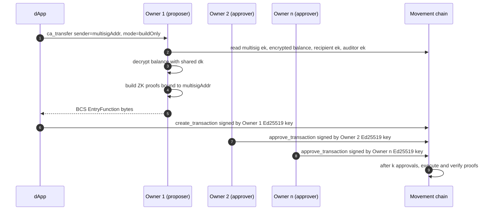

# Confidential Assets — Wallet Integration Design

> **Status:** Draft / proposal — for alignment before implementation.
>
> This document defines the **practical integration design** for confidential assets in the wallet: what the wallet needs to do, how the application talks to it, and the decisions we should settle before writing code.

---

## Table of contents

1. [Guiding principles](#guiding-principles)
2. [Trust boundary](#trust-boundary)
3. [Decryption key lifecycle](#decryption-key-lifecycle)
4. [Operation-by-operation design](#operation-by-operation-design)
   - [Register](#register)
   - [Deposit](#deposit)
   - [Withdraw](#withdraw)
   - [Confidential transfer](#confidential-transfer)
   - [Rollover & normalization](#rollover--normalization)
   - [Key rotation (not wallet-supported)](#key-rotation-not-wallet-supported)
5. [Wallet UX decisions](#wallet-ux-decisions)
6. [Hardware wallets](#hardware-wallets)
7. [Multisig accounts](#multisig-accounts)
8. [Auditor support](#auditor-support)
9. [Safety & loss-of-funds analysis](#safety--loss-of-funds-analysis)
10. [Wallet ↔ application interface](#wallet--application-interface)
11. [Application conformance rules](#application-conformance-rules)
12. [Open questions](#open-questions)

---

## Guiding principles

1. **The decryption key (`dk`) never leaves the wallet.** It has the same security posture as the Ed25519 signing key. Browser dApps must not derive, hold, or see it.
2. **Proof generation happens inside the wallet** for operations the wallet exposes. Every ZK proof for those flows (registration, transfer, withdraw, normalize) requires `dk`. Since `dk` stays in the wallet, proofs are built there too. **Key rotation** is **not** a wallet-supported operation here (see [Key rotation](#key-rotation-not-wallet-supported)); it would still require `dk` in a trusted environment if implemented elsewhere.
3. **The wallet owns rollover and normalization.** These are protocol bookkeeping that users should not think about. The wallet chains them automatically before spends.
4. **The application sends intents, not transactions.** The dApp says "transfer 50 tokens to Alice"; the wallet figures out whether it needs to rollover, normalize, build proofs, and submit.

---

## Trust boundary

```
┌────────────────────────────────────────────────────────────┐
│  Wallet (privileged process / extension background)        │
│                                                            │
│  - Ed25519 signing key                                     │
│  - TwistedEd25519PrivateKey (dk) - derived on demand, or   │
│    held in encrypted keystore (imported, multisig)         │
│  - ZK proof construction (registration, sigma, range)      │
│  - Balance decryption                                      │
│  - Transaction building, signing, submission               │
│  - Rollover / normalize orchestration                      │
│  - Auditor key lookup                                      │
│                                                            │
│  Exposes: ca_* dApp -> wallet API (tables below)           │
└──────────────────────────┬─────────────────────────────────┘
                           │ ca_register, ca_transfer, ...
                           │ (intents in, tx hashes out)
┌──────────────────────────▼─────────────────────────────────┐
│  Application (browser dApp)                                │
│                                                            │
│  - Token selection UI                                      │
│  - Recipient / amount input                                │
│  - Balance display (from wallet-decrypted values)          │
│  - Auditor address input (optional)                        │
│  - Transaction status / history                            │
│                                                            │
│  MUST NOT: hold dk, build proofs, call SDK directly        │
└────────────────────────────────────────────────────────────┘
```

**Normative location:** The `ca_*` method set is defined under [Method namespace](#method-namespace) in [Wallet ↔ application interface](#wallet--application-interface), not in a separate published document.

---

## Decryption key lifecycle

### Derivation (wallet-internal)

The wallet derives `dk` from existing root material the user already controls. It is never generated independently. The only persisted form is one or more user-imported standalone blobs held in the wallet's encrypted keystore for multi-owner CA custody — see the storage rule in [Security invariants](#security-invariants) below and [DK sharing among co-owners](#dk-sharing-among-co-owners).

| Account backing | Derivation | Reference |
|---|---|---|
| **Software wallet (mnemonic in extension)** | `TwistedEd25519PrivateKey.fromDerivationPath("m/44'/637'/0'/1'/{accountIndex}'", mnemonic)` — change index `1'` avoids collision with signing paths. | `twistedEd25519.ts:163` |
| **Hardware wallet (mnemonic on-device)** | `TwistedEd25519PrivateKey.fromSignature(deviceSign(message))` — extension asks the device to sign a wallet-hard-coded derivation message and reduces the signature mod L. Ed25519 is deterministic, so the same device + same message always yields the same `dk`. The mnemonic never leaves the device. | `twistedEd25519.ts:172`; recommended message at `twistedEd25519.ts:170` |

The derivation message used with `fromSignature` MUST be hard-coded in the wallet — never supplied by a dApp. Letting a dApp choose the signed payload allows it to coerce derivation of an arbitrary `dk` (phishing, wrong-`ek` registration). See [Wallet adapter integration](#wallet-adapter-integration).

### Security invariants

- `dk` is held in extension RAM only while the wallet is unlocked. On lock, the cached `dk` is zeroed along with the rest of the unlocked key material. For software-backed accounts the mnemonic is also zeroed; for hardware-backed accounts no mnemonic was in memory to begin with.
- `dk` bytes are never returned to any web origin and never logged.
- `dk` is stored at rest only in one of two forms: (a) **derivable on demand** from root key material the wallet already holds (the mnemonic for software-backed accounts; or, for hardware-backed accounts, re-obtained per unlock by asking the device to sign the hard-coded derivation message), or (b) a **user-imported standalone blob** in the encrypted keystore — same protections as imported Ed25519 signing keys, gated behind an explicit user import action. Form (b) exists only to support multi-owner CA custody (see [DK sharing among co-owners](#dk-sharing-among-co-owners)) and is never written by a dApp-callable code path.
- The **derivation policy** must stay stable across releases. For software-backed accounts that means the BIP-44 path and `accountIndex` rules; for hardware-backed accounts that means the exact bytes of the `fromSignature` derivation message. Changing either yields a different `dk` / `ek` and breaks existing registrations — document any change in wallet release notes.

### Decryption key scope: one `dk` per account

The wallet derives **one `dk` per account**, used as the encryption keypair for **every** CA registration that account makes. There is no per-asset `dk`. Reasoning:

- **Same threat model as the signing key.** Guiding principle 1 already treats `dk` as having the same security posture as the Ed25519 signing key. Wallets do not shard signing keys per asset; sharding `dk` per asset is inconsistent with that posture.
- **Front-running is already mitigated** at the protocol layer by the pending/actual balance split. It does not depend on per-asset key separation.
- **Rotation is per-`(user, token)` registration on-chain regardless.** Each registered asset has its own `ek` slot in the confidential store; rotating one registration does not affect the others, whether `dk` is shared or not. Per-asset keys multiply the number of independent rotation flows to manage; they do not reduce partial-failure surface.
- **Recovery is simpler.** With one `dk` per account, mnemonic recovery is equivalent to account recovery for that account's natively-derived `dk` — no need to enumerate which assets were ever registered. (Imported `dk` for multi-owner CA custody is recovered separately from the user's external hex backup; mnemonic recovery does not reproduce it. See [DK sharing among co-owners](#dk-sharing-among-co-owners).)
- **Per-asset isolation, when wanted, is achieved by using a separate account** (different `accountIndex`), exactly as users already isolate signing-key authority today.

The on-chain `confidential_asset` module permits reusing one encryption keypair across tokens; per-asset separation is a deployment choice, not a protocol requirement. Encryption keypairs are also independent of account signing keys — they are not derived from the Ed25519 scalar.

**Path structure recap.** The signing key lives at `m/44'/637'/0'/0'/{accountIndex}'`; `dk` lives at the sibling change branch `m/44'/637'/0'/1'/{accountIndex}'`. Same account, domain-separated by the BIP-44 change index — so `dk` is bound to the account but is **not** the same scalar as the signing key (which would conflate two cryptosystems on shared raw bytes).

---

## Operation-by-operation design

The tables in this section describe the default **`mode: "submit"`** flow, where the wallet signs and submits a transaction for its own account. For multisig CA operations the dApp passes `sender = <multisig account address>` and `mode: "buildOnly"`; the wallet stops at proof construction and returns BCS-encoded `EntryFunction` bytes instead of submitting (see [Multisig accounts](#multisig-accounts) and [Wallet ↔ application interface](#wallet--application-interface)).

### Register

**What happens:** The wallet registers an encryption key (`ek`) for a `(user, token)` pair on-chain, along with a ZK proof-of-knowledge that it holds the corresponding `dk`.

**Who does what:**

| Step | Actor |
|---|---|
| User clicks "Enable confidential balance" for a token | App |
| App calls `ca_register({ token })` | App → Wallet |
| Derive `dk`, compute `ek = dk.publicKey()` | Wallet |
| Generate registration proof (Schnorr ZKPoK) | Wallet |
| Build and sign `register(sender, token, ek, commitment, response)` | Wallet |
| Submit transaction, return tx hash | Wallet → App |

**Key point:** Registration is **wallet-only**. The dApp must never call `registerBalance` itself — it doesn't have `dk`.

### Deposit

**What happens:** Public fungible asset balance is moved into the confidential pending balance. The deposited amount is **public** on-chain.

| Step | Actor |
|---|---|
| User enters amount to deposit | App |
| App calls `ca_deposit({ token, amount })` | App → Wallet |
| Check if user is registered; if not, register first | Wallet |
| Build and sign `deposit(sender, token, amount)` | Wallet |
| Submit transaction, return tx hash | Wallet → App |

**Key point:** No `dk` needed for deposit itself, but the wallet should auto-register if the user hasn't already.

### Withdraw

**What happens:** Confidential balance is moved back to public fungible asset balance. The withdrawn amount is **public** on-chain. Requires a ZK proof that the remaining balance is non-negative.

| Step | Actor |
|---|---|
| User enters amount to withdraw | App |
| App calls `ca_withdraw({ token, amount })` | App → Wallet |
| Fetch on-chain actual balance; decrypt with `dk` | Wallet |
| If actual < amount but actual + pending ≥ amount: rollover (and normalize if needed) first | Wallet |
| Build sigma proof + range proof for new balance | Wallet |
| Sign and submit `withdraw(sender, token, amount, new_balance, zkrp, sigma)` | Wallet |
| Return tx hash | Wallet → App |

**Key point:** The wallet transparently handles the rollover-before-withdraw case via `withdrawWithTotalBalance`.

### Confidential transfer

**What happens:** Encrypted value moves from sender to recipient. The transfer amount is **hidden** on-chain. Requires sigma proof + two range proofs (new balance, transfer amount).

| Step | Actor |
|---|---|
| User enters recipient, amount, (optionally auditor addresses) | App |
| App calls `ca_transfer({ token, recipient, amount, auditorAddresses? })` | App → Wallet |
| Fetch sender's actual balance, decrypt with `dk` | Wallet |
| If actual < amount: rollover/normalize first | Wallet |
| Fetch recipient's `ek` from chain | Wallet |
| Fetch per-asset auditor `ek` for the token (if configured via `get_auditor`) | Wallet |
| Merge that auditor + any additional auditor keys from the request | Wallet |
| Build `ConfidentialTransfer` with proofs (sigma + 2× range) | Wallet |
| Sign and submit `confidential_transfer(...)` | Wallet |
| Return tx hash | Wallet → App |

**Key point:** The wallet manages all the complexity. The dApp just says "send X to Y."

### Rollover & normalization

**What happens:** Pending balance (from deposits and inbound transfers) is merged into the actual (spendable) balance. This is a **protocol-level bookkeeping** step — users should not have to think about it.

**Rollover requires normalization:** The chain enforces `normalized == true` before rollover. If it's `false`, the wallet must submit `normalize` first (which requires sigma + range proof using `dk`).

**Agreed approach: automatic rollover after every inbound transfer or deposit.**

While transaction fees remain low, the wallet should automatically rollover pending balances so the user never has to understand the pending/actual split. This also avoids normalization becoming a user-facing concept — if rollover happens promptly after each inbound operation, the balance stays in a clean state.

| Scenario | Wallet behavior |
|---|---|
| User sends a confidential transfer | After the transfer confirms, wallet auto-rollovers the **recipient's** pending balance (if the wallet controls the recipient account). |
| User receives an inbound transfer or deposit | Wallet detects pending > 0 and chains rollover (+ normalize if needed) automatically. |
| User wants to spend but actual < amount | Wallet chains rollover + normalize + spend in a single flow (via `transferWithTotalBalance` / `withdrawWithTotalBalance`). |
| Receive-only user (never sends) | Still needs rollover to make received funds spendable. The wallet should rollover on next balance fetch or on a background schedule. |

**Important edge case:** A user who only *receives* transfers and never sends will accumulate funds in pending that are not spendable until rolled over. The wallet must handle this — either by auto-rolling over when it detects pending > 0, or at minimum when the user attempts to spend or withdraw.

**The dApp should not need to know about normalization at all.** It is an internal protocol detail. The wallet should present a single combined balance to the user. If the wallet needs to show a brief "processing incoming funds" state while rollover transactions confirm, that is acceptable.

### Key rotation (not wallet-supported)

**On-chain protocol:** The `confidential_asset` module can replace a user's registered encryption key (`rotate_encryption_key`, with optional **`rotate_encryption_key_and_unfreeze`**). That typically involves old and new `dk` material, sigma/range proofs, and often **freezing** the confidential store so inbound transfers do not land mid-rotation—see the Move module and the SDK's `rotateEncryptionKey` builder for the full sequence.

**Motion Wallet scope:** Motion Wallet does **not** plan to support Ed25519 **signing key** rotation. For the same product scope, this integration treats **decryption key rotation as out of scope**: there is **no** wallet UI and **no** `ca_rotateEncryptionKey` (or similar) on the wallet ↔ dApp surface.

**Advanced users:** If you need same-account key rotation (e.g., suspected `dk` compromise), use the **Confidential Assets TypeScript SDK** (`@moveindustries/confidential-assets`) **directly** in an environment you trust—build transactions with `ConfidentialAsset` / `ConfidentialAssetTransactionBuilder` (e.g. `rotateEncryptionKey`) and submit them like any other custom script. That path is for **technical users** who can hold `dk` and follow the freeze/rotate/unfreeze rules themselves; it is **not** something this document promises from the wallet.

**Threat-model note: rotation only addresses `dk`-only compromise.** `rotate_encryption_key` re-encrypts in place under a new `ek` for a single registration. It is the right tool when **only `dk` is suspected to be exposed** while the Ed25519 signing key and mnemonic remain safe. **It is not** the right tool for the "lost device / lost backup" case, where the **mnemonic** is potentially exposed: in that scenario every key derivable from the mnemonic — signing key, `dk`, and any future per-account material — is compromised. The correct response is the same as for signing-key compromise: **generate a new account from a fresh mnemonic and confidentially-transfer balances out of the old one**, not rotate `dk` in place. Wallet UI should communicate this distinction clearly.

**Rotating across multiple registered assets.** Because rotation is per-`(user, token)` registration on-chain, an advanced user who has registered `ek` for several assets and wants to rotate all of them must submit one rotation flow per asset. SDK-side helpers (e.g., a `rotateEncryptionKeyAll` convenience that loops over the user's registered assets) **must be resumable and idempotent per asset**: if rotation succeeds for assets `A` and `B` but fails for `C`, re-running the helper must pick up at `C` without retrying `A`/`B`. A natural implementation is: enumerate registered assets, check whether each registration's on-chain `ek` already matches the new key, and skip the ones that do.

**dApps:** Do not rely on the wallet to perform or orchestrate key rotation.

---

## Wallet UX decisions

### Balance visibility

Confidential balances should be **shown by default** as a separate line item beneath the regular asset — not hidden behind a toggle or special mode. "Confidential" refers to **on-chain privacy**, not visual hiding from the user. If a user has a shielded MOVE balance, it should appear as a distinct entry (e.g., "Shielded MOVE") below their regular MOVE balance. There is no need for the user to hide their own CA balance from themselves.

### Rollover is invisible to the user

The user should never see "pending balance" or "normalization" as concepts. The wallet auto-rollovers (see [above](#rollover--normalization)), so the displayed balance is always the combined spendable amount. During the brief window where rollover transactions are confirming, the wallet may show a subtle "processing incoming funds" indicator, but should not require user action.

### Spam token handling

For well-known assets (MOVE, USDC, WETH, WBTC, etc.), auto-rollover should happen unconditionally. For unknown or low-value tokens, the wallet may prompt the user before rolling over, to avoid accepting spammy assets automatically. This is an enhancement for later — v1 can auto-rollover everything.

---

## Hardware wallets

Motion Wallet can back a single account with a hardware device (e.g. Ledger) and still expose the `ca_*` interface. Because the mnemonic stays on-device, the extension cannot run `fromDerivationPath`; it derives `dk` via `fromSignature` instead — see [Decryption key lifecycle](#decryption-key-lifecycle). The natively-derived `dk` is re-derived from a fresh device signature each time the wallet unlocks; it is not persisted at rest. (A hardware-backed wallet that has additionally imported a `dk` for multi-owner CA custody persists that imported `dk` in its encrypted keystore — see [Security invariants](#security-invariants).)

**What this protects.** The Ed25519 signing key stays on the device. An extension compromise cannot move funds via standard transactions or sign multisig approvals; the user has to press the device button.

**What it does not protect.** `dk` lives in extension RAM whenever a CA operation runs (decrypting balances, building proofs). An extension compromise during that window leaks balance privacy and lets the attacker construct valid CA proofs against the user's `ek`. Those proofs still require a device button-press to execute on chain, so funds remain safe; **privacy** is lost. Wallet UI for hardware-backed accounts must not represent confidential balances as device-protected.

**Requires.** The device's chain app must expose deterministic message-signing for arbitrary fixed bytes. Without that capability, CA cannot run against that hardware backing.

**Future path.** Device-side Ristretto and bulletproof support (chain app extension) would move `dk` and proof construction on-device, closing the privacy gap above.

---

## Multisig accounts

A multisig account is a resource account: it holds funds but has no private key, so a multisig account cannot run `fromDerivationPath` itself. CA proofs for multisig CA operations must bind to the multisig account's address — the SDK's Fiat–Shamir transcript includes `senderAddress` (see `src/crypto/fiatShamir.ts`), and proofs built against any other address abort on chain.

### Data ownership

For a k-of-n multisig CA account, each co-owner's wallet holds the same kinds of material it would for a single-owner account — the one thing *shared* across owners is `dk`, the encryption keypair for the multisig account itself. Nothing else crosses owner boundaries.

| Held by | Material | How it's obtained | Used for |
|---|---|---|---|
| Each owner (private to that owner) | Owner's mnemonic / device | Generated at wallet setup | Producing that owner's Ed25519 signatures on multisig proposals |
| Each owner (private to that owner) | Owner's personal Ed25519 signing key | Derived from owner's mnemonic / device | Approving or rejecting multisig proposals on chain |
| Every owner (shared, identical bytes) | Multisig account's `dk` (32 bytes) | Derived once by the designated owner; exported and imported by co-owners (see [DK sharing](#dk-sharing-among-co-owners)) | Decrypting the multisig account's CA balances; building CA proofs against the multisig address |
| On chain (public) | Multisig account address, owner set, threshold `k` | Set when the multisig account is created | Authorizing transactions: any submitted tx requires k-of-n owner approvals |
| On chain (public) | Multisig account's `ek` (encryption key) | Registered via the first multisig CA proposal | Letting senders encrypt CA transfers to this multisig recipient |
| On chain (public, encrypted) | Multisig account's CA balances (`pending_balance`, `actual_balance`) ciphertexts under `ek` | Updated by every CA op the multisig executes | Source of truth for confidential balances |

### Transfer flow — actions and data

A confidential transfer **out of** a multisig CA account has two phases: off-chain proof construction (one owner, with `dk`) and on-chain k-of-n approval (every owner, with their personal Ed25519 key only).



Key properties of this split:

- **Only the proposer needs `dk` *for that proposal*.** Approvers verify on-chain semantics (recipient, amount-as-ciphertext, auditor inclusion, proposal hash) using their wallet UI; they don't re-run proof construction. They still hold `dk` so that *any* of them can be a future proposer, and so they can decrypt balances to audit the account locally.
- **Approvers' Ed25519 keys never touch `dk`.** A compromise of an approver's wallet at approval time risks one signature on one proposal — same blast radius as a non-CA multisig.
- **Proofs are not aggregated across owners.** There is one set of ZK proofs per proposal, built by the proposer. Aggregation across approvers would only be meaningful if each approver held a *share* of `dk` — see [Algorithm choice](#algorithm-choice) below.

### Wallet API requirements

A CA-aware wallet supports multisig CA operations by accepting two extra parameters on every `ca_*` write method:

- **`sender?: string`** — the address bound into the Fiat–Shamir transcript. Defaults to the wallet's own account; for multisig CA operations the dApp passes the multisig account's address. Without this, every proof is implicitly bound to the wallet account and aborts when executed by the multisig account.
- **`mode?: "submit" | "buildOnly"`** — in `buildOnly` mode the wallet returns BCS-encoded `EntryFunction` bytes instead of submitting. The dApp wraps the bytes in `MultiSigTransactionPayload` and proposes via `multisig_account::create_transaction`.

A request with `sender` set to anything other than the wallet's own account address MUST also set `mode: "buildOnly"`. The wallet has no key for the multisig account and cannot sign a transaction with a non-wallet sender; the wallet MUST reject `{ sender: <other>, mode: "submit" }` requests.

With those in place the dApp builds no proofs and holds no `dk`: the wallet builds proofs against the multisig account's address, returns the entry function bytes, and the dApp proposes it through the standard multisig flow. Approval and execution paths require no `dk` and are unchanged.

### DK sharing among co-owners

`dk` is per-account material derived inside one owner's wallet — by `fromDerivationPath` for software-backed accounts or `fromSignature` for hardware-backed accounts — and cannot be reproduced by any other co-owner from their own wallet alone. Multi-owner CA custody therefore requires sharing `dk`:

1. One designated owner derives `dk` normally in their wallet.
2. They register the corresponding `ek` against the **multisig account's** address on-chain (via a multisig proposal).
3. They export the 32-byte `dk` hex from their wallet UI and share it with co-owners through a secure out-of-band channel (e.g. 1Password).
4. Co-owners import the hex into their wallets.

After that, every co-owner's wallet can build proofs for multisig CA operations.

This export/import pattern is a **narrow carveout to [Principle 1](#guiding-principles)**, permitted only:

- Behind an explicit, user-initiated wallet UI action with a clear warning and a typed confirmation.
- Never via a dApp-callable method on the `ca_*` interface — there is no `ca_exportDk`, no `ca_importDk`. The dApp cannot ask the wallet for `dk` bytes; only the user can.

**Threat model.** If the shared `dk` hex leaks (compromised password manager, screenshot, etc.), the multisig account's **privacy** is lost: the attacker can decrypt its confidential balances and observe transfer amounts. The multisig account's **funds** remain safe — moving funds still requires k-of-n owner Ed25519 signatures on the multisig proposal, which `dk` alone cannot produce. The shared 32-byte hex is a one-way function of the originating owner's root key material in both `fromDerivationPath` and `fromSignature`, so leaking the hex never leaks the mnemonic or device key.

### Recovery from a shared `dk` leak

If the shared `dk` hex leaks (one co-owner's password manager is compromised, the import dialog is screenshotted, etc.), the recovery path is to rotate to a fresh `dk` / `ek` pair against the **same** multisig address. Funds never have to move — only the encryption key registered against the multisig changes.

Two layers to keep separate:

- **Cryptographically**, `dk` is a 32-byte scalar with no address baked in. Any owner can generate a fresh `dk'` from any source.
- **By virtue of registration**, the *currently registered* `dk` / `ek` pair is the one that decrypts the multisig's on-chain balance and the one proofs verify against. A fresh `dk'` alone does not decrypt anything until its `ek'` is registered and the existing balance is re-encrypted under it. That re-encryption is what `rotate_encryption_key` does in a single Move call.

**Rotation flow (out of band of this wallet design):**

1. One owner generates a fresh `dk'` and computes `ek'`.
2. They use **`@moveindustries/confidential-assets`** (`ConfidentialAsset` / `ConfidentialAssetTransactionBuilder.rotateEncryptionKey`) to build a `rotate_encryption_key` entry function bound to the multisig address. The builder needs the current `dk` (still held by the proposer) and the new `dk'`; it emits the sigma + range proofs that re-encrypt the on-chain balance from `ek` to `ek'`.
3. The bytes are wrapped in a `MultiSigTransactionPayload` and proposed via `multisig_account::create_transaction`. Co-owners approve with their Ed25519 keys; once k-of-n is reached, anyone executes.
4. After execution, `ek'` is the registered key for the multisig and the old `dk` no longer matches. The proposer exports `dk'` and re-shares it to co-owners over the same out-of-band channel used for initial setup.

**What is and isn't covered:**

- **Funds are safe throughout.** Rotation does not move balances or transfer ownership; it re-encrypts in place. `dk` cannot produce Ed25519 signatures, so even during the leak window the attacker cannot drain the multisig.
- **Past privacy is lost.** Balance ciphertexts the attacker observed and decrypted before rotation stay decrypted to them. Rotation closes the going-forward window only.
- **Mnemonic compromise is a different incident.** If the leak is the originating owner's *mnemonic* (not just the exported `dk` hex), every key derivable from that mnemonic is suspect and rotation in place is not sufficient — see the threat-model note in [Key rotation](#key-rotation-not-wallet-supported). Move funds to a fresh multisig with fresh owner keys.
- **Wallet UI does not expose this.** Consistent with [Key rotation (not wallet-supported)](#key-rotation-not-wallet-supported), Motion Wallet does not provide a `ca_rotateEncryptionKey` method or a UI flow. The path runs through the SDK in a trusted environment, then through the standard multisig proposal UI.

### Treasury-scale balances

Users with large balances should keep the bulk in a **normal (non-CA) cold or multisig account** and only top up a CA hot account (or CA multisig account) as needed for confidential transfers. The cold account uses standard Ed25519 custody with no privacy posture to defend; the CA account is sized to recent activity, so a privacy compromise has bounded blast radius.

### Algorithm choice

Multi-owner CA custody could in principle be built several ways. They are not equivalent in security, and most are not viable for this protocol as it stands. Listing them so the trade-offs are explicit before we lock the design in code:

| Approach | What each owner holds | How proofs are produced | Privacy if one owner's wallet is compromised | Funds if one owner's wallet is compromised | Viable today? |
|---|---|---|---|---|---|
| **Shared-`dk`** (this design) | Identical 32-byte `dk` + own Ed25519 key | One proposer builds the full proof set with `dk`; approvers add Ed25519 sigs only | **Lost** for this account (attacker has `dk`) | Safe — still needs k-of-n Ed25519 | **Yes** — works against the deployed Move modules with no protocol change |
| **Per-owner separate `dk`** (re-encrypt to all owners) | Their own `dk`; transfers carry one ciphertext per owner | Proposer builds proofs against multiple `ek`s; on-chain verifier checks all | Privacy lost only for the compromised owner's view; others retain it | Safe | **No** — current Move modules store one `ek` per account; would require protocol changes and breaks per-asset auditor accounting |
| **Threshold ElGamal + threshold ZK** (true MPC) | A *share* of `dk`; no owner can decrypt alone | k owners run an interactive MPC to jointly decrypt and to build a proof; output is a single, indistinguishable proof | **Preserved** — attacker holds one share, below threshold | Safe | **No** — needs threshold-ElGamal-aware Move verifier, threshold-friendly Bulletproofs/Sigma, and a multi-round MPC channel between wallets. Substantial protocol + wallet work |
| **Trusted-coordinator service** (one server holds `dk`, owners auth to it) | Their own Ed25519 key; auth token to coordinator | Coordinator builds proofs on owners' behalf | Lost if coordinator is compromised — single point of failure outside the wallet trust boundary | Safe (still k-of-n on chain) | Possible to build, **but rejected** — violates [Principle 1](#guiding-principles): `dk` must not leave the wallet, let alone live on a shared server |

**Reasons why shared-`dk` is optimal for v1:**

- It is the **only option** that runs against the existing on-chain modules without protocol changes.
- The privacy degradation is *bounded and explicit*: the user types a confirmation to import the hex, and we document that this account's privacy is now equivalent to the weakest co-owner's wallet hygiene. This is the same trust boundary co-owners already accept for non-CA multisig (any one owner can phish-leak the account address, observed activity, etc.); we are extending that boundary to "and balance amounts."
- Funds remain safe under the stronger guarantee — `dk` cannot produce Ed25519 signatures, so leaking `dk` cannot move money. This is the property that matters most to most users; privacy being best-effort with a clear threat model is acceptable.
- The wallet API surface (`sender` + `mode: "buildOnly"`) is independent of the multi-owner key scheme: if we move to threshold CA later, the same dApp-facing interface keeps working — only the wallet-internal proof construction changes.

The threshold approach is the right end-state. Shipping it requires Move-side changes plus an MPC protocol between wallets; both are out of scope for this wallet integration nor would they be advantageous as shared-dk is secure provided that the dk is shared securely eg with 1-Password. 

### Future path

Threshold CA — per-owner secret shares of `dk`, threshold ElGamal decryption, threshold proof construction — removes the DK-sharing step entirely. Protocol-level work, not a wallet feature.

---

## Auditor support

### Two kinds of auditors

The on-chain protocol supports **auditors** — third parties who receive encrypted copies of transfer amounts under their own encryption keys. There are two distinct sources:

1. **Per-asset (primary) auditor:** One optional auditor encryption key is stored **on-chain** per fungible asset. It is **installed or updated only by the framework account** (`set_auditor` in Move — i.e. **network / governance**, not a user's or "issuer's" wallet). The SDK reads it with `get_auditor(token)`. When set, senders must include that auditor in the transfer; it sees every confidential transfer for that asset.

2. **Per-transfer (voluntary) auditors:** The sender can include **additional** auditor encryption keys at transfer time. These are **not** stored on-chain — they only appear in the transaction data and the emitted `Transferred` event. They are useful for compliance, personal accounting, or regulated counterparties.

### What the wallet needs to do

- **Always include the per-asset auditor** if one is configured for the token (the SDK handles this automatically when building `ConfidentialTransfer`).
- **Accept optional additional auditor keys** from the dApp or user via the transfer request.
- **Build encrypted copies** of the transfer amount for each auditor key (handled by the SDK — each auditor gets the transfer amount encrypted under their `ek`, plus `D` components bound into the sigma proof's Fiat-Shamir transcript).
- **Let users view** which per-asset auditor is configured for a given token.

### What the dApp can do

- **Display** the configured per-asset auditor, if any: the [`ca_getAuditor`](#read-methods) read in [Wallet ↔ application interface](#wallet--application-interface) corresponds to the on-chain `get_auditor` view. The per-asset auditor `ek` is **public** chain state; showing it in the UI is for transparency and does not expose a value the user is expected to keep secret.
- **Let users enter or select additional auditor addresses** to include in a transfer. The dApp passes these to `ca_transfer`; the wallet builds the encrypted auditor copies.
- **Enterprise/compliance dApps** may show dashboards and policy labels per asset. **Changing** the on-chain per-asset auditor is **governance / framework** (`set_auditor`) — not a capability exposed to dApps or typical asset / FA accounts.

### Proposed `ca_transfer` request shape with auditor support

```ts
{
  token: string;           // FA metadata address
  recipient: string;       // recipient account address
  amount: string;          // transfer amount (decimal string or bigint-compatible)
  auditorAddresses?: string[];  // optional per-transfer auditor encryption keys (hex)
  senderAuditorHint?: string;   // optional opaque metadata (max 256 bytes, bound into proof)
}
```

### Auditor epoch (future consideration)

An `auditor_epoch` field on the confidential store would let senders tell whether their cached per-asset auditor key is current and refuse to encrypt to a stale one. This is a potential on-chain enhancement; the wallet would read the epoch alongside `get_auditor` and refresh on mismatch.

---

## Safety & loss-of-funds analysis

Every CA scenario must be validated to ensure it does not lead to loss of funds or irrecoverable states. The following table enumerates the known risk scenarios and their mitigations.

### Decryption key risks

| Scenario | Impact | Mitigation |
|---|---|---|
| **dk lost** (wallet uninstalled, mnemonic lost) | Funds remain on-chain but cannot be spent or withdrawn — effectively frozen forever. The Ed25519 signing key is not compromised. | Same mnemonic backup story as the signing key for natively-derived `dk`: mnemonic recovery restores both signing and CA decryption capability. Imported `dk` (multi-owner CA custody) is **not** covered by mnemonic recovery — the user must independently retain the imported hex (e.g., 1Password). Wallet UI should communicate both. |
| **dk derived differently after restore** (derivation policy changed, different wallet software) | Restored `dk` does not match the registered `ek` — same as key loss. | Wallets must use a stable, documented derivation policy: BIP-44 path and `accountIndex` rules for software-backed accounts; exact `fromSignature` message bytes for hardware-backed accounts. Wallet version notes must flag any change. |
| **dk compromised** (malware, leaked) | Attacker can decrypt all balances and construct valid proofs. Combined with a compromised Ed25519 key, attacker can transfer funds. `dk` alone cannot sign transactions. | Prefer moving funds to a **new account** with fresh keys when possible. On-chain **`rotate_encryption_key`** can re-encrypt in place, but **Motion Wallet does not expose rotation**—use **`@moveindustries/confidential-assets`** directly if you must rotate without a wallet UI. |
| **Wrong `ek` registered** (registered from a key not held by the user's wallet) | Wallet cannot decrypt or spend — same as key loss for that `(account, token)` pair. | Registration is wallet-only; the dApp cannot register an arbitrary `ek`. The wallet always derives and registers its own key. |

### Operational risks

| Scenario | Impact | Mitigation |
|---|---|---|
| **Rollover not performed** | Pending funds are not spendable. User sees a balance but cannot transfer or withdraw it. | Wallet auto-rollovers (see [rollover design](#rollover--normalization)). The SDK's `WithTotalBalance` methods also chain rollover before spends. |
| **Normalization skipped before rollover** | Rollover aborts with `ENORMALIZATION_REQUIRED`. Gas spent, no state change. | Wallet must check `is_normalized` before rollover and chain `normalize` first if needed. The SDK handles this internally. |
| **Wrong recipient address** | Confidential transfer is irreversible. Amount is hidden on-chain, but it is sent to the wrong party. | Standard address validation UX. No CA-specific mitigation beyond what exists for normal transfers. |
| **Wrong token metadata address** | Transaction fails, or wrong asset is moved. | Wallet should resolve token identifiers to FA metadata addresses and display the asset name for user confirmation. |
| **Transaction submitted with stale balance view** | Proof built against outdated ciphertext; chain rejects. Gas spent, no state change. | SDK fetches fresh views before proof construction. Wallet should not cache aggressively for proof-building paths. |
| **Multi-tx flow partially fails** (e.g., normalize succeeds but rollover fails) | State is partially updated — subsequent retries should work since the successful steps are idempotent in their end state. | Wallet should handle partial failure gracefully: detect current state and resume from where it left off rather than replaying the entire sequence. |

### Protocol constraints

| Scenario | Impact | Mitigation |
|---|---|---|
| **Frozen store** (e.g. frozen for rotation or protocol reasons) | Inbound transfers rejected until unfrozen. | Wallet UI should show **frozen** clearly. Motion Wallet **does not** run freeze → rotate → unfreeze; if the user froze or rotated via **`@moveindustries/confidential-assets`** (or another tool), they must complete recovery there or move funds per protocol rules. |
| **Allow list / token disabled** | Deposits and transfers may abort. Withdrawals may still work. | Wallet should check token status before building transactions and surface clear errors. |
| **Pending counter overflow** (too many inbound operations before rollover) | Further deposits and transfers to this account are rejected. | Auto-rollover after each inbound operation prevents this from accumulating. |

---

## Wallet ↔ application interface

### Method namespace

**Identifier convention.** Methods in the tables below are named with the prefix `ca_` (confidential assets). They denote the **dApp–wallet interface**: request/response operations invoked from a web application on a wallet or wallet adapter. They are **not** exports of the TypeScript SDK; wallet support for each method is **implementation-defined** until a release documents conformance.

**Normative reference.** The read and write method tables in this section are the **definitive** list of `ca_*` names and shapes referenced elsewhere in this document.

**Mapping to the chain and SDK.** Implementations of these entry points call the confidential-asset module's Move `view` and `entry` functions as required. For example, the per-asset auditor is read via the on-chain `get_auditor` view. The package `@moveindustries/confidential-assets` provides the corresponding API for **trusted (non-browser) code** as `ConfidentialAsset.getAssetAuditorEncryptionKey`.

### Read methods

| Method | Request | Response | Notes |
|---|---|---|---|
| `ca_getBalances` | `{ tokens: string[] }` | `{ balances: { token, registered, available, pending }[] }` | Wallet decrypts; dApp sees plaintext numbers only |
| `ca_isRegistered` | `{ token }` | `{ registered: boolean }` | No `dk` needed |
| `ca_getEncryptionKey` | `{ token }` | `{ encryptionKey: string }` | Public key — safe to return |
| `ca_getAuditor` | `{ token }` | `{ auditorEncryptionKey?: string }` | Optional per-asset auditor; corresponds to on-chain `get_auditor` / SDK `getAssetAuditorEncryptionKey` — omit or empty if no auditor is configured |

### Write methods

| Method | Request | Response | Notes |
|---|---|---|---|
| `ca_register` | `{ token, sender?, mode? }` | `{ txHash }` or `{ entryFunctionBcs }` | Wallet derives dk, builds proof, submits (or returns BCS bytes if `mode: "buildOnly"`) |
| `ca_deposit` | `{ token, amount, sender?, mode? }` | `{ txHash }` or `{ entryFunctionBcs }` | Auto-registers if needed |
| `ca_withdraw` | `{ token, amount, sender?, mode? }` | `{ txHash }` or `{ entryFunctionBcs }` | Auto-rollover/normalize if needed |
| `ca_transfer` | `{ token, recipient, amount, auditorAddresses?, senderAuditorHint?, sender?, mode? }` | `{ txHash }` or `{ entryFunctionBcs }` | Auto-rollover/normalize if needed |
| `ca_rolloverPending` | `{ token, sender?, mode? }` | `{ txHash }` or `{ entryFunctionBcs }` | Explicit rollover; auto-normalizes if needed |

**`sender`** defaults to the wallet's own account address. Pass an explicit value (e.g. a multisig account address) when the executing signer is not the wallet account; the value is bound into the proof's Fiat–Shamir transcript and must match the executor at chain-verification time. A non-default `sender` requires `mode: "buildOnly"` — the wallet cannot sign a transaction on behalf of an account whose key it does not hold.

**`mode`** defaults to `"submit"`. `"buildOnly"` returns BCS-encoded `EntryFunction` bytes (which the dApp wraps in `MultiSigTransactionPayload`) instead of submitting a transaction. See [Multisig accounts](#multisig-accounts).

### Return values

- **Transaction hashes** (and optionally structured event data after confirmation).
- **Decrypted balances** via `ca_getBalances`.
- The dApp **must not** receive: `dk`, proof material, raw ciphertext, or any data from which the decryption key could be derived.

### Wallet adapter integration

The wallet adapter (`@moveindustries/wallet-adapter-react`) provides `useWallet()` with generic methods (`signAndSubmitTransaction`, etc.). For CA, the adapter should expose **thin wrapper functions** that:

1. **Feature-detect** whether the connected wallet supports `ca_*` methods.
2. **Forward** requests/responses without bundling any CA SDK or proof logic.
3. **Report unsupported** if the wallet doesn't implement the CA surface, so the dApp can degrade gracefully.

Example (conceptual):

```ts
const { caTransfer, caGetBalances, caGetAuditor, caSupported } = useConfidentialAssets();

if (!caSupported) {
  // show "wallet does not support confidential assets"
}

const balances = await caGetBalances({ tokens: [tokenAddress] });
const { auditorEncryptionKey } = await caGetAuditor({ token: tokenAddress }); // optional: display only
const { txHash } = await caTransfer({ token, recipient, amount: "100" });
```

This is **not** the same as running the `ConfidentialAsset` SDK in the browser — these are RPC calls to the wallet.

The adapter **must not** offer a generic "sign arbitrary bytes for CA" hook. When the wallet derives `dk` via `fromSignature` (the supported path for hardware-backed accounts — see [Decryption key lifecycle](#decryption-key-lifecycle)), the signed payload must be **fixed by the wallet**, not supplied by the dApp — otherwise phishing or wrong-`ek` registration is possible. Software-backed accounts use `fromDerivationPath` from the mnemonic and never sign anything for derivation.

### Token addressing

All `ca_*` methods that take a `token` parameter must use the **fungible asset metadata object address** (32-byte FA metadata). Legacy coin type strings (the `0x1::module::CoinType` form) must not be used.

---

## Application conformance rules

Browser dApps integrating with confidential assets must follow these rules:

| ID | Rule |
|---|---|
| A1 | dApps must not hold the user's Ed25519 signing private key. `ek` registration is **wallet-only** via `ca_register`. |
| A2 | dApps must not obtain, derive, or hold `TwistedEd25519PrivateKey` in the dApp process. They must not run the CA SDK for proof construction or balance decryption in page JavaScript. They must use `ca_*` methods for all CA operations, including multisig CA operations (which use the `sender` and `mode: "buildOnly"` parameters — see [Multisig accounts](#multisig-accounts)). |
| A3 | dApps must not persist, log, or forward CA decryption key material. They must not ask the wallet to export `TwistedEd25519PrivateKey` to the page. |
| A4 | dApps must not derive `TwistedEd25519PrivateKey` in the page (`fromDerivationPath`, `fromSignature`, or otherwise). CA key derivation is wallet-internal. |
| A5 | dApps must pass FA metadata addresses for `token` (see [token addressing](#token-addressing)). |
| A6 | Deposit and withdraw amounts are public on-chain; dApps must not imply that confidential transfer amounts are visible. |

---

## Resolved decisions

| # | Decision | Resolution |
|---|---|---|
| 1 | **Rollover strategy** | **Automatic after each inbound transfer/deposit** while fees are low. This avoids exposing "pending balance" as a user concept and avoids normalization being user-visible. |
| 2 | **Balance visibility** | **Show confidential balances by default** as a separate asset row (e.g., "Shielded MOVE" below "MOVE"). Confidential means on-chain privacy, not hiding from the user's own display. |
| 3 | **Normalization** | **Never user-facing.** If auto-rollover happens after each inbound operation, normalization is handled transparently. Even if it is needed, the wallet chains it internally before rollover. |
| 4 | **Auditor model** | One **optional per-asset auditor** (governance-set via `set_auditor`) plus **optional per-transfer auditors** chosen by the sender. Both must be supported by the wallet. |
| 5 | **Encryption key rotation** | **Not supported in Motion Wallet** (aligned with no Ed25519 signing-key rotation in product). On-chain rotation remains available via **`@moveindustries/confidential-assets`** for advanced users. |

---

## Open questions

These should be resolved before implementation:

| # | Question | Options | Notes |
|---|---|---|---|
| 1 | **Should `ca_deposit` auto-register?** | (a) Yes — seamless. (b) No — require explicit `ca_register` first. | Auto-register is better UX; two transactions (register + deposit) can be sequenced by the wallet. |
| 2 | **Auditor address UX** | (a) Per-transfer entry only. (b) Wallet-managed address book. (c) dApp provides a list, wallet confirms. | For v1, (a) or (c) is likely sufficient. An enterprise dashboard for managing auditors per asset is a separate concern. |
| 3 | **Auditor epoch** | Should the on-chain module track an auditor epoch to prevent stale auditor keys? | Needs on-chain changes; out of scope for the wallet itself. |
| 4 | **Error reporting granularity** | What does the dApp see when rollover fails, normalization fails, proof generation fails, or the chain rejects? | Wallet should map internal failures to meaningful dApp-facing errors without leaking protocol internals. |
| 5 | **Multi-transaction flows** | When withdraw requires rollover + normalize + withdraw (3 txs), does the wallet handle all three silently, or notify the dApp of intermediate steps? | Recommend silent chaining with a single response for the final operation. |
| 6 | **Concurrent operations** | Can a dApp fire `ca_transfer` while a `ca_rolloverPending` is in flight? | Wallet should serialize CA operations per account/token to avoid on-chain race conditions. |
| 7 | **Spam token rollover** | Should the wallet auto-rollover unknown/low-value tokens, or prompt the user first? | For v1, auto-rollover everything. Spam filtering is an enhancement for later. |

---

*Once the open questions above are resolved, the implementation plan follows from the operation tables.*
