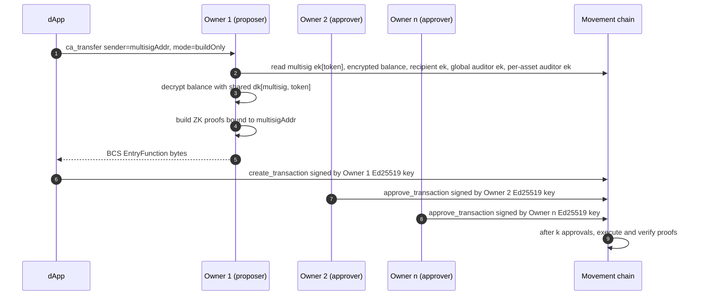

# Confidential Assets — Wallet Integration Design

> **Status:** Draft proposal, pending alignment before implementation.
>
> This document specifies the integration design for confidential assets in the wallet: the responsibilities of the wallet, the dApp–wallet protocol, and the design decisions that govern both.

---

## Table of contents

1. [Guiding principles](#guiding-principles)
2. [Trust boundary](#trust-boundary)
3. [Decryption key lifecycle](#decryption-key-lifecycle)
4. [Operation-by-operation design](#operation-by-operation-design)
   - [Register](#register)
   - [Deposit](#deposit)
   - [Withdraw](#withdraw)
   - [Confidential transfer](#confidential-transfer)
   - [Rollover & normalization](#rollover--normalization)
   - [Key rotation (not wallet-supported)](#key-rotation-not-wallet-supported)
5. [Wallet UX decisions](#wallet-ux-decisions)
6. [Hardware wallets](#hardware-wallets)
7. [Multisig accounts](#multisig-accounts)
8. [Auditor support](#auditor-support)
9. [Safety & loss-of-funds analysis](#safety--loss-of-funds-analysis)
10. [Wallet ↔ application interface](#wallet--application-interface)
11. [Application conformance rules](#application-conformance-rules)
12. [Open questions](#open-questions)

---

## Guiding principles

1. **Decryption keys are wallet-custodied.** Each decryption key (`dk`) has the same security posture as the Ed25519 signing key: stored in the encrypted keystore, used in-process for proof construction, and disclosed outside the wallet only through an explicit, user-initiated export flow — the same affordance the wallet provides for exporting an Ed25519 signing key. dApps, web origins, and the wallet adapter do not receive `dk` bytes under any code path. There is no programmatic export and no implicit sharing across origins.
2. **Per-asset `dk` isolation.** The wallet derives, stores, and uses a distinct `dk` for every `(account, token)` pair. There is no shared per-account `dk`. Compromise or export of one asset's `dk` reveals only that asset's confidential balance and history and carries no information about any other asset's `dk` or balance.
3. **Proof generation occurs inside the wallet** for the operations the wallet exposes. Every ZK proof in those flows (registration, transfer, withdraw, normalize) requires the `dk` for the specific asset being acted on; because each `dk` remains in the wallet, proofs are constructed there as well. Key rotation is not a wallet-supported operation (see [Key rotation](#key-rotation-not-wallet-supported)); rotation performed elsewhere would also require the relevant per-asset `dk` in a trusted environment.
4. **Rollover and normalization require explicit user authorization.** Rollover and normalization are protocol-level bookkeeping operations, but they are also on-chain transactions that incur gas and alter the account state. The wallet does not initiate them on its own. The wallet surfaces a pending balance, presents a clearly labelled action ("Accept incoming funds" or equivalent), and submits the rollover transaction (chaining normalization where required) only when the user authorises it. This boundary is deliberate. A wallet that initiates on-chain transactions without explicit user authorisation could be construed, in some jurisdictions, as an agent executing transactions on the user's behalf, with associated implications for money-transmission and payment-services regulation. Keeping rollover user-initiated preserves the wallet's posture as a tool the user controls, rather than an agent acting on the user's behalf.
5. **The application expresses intents; the user authorises every transaction.** The dApp expresses an action (for example, "transfer N tokens to address `R`"); the wallet selects the appropriate per-asset `dk`, fetches the necessary on-chain state, computes any required rollover and normalization steps, and constructs the proofs. Each on-chain transaction — including rollover, normalization, deposit, withdraw, and confidential transfer — is submitted only after the user reviews and confirms it through the wallet UI. The wallet does not auto-submit transactions on the dApp's or the protocol's behalf.

---

## Trust boundary

```
┌────────────────────────────────────────────────────────────┐
│  Wallet (privileged process; e.g. browser-extension        │
│  background context)                                       │
│                                                            │
│  - Ed25519 signing key                                     │
│  - Per-asset TwistedEd25519PrivateKey (dk[token]) -        │
│    one per (account, token); derived on demand, or held    │
│    in encrypted keystore (imported, multisig). Each        │
│    entry is encrypted and exportable on the same footing   │
│    as an Ed25519 signing key.                              │
│  - ZK proof construction (registration, sigma, range) —    │
│    each proof loads only the dk for the asset being acted  │
│    on; other dks stay sealed.                              │
│  - Balance decryption                                      │
│  - Transaction building and signing; submission only       │
│    after explicit user confirmation in the wallet UI       │
│  - Rollover / normalize orchestration (requires explicit   │
│    user authorisation per submission; not auto-initiated)  │
│  - Auditor key lookup (chain-level global, per-asset,      │
│    and per-transfer voluntary)                             │
│                                                            │
│  Exposes: ca_* dApp -> wallet API (tables below)           │
└──────────────────────────┬─────────────────────────────────┘
                           │ ca_register, ca_transfer, ...
                           │ (intents in, tx hashes out)
┌──────────────────────────▼─────────────────────────────────┐
│  Application (browser dApp)                                │
│                                                            │
│  - Token selection UI                                      │
│  - Recipient / amount input                                │
│  - Balance display (from wallet-decrypted values)          │
│  - Auditor address input (optional)                        │
│  - Transaction status / history                            │
│                                                            │
│  MUST NOT: hold dk, build proofs, call SDK directly        │
└────────────────────────────────────────────────────────────┘
```

The normative definition of the `ca_*` method set is in [Method namespace](#method-namespace) under [Wallet ↔ application interface](#wallet--application-interface). No separate published document defines these methods.

---

## Decryption key lifecycle

### Scope: one `dk` per `(account, token)`

The wallet maintains a separate `dk` for every `(account, token)` pair the account has registered. There is no per-account `dk`. Specifically:

- An account that has registered confidential balances for `n` tokens holds `n` distinct `dk` values in its keystore, denoted `dk[token₁], dk[token₂], …, dk[tokenₙ]`. Each is a 32-byte Ristretto scalar with no algebraic relationship to the others or to the account's Ed25519 signing key.
- The on-chain `ek` slot for each `(account, token)` registration is the public key of that asset's `dk` only; encryption keys are never reused across assets.
- Operations on asset `X` (balance decryption, transfer-proof construction, withdraw-proof construction) load `dk[X]` into RAM. For any other asset `Y`, `dk[Y]` remains sealed in the encrypted keystore for the duration of that operation.

Compromise, export, or rotation of `dk[token]` is therefore scoped strictly to the `(account, token)` pair it belongs to. The on-chain `confidential_asset` module permits reusing a single encryption keypair across tokens; this wallet does not. The dApp interface and proof-construction code paths expose no means to reuse `dk` across tokens.

### Derivation

Each per-asset `dk` is derived deterministically from the account's root key material and the token's fungible-asset metadata address. The token address is the only dApp-influenced input to derivation, and the wallet binds it exclusively under a hard-coded domain-separation tag; a dApp cannot coerce the derivation of a `dk` for an address it controls or for an arbitrary scalar.

#### Notation and cryptographic primitives

The derivation specifications below use the following notation. Implementers without prior exposure to these primitives should treat this subsection as normative.

| Symbol or term | Meaning |
|---|---|
| `‖` | Byte-string concatenation. `A ‖ B` is the bytes of `A` followed by the bytes of `B`. |
| `HKDF-SHA512` | The HMAC-based Key Derivation Function specified in [RFC 5869](https://www.rfc-editor.org/rfc/rfc5869), instantiated with HMAC-SHA-512 as the underlying PRF. It takes three inputs — a `salt`, an input keying material `ikm`, and a context-specific `info` string — and produces an output of a requested length. Different `info` values from the same `(salt, ikm)` pair produce independent, unrelated outputs. HKDF is also approved as a key-derivation method in [NIST SP 800-56C Rev. 2](https://nvlpubs.nist.gov/nistpubs/SpecialPublications/NIST.SP.800-56Cr2.pdf). |
| `salt` | The HKDF salt parameter. In this specification it is set to `DK_DOMAIN_TAG`, which provides domain separation from any other use of HKDF in the system. |
| `ikm` (input keying material) | The HKDF secret input — the high-entropy value the derivation expands. In this specification, `ikm` is the account-level CA seed `S` (a 32-byte BIP-32 child key). |
| `info` | The HKDF context string. In this specification, `info` is the 32-byte fungible-asset metadata address of the token. Setting `info` to the token address is what makes each `dk[token]` independent from every other `dk[token']` derived from the same `S`. |
| `mod L` | Reduction modulo the order `L` of the Ristretto group used by the confidential-asset cryptosystem. A 64-byte uniform string interpreted as an integer and reduced `mod L` yields a uniformly distributed scalar in `[0, L)`, which is the canonical form of a `TwistedEd25519PrivateKey`. |
| `BIP-32` / `BIP-44` | The hierarchical deterministic wallet specifications [BIP-32](https://github.com/bitcoin/bips/blob/master/bip-0032.mediawiki) and [BIP-44](https://github.com/bitcoin/bips/blob/master/bip-0044.mediawiki). `m/44'/637'/0'/<change>'/<accountIndex>'` is the BIP-44 derivation path used by this wallet, with hardened indices indicated by `'`. |
| `TwistedEd25519PrivateKey.fromUniformBytes(b)` | Constructs a private key by interpreting the 64-byte input `b` as a little-endian integer and reducing `mod L`. Defined at `src/crypto/twistedEd25519.ts`. |
| `TwistedEd25519PrivateKey.fromSignature(sig)` | Constructs a private key from a 64-byte Ed25519 signature by reducing `mod L`. Defined at `src/crypto/twistedEd25519.ts`. |

#### Domain-separation constant

The wallet hard-codes a fixed byte string `DK_DOMAIN_TAG` and uses it as the HKDF salt (software backing) and as the prefix of the device-signed message (hardware backing). Its purpose is to ensure that derivation outputs are unrelated to any other use of HKDF or of device signing in the system, including the Ed25519 signing-key path.

```
DK_DOMAIN_TAG = b"MOVEMENT-CONFIDENTIAL-ASSET-DK"   // 30 bytes, US-ASCII, no terminator
```

These exact bytes are normative. They are stable across wallet releases; any change to the byte value is a breaking change to the derivation policy and produces a different `dk[token]` for every `(account, token)` pair (see [Security invariants](#security-invariants)).

The token address used as `info` (and as the suffix of the hardware signing message) is the 32-byte fungible-asset metadata object address (see [Token addressing](#token-addressing)).

| Account backing | Derivation of `dk[token]` | Reference |
|---|---|---|
| Software wallet (mnemonic held by the wallet, e.g. inside a browser-extension keystore) | Two stages. Stage 1: derive the account-level CA seed `S = bip32_node("m/44'/637'/0'/1'/{accountIndex}'", mnemonic).privateKey` (32 bytes). Stage 2: `dk[token] = TwistedEd25519PrivateKey.fromUniformBytes(HKDF-SHA512(salt = DK_DOMAIN_TAG, ikm = S, info = tokenMetadataAddress, length = 64))`. The 64-byte HKDF output is reduced mod L to a Ristretto scalar. The stage-1 seed `S` is never used as a `dk` and never registered as an `ek`. | `twistedEd25519.ts:163`, `twistedEd25519.ts:fromUniformBytes` |
| Hardware wallet (mnemonic on-device) | `dk[token] = TwistedEd25519PrivateKey.fromSignature(deviceSign(DK_DOMAIN_TAG ‖ tokenMetadataAddress))`. The wallet requests the device to sign exactly `DK_DOMAIN_TAG ‖ tokenMetadataAddress` (48 bytes) and reduces the signature mod L. Ed25519 device signing is deterministic; the same device and the same token always yield the same `dk`. | `twistedEd25519.ts:172` |

#### Independence from the signing key

The signing key is derived at `m/44'/637'/0'/0'/{accountIndex}'`. The CA seed `S` is derived at the sibling branch `m/44'/637'/0'/1'/{accountIndex}'` and is never used directly; it appears only as HKDF input keying material under `DK_DOMAIN_TAG`. Consequently:

- The signing key and any `dk[token]` are produced by independent BIP-32 derivations, followed (for `dk`) by an HKDF whose tag the signing path never consumes.
- No `dk[token]` equals the CA-seed scalar, the signing scalar, or any other `dk[token']`. The probability of accidental collision between distinct `(token, token')` pairs is `2⁻²⁵⁶` (cryptographic, not policy).
- The hardware path inherits the same property: every derivation message is prefixed by `DK_DOMAIN_TAG`, so a device signature produced for derivation cannot be byte-equal to a signature the device would produce for any other purpose.

#### Resistance to dApp coercion

A dApp supplies a token metadata address through `ca_register`, `ca_transfer`, and similar methods. It does not supply derivation messages, BIP-32 paths, or domain tags. The wallet's derivation function accepts only a 32-byte FA metadata address and always wraps it under `DK_DOMAIN_TAG`. A malicious dApp that supplies a crafted "token" address can, at worst, induce derivation of a `dk` corresponding to a 32-byte string that is not a registered fungible asset; the resulting key is unusable on chain because no `ek` slot exists for that address and no balance can be deposited under it.

### Wallet examples

The following examples are illustrative, not normative. They show the key material a typical wallet keystore holds under the derivation scheme above.

#### Example 1 — software wallet, single account, three confidential assets

A software wallet with one account (`accountIndex = 0`) registered for confidential balances in MOVE, USDC, and WETH:

```
Mnemonic (in encrypted keystore, decrypted on unlock):
  "<24-word mnemonic>"

Ed25519 signing key:
  m/44'/637'/0'/0'/0'                                      → ed25519_sk

Account-level CA seed (transient; never used as a dk, never registered):
  m/44'/637'/0'/1'/0'                                      → S

Per-asset decryption keys (each stored as a separate keystore entry,
encrypted at rest, exportable individually):
  dk[MOVE] = HKDF-SHA512(DK_DOMAIN_TAG, S, info = move_meta_addr)  → mod L
  dk[USDC] = HKDF-SHA512(DK_DOMAIN_TAG, S, info = usdc_meta_addr)  → mod L
  dk[WETH] = HKDF-SHA512(DK_DOMAIN_TAG, S, info = weth_meta_addr)  → mod L

On-chain ek registrations:
  (account, MOVE) → ek[MOVE] = dk[MOVE].publicKey()
  (account, USDC) → ek[USDC] = dk[USDC].publicKey()
  (account, WETH) → ek[WETH] = dk[WETH].publicKey()
```

Exporting `dk[USDC]` to a third party (for example, an accountant) discloses only the USDC confidential balance. The recipient cannot derive `dk[MOVE]` or `dk[WETH]`, and cannot recover `S` or the mnemonic from `dk[USDC]`, since HKDF is one-way.

#### Example 2 — software wallet, two accounts, overlapping asset registrations

A wallet with two accounts (`accountIndex = 0` and `accountIndex = 1`), both registered for MOVE:

```
m/44'/637'/0'/1'/0'  →  S₀         m/44'/637'/0'/1'/1'  →  S₁
dk[acct₀, MOVE] = HKDF(..., S₀, MOVE_meta_addr)
dk[acct₁, MOVE] = HKDF(..., S₁, MOVE_meta_addr)
```

`dk[acct₀, MOVE]` and `dk[acct₁, MOVE]` are independent scalars: distinct accounts, distinct seeds, distinct `ek` values registered against distinct on-chain addresses. Per-account isolation derives from the BIP-44 account index; per-asset isolation derives from the HKDF `info` parameter. The two axes compose.

#### Example 3 — hardware wallet, two assets

A hardware-backed account registered for MOVE and USDC. The mnemonic does not leave the device.

```
Per-asset derivation messages (signed deterministically by the device):
  msg[MOVE] = DK_DOMAIN_TAG ‖ MOVE_meta_addr   (16 + 32 = 48 bytes)
  msg[USDC] = DK_DOMAIN_TAG ‖ USDC_meta_addr   (48 bytes)

Per-asset decryption keys (re-derived on each wallet unlock by requesting
the corresponding device signature; held in the wallet process's RAM only
while the wallet is unlocked):
  dk[MOVE] = TwistedEd25519PrivateKey.fromSignature(device.sign(msg[MOVE]))
  dk[USDC] = TwistedEd25519PrivateKey.fromSignature(device.sign(msg[USDC]))
```

The wallet does not persist `dk[MOVE]` or `dk[USDC]` across lock events; both are recomputed from device signatures on unlock. The hardware device prompts the user on first derivation per asset; subsequent unlocks of an already-derived asset may proceed without an additional prompt, subject to device policy.

If the user additionally exports `dk[MOVE]` (for example, to a password manager for accountant access), the wallet stores the resulting blob in its encrypted keystore as an imported entry, protected on the same footing as an imported Ed25519 signing key. In that case the imported entry is the only persisted `dk` material the wallet retains for the asset.

### Storage and export

Each per-asset `dk` — whether natively derived (Examples 1–3) or imported for multi-owner custody (see [DK sharing](#dk-sharing-among-co-owners)) — is treated as a first-class private credential, with storage and UX equivalent to an Ed25519 signing key.

| Operation | Behavior |
|---|---|
| At rest | Stored in the wallet's encrypted keystore, one entry per `(account, token)`, sealed under the wallet's key-encryption key (KEK). The encryption primitive is the one already used for signing keys. |
| In memory | Loaded into RAM only when an operation against the corresponding token runs; zeroed on wallet lock and after a configurable idle timeout. Loading `dk[X]` does not decrypt `dk[Y]`. |
| Export | Available via an explicit user-initiated UI action (e.g., "Export decryption key — USDC"), gated by the same friction as signing-key export: master-password re-prompt, typed confirmation of the asset name, on-screen warning. Exports a single 32-byte hex string scoped to one `(account, token)`. The wallet exposes no bulk-export UI and no dApp-callable export. |
| Import | Available via an explicit user-initiated UI action, scoped to one `(account, token)`. Required for multi-owner CA custody (see [Multisig accounts](#multisig-accounts)). Imported entries occupy the same encrypted keystore as natively derived ones and are labelled `imported` in the UI. |
| Backup | Mnemonic recovery deterministically reproduces every natively derived `dk[token]`, since derivation is a pure function of the mnemonic and the token address. Imported `dk` entries are not reproduced by mnemonic recovery; the user must independently retain each exported hex (e.g., in a password manager). |
| Display | The wallet UI may freely display `ek[token]` (public). `dk[token]` bytes are never displayed except in the dedicated export confirmation flow. |

### Security invariants

- A given `dk[token]` is held in the wallet process's memory only while an operation against that token is running. On wallet lock, all cached per-asset `dk` values are zeroed along with the rest of the unlocked key material. For software-backed accounts, the mnemonic and the stage-1 CA seed `S` are also zeroed; for hardware-backed accounts, the mnemonic is never present in wallet memory.
- `dk[token]` bytes are never returned to any web origin and are never logged.
- `dk[token]` is stored at rest only in one of two forms: (a) derivable on demand from root key material the wallet already holds (the mnemonic for software-backed accounts, or device re-signing for hardware-backed accounts); or (b) a user-imported standalone blob in the encrypted keystore, with the same protections as imported Ed25519 signing keys, gated behind an explicit user import action. Form (b) is never written by a dApp-callable code path.
- Per-asset isolation is enforced in code, not by convention. The function that loads a `dk` takes `(accountAddress, tokenMetadataAddress)` and returns exactly one `dk`. No API returns "the account's `dk`" or "all `dk` values." Proof-construction routines accept a single `dk` and a single token address; a mismatch is rejected before any cryptographic work begins.
- The derivation policy is stable across releases. For software-backed accounts this includes the BIP-44 path, `accountIndex` rules, `DK_DOMAIN_TAG` bytes, HKDF parameters, and the Ristretto reduction. For hardware-backed accounts it includes the exact byte layout of `DK_DOMAIN_TAG ‖ tokenMetadataAddress` as the signed message. Any change yields a different `dk[token]` / `ek[token]` and breaks existing registrations; release notes must call out such changes.
- The derivation message used with `fromSignature` is hard-coded in the wallet and is never supplied by a dApp. The dApp's only influence on derivation is the 32-byte FA metadata address it passes through `ca_*` methods; the wallet always wraps that address under `DK_DOMAIN_TAG`. See [Wallet adapter integration](#wallet-adapter-integration).

---

## Operation-by-operation design

The tables in this section describe the default `mode: "submit"` flow, in which the wallet signs and submits a transaction for its own account. For multisig confidential-asset operations the dApp passes `sender = <multisig account address>` and `mode: "buildOnly"`; the wallet stops at proof construction and returns BCS-encoded `EntryFunction` bytes instead of submitting (see [Multisig accounts](#multisig-accounts) and [Wallet ↔ application interface](#wallet--application-interface)).

### Register

The wallet registers an encryption key `ek[token]` for a given `(account, token)` pair on chain, accompanied by a zero-knowledge proof of knowledge of the corresponding `dk[token]`.

| Step | Actor |
|---|---|
| User selects "Enable confidential balance" for a token | App |
| App calls `ca_register({ token })` | App → Wallet |
| Derive `dk[token]` for the `(account, token)` pair; compute `ek[token] = dk[token].publicKey()` | Wallet |
| Persist `dk[token]` as a new keystore entry, or confirm an existing one for this pair | Wallet |
| Generate the registration proof (Schnorr ZKPoK) using `dk[token]` | Wallet |
| Build and sign `register(sender, token, ek, commitment, response)` | Wallet |
| Present the transaction for user review and confirmation | Wallet ↔ User |
| After the user confirms, submit the transaction; return the transaction hash | Wallet → App |

Registration is wallet-only and creates a fresh per-asset `dk` keystore entry. The dApp must not call `registerBalance` directly: it neither holds nor can derive any `dk`. Re-registering the same `(account, token)` pair must reuse the existing `dk[token]` entry; the wallet does not silently rotate it. The `register` transaction is submitted only after the user confirms it in the wallet UI.

### Deposit

A public fungible-asset balance is moved into the confidential pending balance. The deposited amount is public on chain.

| Step | Actor |
|---|---|
| User enters the amount to deposit | App |
| App calls `ca_deposit({ token, amount })` | App → Wallet |
| Check whether the account is registered for `token` | Wallet |
| If not registered: present a confirmation for the `register` transaction; submit only after the user confirms | Wallet ↔ User |
| Present a confirmation for the `deposit` transaction (enumerated alongside `register` in the same flow if applicable); build and sign `deposit(sender, token, amount)` | Wallet ↔ User |
| After user confirmation, submit each transaction; return the transaction hash | Wallet → App |

Deposit itself does not require `dk[token]`. When the account is not yet registered for the token, the wallet presents the user with a single review-and-confirm step that enumerates both the `register` and `deposit` transactions; neither transaction is submitted before user confirmation.

### Withdraw

Confidential balance is moved back to a public fungible-asset balance. The withdrawn amount is public on chain. The transaction requires a zero-knowledge proof that the remaining balance is non-negative.

| Step | Actor |
|---|---|
| User enters the amount to withdraw | App |
| App calls `ca_withdraw({ token, amount })` | App → Wallet |
| Fetch the on-chain actual balance ciphertext; decrypt with `dk[token]` | Wallet |
| If `actual < amount` but `actual + pending ≥ amount`: enumerate the prerequisite `normalize` (where required) and `rollover` transactions for inclusion in the user-confirmation step | Wallet |
| Build the sigma proof and the range proof for the new balance | Wallet |
| Present a single confirmation enumerating every transaction in the sequence (any prerequisite `normalize` and `rollover`, followed by `withdraw`); each transaction lists its parameters and gas estimate | Wallet ↔ User |
| After the user confirms, sign and submit each transaction in order | Wallet |
| Return the transaction hash for the final `withdraw` (and intermediate hashes where the wallet API exposes them) | Wallet → App |

The `withdrawWithTotalBalance` flow constructs the full sequence above, including any prerequisite rollover or normalization, but does not submit it without explicit user confirmation. See [Rollover and normalization](#rollover-and-normalization).

### Confidential transfer

Encrypted value moves from sender to recipient. The transfer amount is hidden on chain. The transaction requires a sigma proof and two range proofs (new balance and transfer amount).

| Step | Actor |
|---|---|
| User enters recipient, amount, and optional auditor addresses | App |
| App calls `ca_transfer({ token, recipient, amount, auditorAddresses? })` | App → Wallet |
| Fetch the sender's actual balance ciphertext; decrypt with `dk[token]` | Wallet |
| If `actual < amount`: enumerate the prerequisite `normalize` (where required) and `rollover` transactions for inclusion in the user-confirmation step | Wallet |
| Fetch the recipient's `ek[token]` from chain | Wallet |
| Fetch the global auditor `ek` from the chain-wide view (mandatory inclusion) | Wallet |
| Fetch the per-asset auditor `ek` for the token, if configured (`get_auditor`) | Wallet |
| Combine the global auditor, the per-asset auditor (when configured), and any per-transfer auditor keys supplied in the request | Wallet |
| Build the `ConfidentialTransfer` payload with proofs (sigma plus two range proofs) | Wallet |
| Present a single confirmation enumerating every transaction in the sequence (any prerequisite `normalize` and `rollover`, followed by `confidential_transfer`); the confirmation lists recipient, amount, included auditors, and per-transaction gas estimates | Wallet ↔ User |
| After the user confirms, sign and submit each transaction in order | Wallet |
| Return the transaction hash for the final `confidential_transfer` | Wallet → App |

The wallet performs the cryptographic and balance-state work. The dApp supplies only the recipient, amount, and any optional auditors. The user authorises the resulting transaction sequence in a single review step before any transaction is submitted.

### Rollover and normalization

Pending balance, accumulated from deposits and inbound transfers, is merged into the actual (spendable) balance by a `rollover` transaction. The chain enforces `normalized == true` before rollover; if the actual balance is not normalized, a `normalize` transaction must be submitted first. Normalization requires a sigma and a range proof constructed with `dk[token]`.

Rollover and normalization are on-chain transactions. They incur gas and alter the account's state, and the wallet does not submit them without explicit user authorisation. This policy is established in [Guiding principles, item 4](#guiding-principles).

#### Required wallet UX

- The wallet displays the pending balance as a distinct, user-visible state when `pending > 0` for any registered `(account, token)` pair, with an explicit action labelled "Accept incoming funds" (or an equivalent unambiguous phrasing).
- Activating that action prompts the user to review and confirm a rollover transaction. The wallet computes whether `normalize` is required first, and if so chains it: the user is presented with a single confirmation that authorises the full sequence (`normalize` followed by `rollover`, where applicable), with both transactions clearly enumerated.
- The same explicit-authorisation requirement applies to `transferWithTotalBalance` and `withdrawWithTotalBalance` flows: when the actual balance is insufficient and rollover (with optional normalization) must precede the spend, the wallet presents the user with a single confirmation that enumerates and authorises every transaction in the sequence.
- The wallet does not initiate rollover, normalization, or any other on-chain transaction in the background, on a timer, on balance fetch, on receipt of an inbound transfer, or in response to any dApp signal. Each on-chain transaction is preceded by user confirmation in the wallet UI.

#### Behaviour by scenario

| Scenario | Wallet behaviour |
|---|---|
| The wallet observes `pending > 0` for a registered `(account, token)` pair | The wallet surfaces a "pending — accept incoming funds" indicator on the balance row. No transaction is submitted until the user activates it. |
| User activates the rollover action with normalization not required | The wallet presents a single confirmation for one `rollover` transaction. The transaction is submitted only after the user confirms. |
| User activates the rollover action with normalization required | The wallet presents a single confirmation that enumerates `normalize` and `rollover`. After the user confirms, the wallet submits `normalize`, awaits confirmation, then submits `rollover`. The user authorises the sequence once. |
| User initiates a confidential transfer with `actual < amount` and `actual + pending ≥ amount` | The wallet presents a single confirmation enumerating the required `normalize` (if applicable), `rollover`, and `confidential_transfer` transactions. The wallet submits the sequence only after the user confirms. |
| User initiates a withdraw with `actual < amount` and `actual + pending ≥ amount` | As above, with `withdraw` in place of `confidential_transfer`. |
| Receive-only account (the user only receives confidential transfers) | The pending balance accumulates and remains visible in the UI. The wallet does not roll it over until the user activates the explicit action. |

An account that only receives transfers and does not send accumulates funds in the pending balance, which are not spendable until the user authorises a rollover. The wallet's role is to make this state evident and to make the action available; the wallet does not perform rollover on the user's behalf without authorisation.

#### dApp interaction

The dApp does not need to model normalization. The wallet presents a single combined balance (actual plus pending, where pending is clearly labelled as awaiting acceptance). The dApp may invoke `ca_rolloverPending` to express the user's intent to roll over; the wallet still routes that invocation through an explicit user-confirmation step before submitting any transaction. While `normalize` and `rollover` transactions are confirming on chain, the wallet may display a "processing" indicator; that indicator does not represent any wallet-initiated activity beyond what the user authorised.

### Key rotation (not wallet-supported)

**On-chain protocol.** The `confidential_asset` module can replace a registered encryption key via `rotate_encryption_key`, with the optional variant `rotate_encryption_key_and_unfreeze`. The on-chain rotation flow involves both the previous and new `dk` for the affected `(account, token)` registration, sigma and range proofs, and (often) freezing the confidential store so inbound transfers do not land mid-rotation. See the Move module and the SDK's `rotateEncryptionKey` builder for the full sequence.

**Motion Wallet scope.** Motion Wallet does not plan to support Ed25519 signing-key rotation. For the same product scope, decryption-key rotation is also out of scope: the wallet exposes no UI for rotation and no `ca_rotateEncryptionKey` (or analogous) method on the wallet ↔ dApp surface.

**Use of the SDK directly.** A user who requires same-account key rotation (for example, in response to suspected `dk[token]` compromise) can use the `@moveindustries/confidential-assets` package directly in a trusted environment. They construct transactions via `ConfidentialAsset` / `ConfidentialAssetTransactionBuilder` (for example, `rotateEncryptionKey`) and submit them as custom scripts. This path is intended for technical users who can custody `dk` material and follow the freeze, rotate, and unfreeze sequence themselves; the wallet integration does not promise it.

**Threat-model scope.** Rotation in place addresses only `dk`-only compromise. `rotate_encryption_key` re-encrypts the on-chain balance under a new `ek` for a single `(account, token)` registration. It is the appropriate response when `dk[token]` is suspected to be exposed but the Ed25519 signing key and mnemonic remain safe. It is not the appropriate response when the mnemonic is potentially exposed (for example, lost device, lost backup): in that case every key derivable from the mnemonic — signing key, every per-asset `dk`, and any future derived material — is suspect. The correct response is identical to that for signing-key compromise: generate a new account from a fresh mnemonic and transfer balances out of the old one. Wallet UI should communicate this distinction.

**Rotating multiple registered assets.** Because rotation is per-`(account, token)` on chain, an advanced user with several registered assets must perform one rotation flow per asset. SDK-side conveniences (such as a `rotateEncryptionKeyAll` helper that iterates over the account's registered assets) must be resumable and idempotent per asset: if rotation succeeds for assets `A` and `B` but fails for `C`, re-running the helper must resume at `C` without retrying `A` or `B`. A typical implementation enumerates the account's registered assets, checks whether each registration's on-chain `ek` already matches the corresponding new key, and skips those that do.

**Application requirement.** dApps must not rely on the wallet to perform or orchestrate key rotation.

---

## Wallet UX decisions

### Balance visibility

Confidential balances are shown by default as a separate line item beneath the regular asset, rather than hidden behind a toggle or a special mode. "Confidential" refers to on-chain privacy, not to visual concealment from the account holder. A confidential MOVE balance, for example, appears as a distinct entry ("Shielded MOVE") below the regular MOVE balance. There is no requirement for the user to hide their own confidential balance from their own display.

### Rollover requires explicit user authorisation; normalization is internal

Rollover is a user-visible action. When `pending > 0` for a registered `(account, token)` pair, the wallet displays the pending portion as a distinct state alongside the spendable balance, with an explicit "Accept incoming funds" action. No `rollover` transaction is submitted without the user activating that action and confirming the resulting transaction in the wallet UI. The rationale is stated in [Guiding principles, item 4](#guiding-principles): a wallet that initiates on-chain transactions without explicit user authorisation could be construed as an agent acting on the user's behalf, with associated regulatory implications.

Normalization is an internal protocol detail. When a `normalize` transaction is required as a prerequisite for rollover (or for a spend that requires rollover), the wallet enumerates it within the same user-confirmation step that authorises the rollover or the spend. The user authorises the full sequence in a single review; they do not need to understand normalization as an independent concept. While submitted transactions are confirming on chain, the wallet may display a subtle "processing" indicator; the indicator does not represent any wallet activity beyond the transactions the user has already authorised.

### Spam-token handling

The wallet treats every inbound asset the same way at the protocol layer: a pending balance accumulates and remains visible until the user activates "Accept incoming funds." Because rollover is always user-initiated, no on-chain transaction is incurred for unsolicited or low-value tokens unless the user opts in. For well-known assets (for example, MOVE, USDC, WETH, WBTC), the wallet may default the action to a single-tap confirmation; for unknown or low-value tokens, the wallet may surface an additional warning before presenting the confirmation. The wallet does not at any point submit `rollover` for any token without explicit user authorisation.

---

## Hardware wallets

Motion Wallet can back a single account with a hardware device (for example, a Ledger) and still expose the `ca_*` interface. Because the mnemonic remains on the device, the wallet cannot run `fromDerivationPath`; it derives each `dk[token]` via `fromSignature` instead, as specified in [Decryption key lifecycle](#decryption-key-lifecycle). Each natively derived `dk[token]` is recomputed from a fresh device signature on every wallet unlock and is not persisted at rest. A hardware-backed wallet that has additionally imported one or more `dk[token]` entries for multi-owner CA custody persists those imported entries in its encrypted keystore (see [Security invariants](#security-invariants)).

#### Security properties of the hardware backing

- **Funds remain protected by the device.** The Ed25519 signing key never leaves the device. Compromise of the wallet process alone cannot move funds via standard transactions or produce multisig approvals; every fund-moving transaction requires a physical button press on the device.
- **Privacy is not protected by the device.** During any confidential-asset operation, the `dk[token]` for the asset being acted on resides in the wallet process's memory in order to decrypt balances and construct proofs. A wallet-process compromise during that window discloses the balance and enables the attacker to construct valid confidential-asset proofs against the user's `ek[token]`. Such proofs still require a device button press to execute on chain, so funds for that asset remain safe; the loss is confined to privacy. Per-asset isolation further confines the privacy loss to the specific tokens whose `dk` values are loaded during the compromise window.
- The wallet UI for hardware-backed accounts must not represent confidential balances as device-protected.

#### Requirements on the device

The device's chain application must expose deterministic message signing over arbitrary fixed byte strings. Confidential-asset support is not available against a hardware backing that does not provide this capability.

---

## Multisig accounts

A multisig account is a resource account: it holds funds but has no private key, so a multisig account cannot run `fromDerivationPath` itself. CA proofs for multisig CA operations must bind to the multisig account's address — the SDK's Fiat–Shamir transcript includes `senderAddress` (see `src/crypto/fiatShamir.ts`), and proofs built against any other address abort on chain.

### Data ownership

For a k-of-n multisig CA account, each co-owner's wallet holds the same kinds of material it would for a single-owner account. The thing *shared* across owners is the **per-asset `dk` set for the multisig account** — one shared `dk[multisig, token]` for each token the multisig has registered. Nothing else crosses owner boundaries, and sharing is opt-in per asset: co-owners can run a multisig where every owner holds `dk[multisig, USDC]` but only a subset hold `dk[multisig, MOVE]`, depending on which owners are expected to propose which kinds of transfers.

| Held by | Material | How it's obtained | Used for |
|---|---|---|---|
| Each owner (private to that owner) | Owner's mnemonic / device | Generated at wallet setup | Producing that owner's Ed25519 signatures on multisig proposals |
| Each owner (private to that owner) | Owner's personal Ed25519 signing key | Derived from owner's mnemonic / device | Approving or rejecting multisig proposals on chain |
| Every owner (shared, identical bytes) | Multisig account's per-asset `dk` set: one shared 32-byte `dk[multisig, token]` for each token the multisig has registered | For each registered token, derived once by the designated owner against that token; exported and imported by co-owners (see [DK sharing](#dk-sharing-among-co-owners)) | Decrypting the multisig account's CA balance for that token; building CA proofs against the multisig address for transfers / withdraws of that token |
| On chain (public) | Multisig account address, owner set, threshold `k` | Set when the multisig account is created | Authorizing transactions: any submitted tx requires k-of-n owner approvals |
| On chain (public) | Multisig account's per-asset `ek[token]` registrations | Each registered via a multisig proposal that calls `register` for that token | Letting senders encrypt CA transfers of that token to this multisig recipient |
| On chain (public, encrypted) | Multisig account's CA balances (`pending_balance`, `actual_balance`) ciphertexts under `ek` | Updated by every CA op the multisig executes | Source of truth for confidential balances |

### Transfer flow

A confidential transfer out of a multisig confidential-asset account has two phases: off-chain proof construction by a single proposer (using `dk[multisig, token]` for the asset being transferred) and on-chain k-of-n approval (each approver using only their personal Ed25519 key).



Key properties of this split:

- Only the proposer requires `dk[multisig, token]` for the proposal under construction. Approvers verify on-chain semantics (recipient, amount ciphertext, auditor inclusion, proposal hash) through their wallet UI and do not re-construct proofs. Each approver still holds `dk[multisig, token]` for the assets they are authorized to propose for, so that any qualified owner may serve as a future proposer and so that they may locally decrypt balances for audit.
- An approver's Ed25519 key never operates on any `dk`. Compromise of an approver's wallet at approval time exposes a single signature on a single proposal — the same blast radius as a non-confidential multisig.
- Proofs are not aggregated across owners. A proposal carries a single set of zero-knowledge proofs constructed by the proposer. Cross-owner proof aggregation would be meaningful only under a scheme in which each approver held a share of `dk[multisig, token]`; see [Algorithm choice](#algorithm-choice).

### Wallet API requirements

A confidential-asset-aware wallet supports multisig confidential-asset operations by accepting two additional parameters on every `ca_*` write method:

- `sender?: string`: the address bound into the Fiat–Shamir transcript. The default is the wallet's own account; for multisig operations the dApp passes the multisig account's address. Without this parameter, every proof is implicitly bound to the wallet's own account and aborts on chain when executed by the multisig account.
- `mode?: "submit" | "buildOnly"`: in `"buildOnly"` mode, the wallet returns BCS-encoded `EntryFunction` bytes instead of submitting a transaction. The dApp wraps the bytes in `MultiSigTransactionPayload` and proposes via `multisig_account::create_transaction`.

A request that sets `sender` to any address other than the wallet's own account address must also set `mode: "buildOnly"`. The wallet does not hold the key for the multisig account and cannot sign a transaction with a non-wallet sender; the wallet must reject requests of the form `{ sender: <other>, mode: "submit" }`.

With these parameters in place, the dApp constructs no proofs and holds no `dk`. The wallet constructs proofs against the multisig account's address, returns the entry-function bytes, and the dApp proposes the transaction through the standard multisig flow. The approval and execution paths require no `dk` and are unchanged from non-confidential multisig.

### DK sharing among co-owners

Each `dk[multisig, token]` is per-`(account, token)` material derived inside one owner's wallet — by the HKDF path for software-backed accounts or by `fromSignature` for hardware-backed accounts, in both cases bound to the multisig account's address (as the `accountIndex`-equivalent identity) and to the specific token's metadata address. No other co-owner can reproduce it from their own wallet alone. Multi-owner confidential-asset custody therefore requires sharing each registered asset's `dk` separately:

1. For a given token `T`, one designated owner derives `dk[multisig, T]` normally in their wallet, with the multisig account's address as the binding identity.
2. The same owner registers the corresponding `ek[multisig, T]` against the multisig account's address on chain, by submitting a multisig proposal that invokes `register` for token `T`.
3. The same owner exports the 32-byte `dk[multisig, T]` hex from their wallet UI — using the per-asset export flow described in [Storage and export](#storage-and-export) — and transmits it to co-owners over a secure out-of-band channel (for example, a shared password manager). The exported entry must be labelled with the token.
4. Each co-owner imports the hex into their wallet, scoped to `(multisig, T)`.

This procedure is repeated once per token the multisig registers. Co-owners hold one imported keystore entry per shared asset, not a single shared per-account secret. After import, every co-owner's wallet can construct proofs for multisig confidential-asset operations on that asset. A co-owner who has not imported a given token's `dk` cannot propose transfers of that token; they may still approve such transfers, because approval requires only their Ed25519 signing key.

The export and import procedure is the same user-initiated export flow described in [Storage and export](#storage-and-export), applied per token. It does not weaken [Principle 1](#guiding-principles): `dk` bytes still never reach a dApp or any web origin, and disclosure remains an explicit user action. The procedure does, however, place a copy of `dk[multisig, T]` outside the originating wallet, with the security implications stated below. Sharing is permitted only under the following constraints:

- Each export and each import is gated by an explicit, user-initiated wallet UI action with a clear warning and a typed confirmation.
- No dApp-callable export or import method is exposed. There is no `ca_exportDk` and no `ca_importDk`. A dApp cannot request `dk` bytes; only the user can.

**Threat model.** If a shared `dk[multisig, T]` hex is disclosed (for example, through a compromised password manager or a screenshot), the multisig account's privacy for token `T` is lost: the attacker can decrypt the multisig's confidential balance for `T` and observe transfer amounts denominated in `T`. Privacy of every other registered asset is preserved, because each `dk[multisig, T']` is an independent scalar derived under a distinct HKDF `info` parameter (software backing) or a distinct signed message (hardware backing); the disclosed hex carries no information about them. The multisig account's funds remain safe in all cases: moving funds requires k-of-n Ed25519 owner signatures on the multisig proposal, which a `dk` alone cannot produce. Each shared 32-byte hex is a one-way function of the originating owner's root key material and the token address, so disclosure of any single hex does not reveal the mnemonic, the device key, the account-level CA seed, or any other asset's `dk`.

### Recovery from a shared `dk` leak

If a shared `dk[multisig, token]` hex is disclosed (for example, through a compromised password manager or a screenshot of an import dialog), the recovery path is to rotate to a fresh `dk'` / `ek'` pair against the same multisig address, scoped to that single asset. Funds do not move; only the encryption key registered against the multisig for that asset changes.

Two distinct layers govern this procedure:

- Cryptographically, a `dk` is a 32-byte scalar with no address bound into it. Any owner may generate a fresh `dk'` from any suitable source of randomness or derivation.
- By registration, the currently registered `(dk, ek)` pair for `(multisig, token)` is the one that decrypts the multisig's on-chain balance for that token and against which proofs verify. A freshly generated `dk'` does not decrypt the existing balance until its `ek'` is registered and the on-chain ciphertext is re-encrypted under `ek'`. That re-encryption is performed by `rotate_encryption_key` in a single Move call.

**Rotation procedure** (executed outside this wallet's UI):

1. One owner generates a fresh `dk'` and computes `ek' = dk'.publicKey()`.
2. The same owner uses `@moveindustries/confidential-assets` (`ConfidentialAsset` / `ConfidentialAssetTransactionBuilder.rotateEncryptionKey`) to build a `rotate_encryption_key` entry function bound to the multisig account's address for the affected token. The builder requires the current `dk[multisig, token]` (still held by the proposer) and the new `dk'`; it emits the sigma and range proofs that re-encrypt the on-chain balance from `ek[multisig, token]` to `ek'`.
3. The entry-function bytes are wrapped in a `MultiSigTransactionPayload` and proposed via `multisig_account::create_transaction`. Co-owners approve with their Ed25519 keys; once k-of-n approvals are reached, any owner may execute.
4. After execution, `ek'` is the registered key for `(multisig, token)` and the previous `dk[multisig, token]` no longer matches. The proposer exports `dk'` and redistributes it to co-owners over the same out-of-band channel used at initial setup.

**Coverage of this procedure:**

- Funds remain safe throughout. Rotation does not move balances or alter ownership; it re-encrypts the on-chain ciphertext in place. A `dk` cannot produce Ed25519 signatures, so the disclosure does not enable a fund-moving transaction.
- Past privacy of the affected asset is lost. Ciphertexts the attacker observed and decrypted prior to rotation remain decryptable to them. Rotation closes only the going-forward window for that asset.
- Mnemonic compromise is a separate incident. If the disclosure includes the originating owner's mnemonic — rather than only an exported `dk` hex — every key derivable from that mnemonic is suspect, and in-place rotation is insufficient. See the threat-model note in [Key rotation](#key-rotation-not-wallet-supported); the appropriate response is to move funds to a fresh multisig with fresh owner keys.
- The wallet UI does not expose this rotation flow. Consistent with [Key rotation (not wallet-supported)](#key-rotation-not-wallet-supported), Motion Wallet exposes no `ca_rotateEncryptionKey` method and no rotation UI. The procedure runs through the SDK in a trusted environment and then through the standard multisig proposal UI.

### Treasury-scale balances

Accounts with large balances should retain the bulk of funds in a non-confidential cold or multisig account and top up a confidential hot account (single-owner or multisig) only as needed for confidential transfers. The cold account uses standard Ed25519 custody with no privacy posture to defend. The confidential account, sized to recent activity, has a bounded privacy blast radius in the event of compromise.

### Algorithm choice

Multi-owner confidential-asset custody admits several constructions, which are not equivalent in security and most of which are not viable against the current on-chain protocol. The trade-offs are summarised below.

| Approach | Material per owner | Proof construction | Privacy under one-owner wallet compromise | Funds under one-owner wallet compromise | Viable against the current protocol |
|---|---|---|---|---|---|
| Shared-`dk` (per-asset; this design) | Identical 32-byte `dk[multisig, token]` per shared asset, plus the owner's own Ed25519 key | One proposer constructs the full proof set using `dk[multisig, token]`; approvers contribute only Ed25519 signatures | Lost for the assets whose `dk` the attacker holds; preserved for all other registered assets | Safe — fund movement requires k-of-n Ed25519 signatures | Yes — works against the deployed Move modules without protocol change |
| Per-owner separate `dk` (re-encrypt to all owners) | The owner's own `dk`; transfers carry one ciphertext per owner | Proposer constructs proofs against multiple `ek` values; on-chain verifier checks all | Privacy lost only against the compromised owner's view; other owners retain it | Safe | No — current Move modules store one `ek` per `(account, token)` registration; this approach would require protocol changes and break per-asset auditor accounting |
| Threshold ElGamal with threshold zero-knowledge (true MPC) | A share of `dk`; no single owner can decrypt | k owners run an interactive multi-party computation to jointly decrypt and construct a single proof | Preserved — the attacker holds one share, below threshold | Safe | No — requires a threshold-ElGamal-aware Move verifier, threshold-friendly Bulletproofs and Sigma protocols, and a multi-round MPC channel between wallets. Substantial protocol and wallet work |
| Trusted-coordinator service (server holds `dk`; owners authenticate to it) | The owner's own Ed25519 key; an authentication token to the coordinator | Coordinator constructs proofs on owners' behalf | Lost on coordinator compromise — a single point of failure outside the wallet trust boundary | Safe — k-of-n approvals are still required on chain | Possible to build, but rejected. It violates [Principle 1](#guiding-principles): `dk` is wallet-custodied, and only the user — not a third-party service — may authorise disclosure of `dk` bytes. Disclosure to a shared service outside the user's control is excluded by design |

**Rationale for shared-`dk` (per-asset) in v1:**

- It is the only option among the four that runs against the deployed on-chain modules without protocol changes.
- The privacy degradation is bounded and explicit. Each shared `dk` is imported under an explicit user-initiated UI action with a typed confirmation, and only the assets whose `dk` is shared are exposed if the shared hex is later disclosed. The trust boundary the user accepts is identical to that already accepted for non-confidential multisig (any one owner can disclose the account address and observable activity), extended to the corresponding confidential balance amounts.
- Funds remain safe under the stronger guarantee. A `dk` cannot produce Ed25519 signatures; disclosure of any `dk` cannot move funds. Privacy is best-effort under a clearly stated threat model, while fund safety remains unconditional under the multisig signing scheme.
- The wallet API surface (`sender` and `mode: "buildOnly"`) is independent of the multi-owner key scheme.

The shared-`dk` design (per asset) is the chosen construction for this integration. Provided each shared `dk` is transmitted and stored through a secure channel (for example, a shared password manager), it is sufficient for the multi-owner custody requirements in scope here.


---

## Auditor support

### Three kinds of auditors

The on-chain protocol supports auditors: parties that receive encrypted copies of transfer amounts under their own encryption keys. A confidential transfer carries one encrypted copy per included auditor. Three distinct sources contribute auditor encryption keys to a transfer:

1. **Global (chain-level) auditor.** A single encryption key configured at the chain level applies to every confidential transfer of every fungible asset on the chain, with no exceptions. The wallet must include this auditor's encryption key in every confidential transfer it constructs. The key is read from a chain-wide view (denoted `get_global_auditor` in this document; the exact Move name is fixed by the protocol). It is installed or updated only by the chain's governance authority.
2. **Per-asset auditor.** An optional encryption key is stored on chain per fungible asset and applies to every confidential transfer of that asset. It is installed or updated only by the framework account (`set_auditor` in Move — that is, network or governance authority, not a user or asset issuer wallet). The SDK reads it via `get_auditor(token)`. When set, the wallet must include this auditor in transfers of the affected asset.
3. **Per-transfer (voluntary) auditors.** The sender may include additional auditor encryption keys at transfer time. These are not stored on chain; they appear only in the transaction data and the emitted `Transferred` event.

The three sources compose: a single confidential transfer always carries an encrypted copy for the global auditor, also carries one for the per-asset auditor when one is configured, and may additionally carry one for each per-transfer auditor supplied with the request.

### Wallet responsibilities

- Include the global auditor encryption key in every confidential transfer. The wallet reads it from the chain-wide view and refuses to construct a transfer without it.
- Include the per-asset auditor encryption key when one is configured for the token. The wallet reads it via `get_auditor(token)` and includes it in transfers of that asset.
- Accept optional per-transfer auditor keys supplied through the transfer request and include them alongside the global and per-asset auditors.
- Construct encrypted copies of the transfer amount for each included auditor key. Each auditor receives the transfer amount encrypted under their `ek`, with the corresponding `D` components bound into the sigma proof's Fiat–Shamir transcript. (The SDK performs this construction.)
- Surface, in the user's review-and-confirmation step for a transfer, the set of auditors that will receive an encrypted copy: the global auditor, the per-asset auditor (when configured), and any per-transfer auditors.
- Expose the global auditor and the per-asset auditor for the user to view independently of any pending transfer.

### Application surface

- The dApp may read the global auditor and the per-asset auditor for a given token through the read methods defined in [Wallet ↔ application interface](#wallet--application-interface) and display them. Both keys are public chain state.
- The dApp may collect optional per-transfer auditor addresses from the user and pass them to `ca_transfer`. The wallet constructs the corresponding encrypted copies.
- The dApp does not control the global auditor or the per-asset auditor. Those keys are governed by the chain (`set_global_auditor`) or the framework account (`set_auditor`) and are not exposed to dApps or asset-issuer wallets.

### `ca_transfer` request shape

```ts
{
  token: string;                // FA metadata address
  recipient: string;            // recipient account address
  amount: string;               // transfer amount (decimal string or bigint-compatible)
  auditorAddresses?: string[];  // optional per-transfer auditor encryption keys (hex)
  senderAuditorHint?: string;   // optional opaque metadata (max 256 bytes, bound into proof)
}
```

The global auditor and the per-asset auditor are not parameters of this request. The wallet always reads them from chain and includes them in the constructed transfer; the dApp neither supplies nor overrides them.

### Auditor epoch

An `auditor_epoch` field on the chain-level and per-asset auditor records would allow senders to detect whether a cached auditor key is current and refuse to encrypt under a stale one. The wallet would read the epoch alongside the corresponding key and refresh on mismatch. The on-chain change is out of scope for this integration; the wallet's behaviour is specified here so that it can adopt the field once available.

---

## Safety & loss-of-funds analysis

Every CA scenario must be validated to ensure it does not lead to loss of funds or irrecoverable states. The following table enumerates the known risk scenarios and their mitigations.

### Decryption key risks

| Scenario | Impact | Mitigation |
|---|---|---|
| **`dk[token]` lost** (wallet uninstalled, mnemonic lost) | The confidential balance for that specific token is effectively frozen on-chain — cannot be spent or withdrawn. Other tokens' balances are unaffected because each has its own `dk`. The Ed25519 signing key is not compromised. | Mnemonic recovery deterministically reproduces every natively-derived `dk[token]` (because derivation is pure on the mnemonic + token address) — once the user re-registers no assets and just restores the mnemonic, every previously-registered `(account, token)` pair becomes spendable again. Imported `dk[token]` entries (multi-owner CA custody) are **not** covered by mnemonic recovery; the user must independently retain each imported hex (e.g., 1Password), labelled per token. Wallet UI should communicate both. |
| **`dk` derived differently after restore** (derivation policy changed, different wallet software) | Restored `dk[token]` values do not match registered `ek[token]` slots — same as key loss, scoped per asset. | Wallets must use a stable, documented derivation policy: BIP-44 path, `accountIndex`, `DK_DOMAIN_TAG`, HKDF parameters, and Ristretto reduction for software-backed accounts; exact `DK_DOMAIN_TAG ‖ tokenMetadataAddress` message bytes for hardware-backed accounts. Wallet version notes must flag any change. |
| **`dk[token]` compromised** (malware, leaked, intentional export to accountant) | Attacker / counterparty can decrypt that token's confidential balance and construct valid proofs against that token's `ek`. **Other tokens' privacy is unaffected** — per-asset isolation contains the blast radius. Combined with a compromised Ed25519 key, attacker can transfer that token's confidential balance; `dk` alone cannot sign transactions. | Prefer moving the affected asset's balance to a **new account** with fresh keys when possible. On-chain **`rotate_encryption_key`** can re-encrypt that single registration in place, but **Motion Wallet does not expose rotation** — use **`@moveindustries/confidential-assets`** directly if you must rotate without a wallet UI. Other assets registered against the same account need no action. |
| **Wrong `ek[token]` registered** (registered from a key not held by the user's wallet, or from a `dk` for a different token) | Wallet cannot decrypt or spend that `(account, token)` pair — same as key loss for that pair. Other registered assets are unaffected. | Registration is wallet-only and binds derivation strictly to the requested token's metadata address (`info` in HKDF, or in the signed message for hardware). The dApp cannot register an arbitrary `ek` and cannot influence which `dk` is derived beyond passing a token address. The wallet always derives and registers `ek[token]` from `dk[token]` for the exact token requested. |

### Operational risks

| Scenario | Impact | Mitigation |
|---|---|---|
| Rollover not performed | Pending funds are not spendable. The user observes a pending balance but cannot transfer or withdraw it until rollover is performed. | The wallet displays the pending balance with an explicit "Accept incoming funds" action and surfaces it whenever `pending > 0` (see [Rollover and normalization](#rollover-and-normalization)). When the user initiates a spend with `actual < amount`, the wallet enumerates the prerequisite `rollover` (and `normalize` where required) within the same confirmation step, so the user authorises the full sequence in a single review. |
| **Normalization skipped before rollover** | Rollover aborts with `ENORMALIZATION_REQUIRED`. Gas spent, no state change. | Wallet must check `is_normalized` before rollover and chain `normalize` first if needed. The SDK handles this internally. |
| **Wrong recipient address** | Confidential transfer is irreversible. Amount is hidden on-chain, but it is sent to the wrong party. | Standard address validation UX. No CA-specific mitigation beyond what exists for normal transfers. |
| **Wrong token metadata address** | Transaction fails, or wrong asset is moved. | Wallet should resolve token identifiers to FA metadata addresses and display the asset name for user confirmation. |
| **Transaction submitted with stale balance view** | Proof built against outdated ciphertext; chain rejects. Gas spent, no state change. | SDK fetches fresh views before proof construction. Wallet should not cache aggressively for proof-building paths. |
| **Multi-tx flow partially fails** (e.g., normalize succeeds but rollover fails) | State is partially updated — subsequent retries should work since the successful steps are idempotent in their end state. | Wallet should handle partial failure gracefully: detect current state and resume from where it left off rather than replaying the entire sequence. |

### Protocol constraints

| Scenario | Impact | Mitigation |
|---|---|---|
| **Frozen store** (e.g. frozen for rotation or protocol reasons) | Inbound transfers rejected until unfrozen. | Wallet UI should show **frozen** clearly. Motion Wallet **does not** run freeze → rotate → unfreeze; if the user froze or rotated via **`@moveindustries/confidential-assets`** (or another tool), they must complete recovery there or move funds per protocol rules. |
| **Allow list / token disabled** | Deposits and transfers may abort. Withdrawals may still work. | Wallet should check token status before building transactions and surface clear errors. |
| Pending counter overflow (too many inbound operations before rollover) | Further deposits and transfers to this account are rejected by the chain until rollover is performed. | The wallet displays the pending state prominently with the "Accept incoming funds" action whenever `pending > 0`, and surfaces a stronger warning as the pending counter approaches the protocol limit. The user remains responsible for authorising rollover; the wallet does not perform it on its own. |

---

## Wallet ↔ application interface

### Method namespace

**Identifier convention.** Methods in the tables below are named with the prefix `ca_` (confidential assets). They denote the **dApp–wallet interface**: request/response operations invoked from a web application on a wallet or wallet adapter. They are **not** exports of the TypeScript SDK; wallet support for each method is **implementation-defined** until a release documents conformance.

**Normative reference.** The read and write method tables in this section are the **definitive** list of `ca_*` names and shapes referenced elsewhere in this document.

**Mapping to the chain and SDK.** Implementations of these entry points call the confidential-asset module's Move `view` and `entry` functions as required. The chain-level global auditor is read via the chain-wide global-auditor view; the per-asset auditor is read via the on-chain `get_auditor` view. The package `@moveindustries/confidential-assets` provides the corresponding APIs for trusted (non-browser) code.

### Read methods

| Method | Request | Response | Notes |
|---|---|---|---|
| `ca_getBalances` | `{ tokens: string[] }` | `{ balances: { token, registered, available, pending }[] }` | Wallet decrypts; dApp sees plaintext numbers only |
| `ca_isRegistered` | `{ token }` | `{ registered: boolean }` | No `dk` needed |
| `ca_getEncryptionKey` | `{ token }` | `{ encryptionKey: string }` | Public key — safe to return |
| `ca_getGlobalAuditor` | `{}` | `{ auditorEncryptionKey: string }` | Chain-level (global) auditor; included in every confidential transfer. Corresponds to the on-chain global auditor view |
| `ca_getAuditor` | `{ token }` | `{ auditorEncryptionKey?: string }` | Optional per-asset auditor; corresponds to on-chain `get_auditor` / SDK `getAssetAuditorEncryptionKey`. Omit or empty if no per-asset auditor is configured for the token |

### Write methods

| Method | Request | Response | Notes |
|---|---|---|---|
| `ca_register` | `{ token, sender?, mode? }` | `{ txHash }` or `{ entryFunctionBcs }` | Wallet derives dk, builds proof, submits (or returns BCS bytes if `mode: "buildOnly"`) |
| `ca_deposit` | `{ token, amount, sender?, mode? }` | `{ txHash }` or `{ entryFunctionBcs }` | Auto-registers if needed |
| `ca_withdraw` | `{ token, amount, sender?, mode? }` | `{ txHash }` or `{ entryFunctionBcs }` | Auto-rollover/normalize if needed |
| `ca_transfer` | `{ token, recipient, amount, auditorAddresses?, senderAuditorHint?, sender?, mode? }` | `{ txHash }` or `{ entryFunctionBcs }` | Auto-rollover/normalize if needed |
| `ca_rolloverPending` | `{ token, sender?, mode? }` | `{ txHash }` or `{ entryFunctionBcs }` | Explicit rollover; auto-normalizes if needed |

**`sender`** defaults to the wallet's own account address. Pass an explicit value (e.g. a multisig account address) when the executing signer is not the wallet account; the value is bound into the proof's Fiat–Shamir transcript and must match the executor at chain-verification time. A non-default `sender` requires `mode: "buildOnly"` — the wallet cannot sign a transaction on behalf of an account whose key it does not hold.

**`mode`** defaults to `"submit"`. `"buildOnly"` returns BCS-encoded `EntryFunction` bytes (which the dApp wraps in `MultiSigTransactionPayload`) instead of submitting a transaction. See [Multisig accounts](#multisig-accounts).

### Return values

- **Transaction hashes** (and optionally structured event data after confirmation).
- **Decrypted balances** via `ca_getBalances`.
- The dApp **must not** receive: `dk`, proof material, raw ciphertext, or any data from which the decryption key could be derived.

### Wallet adapter integration

The wallet adapter (`@moveindustries/wallet-adapter-react`) provides `useWallet()` with generic methods (`signAndSubmitTransaction`, etc.). For CA, the adapter should expose **thin wrapper functions** that:

1. **Feature-detect** whether the connected wallet supports `ca_*` methods.
2. **Forward** requests/responses without bundling any CA SDK or proof logic.
3. **Report unsupported** if the wallet doesn't implement the CA surface, so the dApp can degrade gracefully.

Example (conceptual):

```ts
const {
  caTransfer,
  caGetBalances,
  caGetGlobalAuditor,
  caGetAuditor,
  caSupported,
} = useConfidentialAssets();

if (!caSupported) {
  // show "wallet does not support confidential assets"
}

const balances = await caGetBalances({ tokens: [tokenAddress] });
const { auditorEncryptionKey: globalAuditorEk } = await caGetGlobalAuditor(); // chain-level; included in every transfer
const { auditorEncryptionKey: assetAuditorEk } = await caGetAuditor({ token: tokenAddress }); // per-asset; optional
const { txHash } = await caTransfer({ token, recipient, amount: "100" });
```

This is **not** the same as running the `ConfidentialAsset` SDK in the browser — these are RPC calls to the wallet.

The adapter **must not** offer a generic "sign arbitrary bytes for CA" hook. When the wallet derives `dk` via `fromSignature` (the supported path for hardware-backed accounts — see [Decryption key lifecycle](#decryption-key-lifecycle)), the signed payload must be **fixed by the wallet**, not supplied by the dApp — otherwise phishing or wrong-`ek` registration is possible. Software-backed accounts use `fromDerivationPath` from the mnemonic and never sign anything for derivation.

### Token addressing

All `ca_*` methods that take a `token` parameter must use the **fungible asset metadata object address** (32-byte FA metadata). Legacy coin type strings (the `0x1::module::CoinType` form) must not be used.

---

## Application conformance rules

Browser dApps integrating with confidential assets must follow these rules:

| ID | Rule |
|---|---|
| A1 | dApps must not hold the user's Ed25519 signing private key. `ek` registration is **wallet-only** via `ca_register`. |
| A2 | dApps must not obtain, derive, or hold `TwistedEd25519PrivateKey` in the dApp process. They must not run the CA SDK for proof construction or balance decryption in page JavaScript. They must use `ca_*` methods for all CA operations, including multisig CA operations (which use the `sender` and `mode: "buildOnly"` parameters — see [Multisig accounts](#multisig-accounts)). |
| A3 | dApps must not persist, log, or forward CA decryption key material. They must not ask the wallet to export `TwistedEd25519PrivateKey` to the page. |
| A4 | dApps must not derive `TwistedEd25519PrivateKey` in the page (`fromDerivationPath`, `fromSignature`, or otherwise). CA key derivation is wallet-internal. |
| A5 | dApps must pass FA metadata addresses for `token` (see [token addressing](#token-addressing)). |
| A6 | Deposit and withdraw amounts are public on-chain; dApps must not imply that confidential transfer amounts are visible. |

---

## Open questions

These should be resolved before implementation:

| # | Question | Options | Notes |
|---|---|---|---|
| 1 | **Should `ca_deposit` auto-register?** | (a) Yes — seamless. (b) No — require explicit `ca_register` first. | Auto-register is better UX; two transactions (register + deposit) can be sequenced by the wallet. |
| 2 | **Per-transfer auditor address UX** | (a) Per-transfer entry only. (b) Wallet-managed address book. (c) dApp provides a list, wallet confirms. | The global and per-asset auditors are not in scope here; this question concerns only the optional per-transfer (voluntary) auditors. For v1, (a) or (c) is likely sufficient. |
| 3 | **Auditor epoch** | Should the on-chain module track an auditor epoch (for the global auditor and for each per-asset auditor) to prevent stale auditor keys? | Needs on-chain changes; out of scope for the wallet itself. |
| 4 | **Error reporting granularity** | What does the dApp see when rollover fails, normalization fails, proof generation fails, or the chain rejects? | Wallet should map internal failures to meaningful dApp-facing errors without leaking protocol internals. |
| 5 | **Multi-transaction flows** | When withdraw requires rollover + normalize + withdraw (3 txs), does the wallet handle all three silently, or notify the dApp of intermediate steps? | Recommend silent chaining with a single response for the final operation. |
| 6 | **Concurrent operations** | Can a dApp fire `ca_transfer` while a `ca_rolloverPending` is in flight? | Wallet should serialize CA operations per account/token to avoid on-chain race conditions. |
| 7 | **Spam token rollover** | Should the wallet auto-rollover unknown/low-value tokens, or prompt the user first? | For v1, auto-rollover everything. Spam filtering is an enhancement for later. |

---

*Once the open questions above are resolved, the implementation plan follows from the operation tables.*
